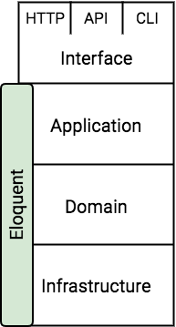

# Conciliating Laravel and DDD

This article focuses on finding common ground for using Domain-Driven Design in the Laravel framework in a way that leverages a maximum of Laravel features.

## Introduction
If you follow some key members of the Laravel community you might have noticed some occasional tensions between the *Laravel lovers*  — proning clean and simple code — and the *PHP experts* — proning separation of concerns no matter what. Even though I am obviously a biased *Laravel lover*, I often find myself submerged by the increasing complexity of my applications in the long run. Therefore I decided that it might be time for me to dig into the world of *Domain-Driven Design (Evans 2004)*.

<small>Note: I am assuming that you either read that book or that you are at least familiar with the concept of DDD. A gentle introduction by Mathias Verraes [can be found here](http://verraes.net/2014/09/decoupling-model-framework/).</small>

University taught me a lot from technical design patterns to enterprise oriented architectures, but reading the blue book enabled me to be focus on the **why** of my software rather than the **how** and bring that business logic directly into my applications. It was a great read but when you enthusiastically go back to your Laravel projects trying to apply what you learn... brain freeze ⛄️.

Hence, this article's purpose is to dig deeper into the concepts of DDD applied to the Laravel framework. As a matter of fact they are not totally mutually exclusive. We just need more disciple as developers to make this work. Just like any religious books, the blue book is subject to interpretations and contexts. Here I will share my interpretation in the Laravel context.

## End-goal rules
Before going through all of that, let's take a minute to analyze what we want to achieve and what we want to avoid in this journey. We will — consulting style — create 3 rules for that:

* **Rule A: Keep focus on the domain of the application.** Without this we lose the very essence of DDD. Our model objects need to be inline with our domain and need to follow the *Ubiquitous Language* of the project.
* **Rule B: Stay true to the framework.** Fighting a framework is exhausting, not scalable and pointless. We want it to be easy to upgrade to the next versions. We want not only to have access to the entire framework's goodness but also to discretely leverage its power inside our domain.
* **Rule C: Keep it simple.** It is somewhat linked to the previous rule but we do not want to create and inject dozens of classes when `User::find(1)` or `config('app.name')` suffice. Additionally, we do not want to maintain two versions of our model objects: one that our domain understands and one that Laravel understands.

## A mismatch in the layer structure
One of the key concepts of DDD is to isolate your domain logic from the rest of your application. This helps developers reasoning about their software when complexity increases. To reach this state, Evans advises us to partition our program into a *Layered Architecture*. This can be done in a number of ways — as long as the domain is isolated — but the book uses the following architecture.


The first thing I did when reading this part of the book was to try matching the actual Laravel folders within those layers.


As you can see, folders are all over the place and sometimes it is a bit challenging to decide in which layer a certain folder falls into. If we just focus on *the Eloquent beast*, we can see that it is part of the Laravel infrastructure (in the vendors folder) but a big part of our domain logic resides inside the models that extend it whilst being used in the application layer.



We can agree or disagree on any of those structures and their components but the fact is they don't fit nicely together out-of-the-box.

## Towards a compromising structure
This is the core of the article. Where we will start with an empty layered structure and little by little reach a state where Laravel and DDD cohabitate together.


### Focus on the domain
Let's start by adding all of the building blocks of a Domain-Driven implementation into our domain layer. Our domain is semantically segmented in various **Modules** which contain their own model objects. These objects can have an identity, i.e. **Entities**, or can be solely identified by the value of their attributes, i.e. **Value Objects**. Groups of Entities and Value Objects form **Aggregates**. 

Some domain concepts are not meant to be persisted or to have a state that evolves, they are called **Services**. Their role is simply to compute some output and/or do some actions based on some inputs.

Factories and Repositories are part of the domain but not part of the model representing the business. **Repositories** are interfaces that encapsulate the way we persist our models and **Factories** are encapsulations of how to create a particular object to free the latter of that responsibility.

Nothing new here. Just stating the basis of our domain implementation.


<small>Squares are classes, hexagons are interfaces.</small>

### Leverage the framework in your domain
This is where the brain freeze occurs. How do we use everything that Laravel has to offer when all of our logic lives outside our application layer?

We could treat all domain objects as *Plain Old PHP Objects (POPOs)* but that would imply the need for data mappers and the abandon of Laravel's active record: *Eloquent*. Once this is done we have already lost a good chunk of Laravel's power which is a breach of **rule B**.

An other alternative is to make these Entities and Aggregates extend Eloquent to leverage all of its power. Now, this is easier said than done and that choice comes with a number of trade-offs and temptations that could make us lose focus of our domain, therefore violating **rule A**.

Nonetheless, this is an interesting challenge that one has to take to fully leverage the power of Laravel using DDD and it is the one that we will explore. We will discuss the consequences of that choice in the second part of this article dedicated to exploring the ways to tame the Eloquent beast inside our domain layer.

It is also possible to leverage the goodness provided by Laravel Jobs into our domain services. All it takes is to add a few traits to our Services. Doing so will make it so much easier for our application to dispatch our Services or to queue them using Horizon. Similarly, in the event where sending emails is key to our domain, nothing stops us from making our Mail objects extend the `Mailable` class.

The key point here is the balance between using Laravel's goodness and not clustering our domain with technical details. The moment we accept the fact the technical paradigm we are using is **The Laravel Framework™** and not a general object-oriented language, it does make sense to use and extend Laravel classes, traits and interfaces within our domain. This is our new base. This is our new empty class.

If a new developer glance at a Service object in our domain and see the line ...
```php
use Dispatchable, InteractsWithQueue, Queueable, SerializesModels;
```
... he/she will not be traumatized.

Yes, it requires more discipline for developers not to go too far and transform object models into Laravel configuration files, but it is far from impossible.

On a final note, the infrastructure layer being underneath the domain layer, it is allowed by the DDD police to use it. Once we throw the `/vendors` folder in it, it legitimates our choice to include some of the Laravel goodness into our domain. Following this logic, we can also leverage our `/configs` or `/storage` folders within our domain objects. 

The only exception would be anything related to our `/database` since it is already encapsulated by the repository interfaces. Furthermore, accessing the database outside the bottleneck provided by the repositories could bypass some invariant checks and make our code a lot more difficult to reason about.


<small>Green is our domain, Grey is everything we are familiar with in Laravel</small>

### Use the domain in your Laravel app
This part is very straightforward. We simply add to our *Layered Architecture* all the Laravel concept that we all know.

* The routes can be semantically seen as the entry point of our application based on the desired interface. By default, Laravel even provides one file per interface — `web.php`, `api.php`, `console.php`, etc.
* Then our request gets pipelined into a bunch of middleware belonging to the application layer. Before our request reaches the logical part of our code, it might get validated through `Requests` or verified for a given user through `Policies`.
* Finally our requests reach the meat of our application through web controllers, API controllers or commands. All of these live in the interface layer because they vary based on the interface. If our application uses only web controllers — and that's probably enough for most applications — then we do not have to worry to much about which layer we are in. But when we start enabling access to our application via multiple protocols, it might be a good idea to create jobs that will be called via each of these interfaces.
* No matter where the meat of our application gets called, it should always delegate any business logic to the domain layer to ensure no invariants are being breached.

Note that so far, outside the domain layer, nothing has changed in the way we use Laravel. We still have our *Providers*, *Exceptions*, *Rules*, *Mails* and more inside our `/app` folder. These discussions are made to make us realize that, in some ways, Laravel is already segmented in a useful structure that can match a domain-centric architecture.


<small>Dashed arrows make up the logical workflow of incoming requests. Any controllers, commands, jobs or other classes executing logical code should eventually delegate to the domain layer.</small>

### Application modules
One last thing that our architecture is lacking, is the concrete implementation of interfaces within our domain, e.g. our repository interfaces.

Therefore for each module on the domain layer, we need a matching module in the application layer which takes responsibility for what the domain layer cannot afford to care about. This implies repository implementations but also some local providers which will bind interfaces with their implementation.

This also gives us the perfect place for any implementation of external system boundaries that might be used within the domain. E.g. if our domain uses an interface to encapsulate all the logic of payments and subscriptions, we can put its Stripe implementation within the corresponding module. If our domain uses data from an external CRM, an application module is the perfect place for some data mappers, etc.

Just like the domain layer, this subset of the application layer **will** make us add some additional logic to our Laravel applications.


<small>
Final architecture:<br>
- Green is for the domain<br>
- Blue is for any technical implementation of domain interfaces<br>
- Grey is for everything we are familiar with in Laravel<br>
- Hexagons are interfaces<br>
- Dashed arrows make up the logical workflow of incoming requests<br><br>
</small>

### A note on repository implementations
Even though our Aggregates and Entities are using Eloquent, I think it is important to use repositories to provide a bottleneck for accessing and persisting our object models to — at least — free them of that burden.

This does not mean that we can't leverage the power of Eloquent within the implementation of those repositories. All we have to do is wrap calls to the `Eloquent\Builder` or the `Query\Builder` into methods that make sense to our domain and our *Ubiquitous Language*.

Unfortunately, this results in using a different static call than what we are used to ...

```php
// From:
Customer::find('000-11-1111');

// To:
CustomerRepository::findBySocialSecurityNumber('000-11-1111');
// Note that here we are leveraging real-time
// Facades to keep a similar syntax.
```

... and adding two files — ergh, doesn't look so good for **rule C**!

```php
namespace Domain\Accounting\Repositories;

interface CustomerRepository
{
    public function findBySocialSecurityNumber($ssn);
}
```

```php
namespace App\Accounting\Repositories;

use Domaine\Accounting\Customer;

class CustomerRepository
{
    public function findBySocialSecurityNumber($ssn)
    {
        return Customer::find($ssn);
    }
}
```

<small>Plus the service provider that bind those two together...</small>

However, we do have some significant advantages with this approach:

* We are no longer dependent on Laravel's method names and we can use some naming that reflect the language of our domain. E.g. here `findBySocialSecurityNumber()` is a lot more explicit than `find()`.
* When we have very complex queries to compute, they are already abstracted in the domain.
* We do not have to cluster our object models with local scopes or other repository-like methods. This is particularly important now that our Eloquent models are part of the domain.

## A possible folder structure
Because **rule B** forced us to stay true to Laravel, we actually haven't changed many aspects of its structure. Here, I will suggest a simple folder structure to concretely implement what we've discussed so far.

* We start with a fresh install of Laravel

* We add a `/domain` folder at the root of our project and autoload its content within the `Domain` namespace. Don't forget to `composer dump-autoload`.

```json
// composer.json
"autoload": {
    "psr-4": {
        "App\\": "app/",
        "Domain\\": "domain/"
    }
},
```

* We add a folder per module in the `/domain` folder.

```
/domain
    |___ /ModuleA
    |___ /ModuleB
    |___ /ModuleC
        |___ /Factories
        |___ /Repositories (interfaces)
        |___ AggregateA1.php
        |___ EntityA2.php
        |___ EntityB.php
        |___ CRMInterface.php
        |___ PaymentInterface.php
        |___ ValueObjectA3.php
        |___ ValueObjectC.php
        |___ ...
```
    
* We add a folder per module in the `/app` folder.

```
/app
    |___ ...
    |___ /ModuleA
    |___ /ModuleB
    |___ /ModuleC
        |___ /CloseIO
        |___ /Repositories (implementation)
        |___ /Stripe
        |___ AggregateA1Resource.php (if using API interface)
        |___ ModuleCServiceProvider.php
        |___ ...
```

What I like the most about having a dedicated folder for each module in the application layer is that everytime we need to support the domain with some application logic, we have the perfect place for it with its own service provider.

Also note that I did not wrap all modules in the application layer inside a `/Modules` folder — or something similar. This keeps our namespaces clearer and creates a matching convention between our domain layer `Domain\Shipping\Cargo` and our application layer `App\Shipping\Cargo`.

## Conclusion
Implementing Domain-Driven Design is always going to be a challenge no matter what framework we use. The blue book and the writing of this article helped me in the process of understanding how to use DDD without frustrating our use of Laravel as we know it. My goal is not to provide a textbook structure that everyone should follow but to share my **current view** on the matter and establish the basis of a very interesting discovery process.

As promised, [part 2 of this article](/conciliating-laravel-and-ddd-part-2) will focus on how to leverage the use of Eloquent within the domain layer and try to deal with the frustrations that come along.