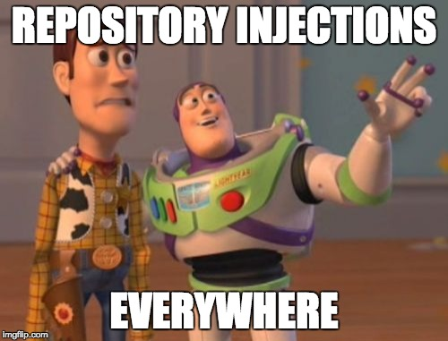

# Conciliating Laravel and DDD (part 2)

In [a previous article](/conciliating-laravel-and-ddd) we concluded that, when implementing DDD with Laravel, the Framework itself should become our new programming paradigm in order to leverage all of its goodness and avoid fighting it. This implies allowing the Eloquent beast to enter our domain layer. A dangerous decision that I will tackle here 🦁.

## Introduction
In various projects I have found myself submerged with Eloquent models that simply became some kind of configuration files. Each had their fair share of accessors `getFirstnameAttribute()`, mutators `setFullnameAttribute()`, relationship methods `comments()`, query scopes `scopeActive()`, model events `static::saving(function($model) {...})`, etc. Not to mention: `$fillable`, `$guarded`, `$visible`, `$hidden`, `$appends`, and even some provided by packages. My solution when the complexity increased was to extract some of the functions into dedicated traits. For example I would have a `UserRepository` trait with all query scopes inside and a `UserPresenter` trait with all accessors inside. It helps surviving a little longer but I don't have to tell you that it does not make miracles in the long term. Moreover, in a Domain-Driven environment it completely overshadows the semantic of the model objects by assimilating them as a set of technical draws.

Now that we introduced Eloquent to DDD, we did not magically remove all of these constraints. In fact they are even more dangerous now that the focus on the domain is at stake. We will go through each of these challenges and see how to overcome them **if** we can overcome them. Some sacrifices will have to be made. 

It is important to keep in mind how important it is to reach a balance in keeping focus on the domain (**rule A**) whilst staying true to the framework and, particularly in that case, active records (**rule B**). When none of them can be satisfied together, we will prioritize **rule B** and stay true to Laravel.

## Implicit unmapped attributes
The disturbing thing about Eloquent models is that even when they are completely empty, there is already so much they can do. For example, can you tell me what are the attributes of the following class?

```php
class Customer extends \Illuminate\Database\Eloquent\Model
{
    //
}
```

Of course not. Could be none. Could be one hundred. This is very handy when its one hundred but not very convenient in the domain layer where the attributes of an object need to be explicit so that we can reason about them. So what should we do?

* *Should we add them as class properties anyway and ignore the `$attributes` of Eloquent?*
 Without the `$attributes` property, we miss out on the majority of features provided by Eloquent. We might as well use POPOs and data mappers.

* *Can we at least initialize those attributes in the constructor?*
 We could, but overriding the constructor with one that accepts arguments will make a lot of Eloquent function fail as most static calls proxy to an empty model using `new static`, e.g. [the magic method `__callStatic`](https://github.com/laravel/framework/blob/5.6/src/Illuminate/Database/Eloquent/Model.php#L1515).
 
* *What about using `$fillable` and `$visible` to make them obvious?*
 They are actually here for a reason and using them for another purpose feels like hacking the framework.
  
Okay let's say we accept implicit attributes. There is actually a deeper problem to that. What about when the attributes of the domain do not match the attributes in our database? **Some mapping has to happen somewhere right?**

* *How are we dealing with this now?*
 Our `$attributes` property only reflects the columns of our table. We then use accessors and mutators to generate some domain attributes based on some database attributes.
 
```php
class Cargo extends Model
{
    public function getTrackingIdAttribute()
    {
        return $this->id;
    }
    
    public function setTrackingIdAttribute($id)
    {
        $this->id = $id;
    }
}
```
 
* *Why can't we do that with DDD?*
 The consequence is that the domain will know things about the database — and possibly bypass invariants from our repositories. The domain model basically becomes a data mapper.
 
* *So what's the solution?!* 😡
There is none. Using Eloquent within the domain layer can unfortunately not satisfy all of our constraints. This time, we have to choose a side: team DDD, or team Laravel? rule A or B?

If it's any consolation to you, this situation might be messy but this is how we've always worked with Eloquent before. Trying to fight it or add a package that uses a version of Eloquent that is more adequate to DDD will only push us and future developers out of our comfort zone. Any implementation that tries to fight this aspect of Eloquent models (e.g. extracting mutators and accessors to a trait in the application layers) will increase the complexity level and the discomfort of our Laravel programmers.

Since we made the commitment to stay true to Laravel, we will accept that burden and make sure to minimize the distraction it produces on the domain.

## Value objects
Now that we've accepted we are doomed using Eloquent the way it was designed to, adding some Value Objects within aggregates is really simple.

```php
class Cargo extends Model
{
    public function getDeliverySpecificationAttribute()
    {
        return new DeliverySpecification($this->deadline, $this->destination);
    }

    public function setDeliverySpecificationAttribute($deliverySpecification)
    {
        $this->deadline = $deliverySpecification->getDeadline();
        $this->destination = $deliverySpecification->getDestination();
    }
}
```

At least our dear Value Objects don't need to extend Eloquent and can have the luxury of having their own constructor and properties.

## Relationship methods
Another interesting challenge. What is the problem of using the traditional following approach?

```php
class DeliveryHistory extends Model
{
    public function handlingEvents()
    {
        return $this->hasMany(HandlingEvent::class);
    }
}
```

We are completely bypassing the bottleneck provided by repositories. One can create and persist a new handling event without using the `HandlingEventRepository` interface via a simple `$deliveryHistory->handlingEvents()->create($databaseData)`.

First of all, this is one of my favorite features of Eloquent and I wouldn't want to lose it. It caches relationships for us, it can eagerload them and much more. Also, I don't really see myself wanting to use a repository every time I want to retrieve a relationship. Finally, I will question the use of repositories all-together in the following section.

However if you really want to use repositories as database boundaries whilst using relationship methods, my suggestion would be to use these relationship methods but only to access the relationship and not to modify it. Anytime we want to create, update or delete a relationship, we access the appropriate repository. Note that nothing stops the implementation of repositories to fully use these relationship methods — e.g. `$model->relationship()->attach()`.

## Repositories
When I first wrote this article, I basically outputed a list of DOs and DONTs when using Eloquent within the domain layer. Before publishing it I decided to test my restrictions within a small dummy application that has a somewhat complex set of requirements to justify the use of DDD. 

<small>The application basically lets people write the beginning of a story with two decisions at the end. Then other users could write the next part of the story for each decision. We then end up with a story that looks like a binary tree. In order to make the stories fun and enjoyable, the application came with a set of rules like "Users can thumb up or down any page that they read. The initiator of a story can correct a page that has a negative grade and more than 10 views".</small>

When developing this application, I started by using repository interfaces in the domain layer and repository implementations in the application layer within matching modules. It seemed nice at first to just ask the application layer what we need and let it take care of it for us, but in practice, my code ended up with **a lot** of repository injections.



Then when I ended up doing things like this in my controller...

```php
public function show($id)
{
    return view('page.show', [
        'page' => $this->repository->find($id),
    ]);
}
```

... instead of...

```php
public function show(Page $page)
{
    return view('page.show', compact('page'));
}
```

... I had enough!

If we are using Eloquent inside our domain layer, then inevitably our domain already knows a lot about our database. Too much for a pure DDD implementation that's for sure. At this point, we don't want to decouple our database entirely from our domain but we do want to minimize its disturbance which Eloquent already does very well.

I am not saying that repositories should not be used at all within the domain layer but rather that we shouldn't default to use them for no reason. Personally, I ended up removing all of repository interfaces, classes, bindings and injections and it felt good!

Side note on application modules: When removing repository implementations I ended up with empty application modules — Since my application was not complex enough to have third party boundaries, etc. As a result I deleted all of their folders and I'll recreate them as I need them in the future. One could probably spread folders like Providers, Mails, Policies, etc. in their respective application modules but I find that too confusing when coming back to the code. I prefer staying true to the default Laravel folder structure on that one.

## Query scopes
Local query scopes are very helpful to separate our queries into multiple chainable methods. Eloquent models tend to have a lot of them which could eventually make us lose focus of our domain model.

If a model does not have a matching repository, I would simply use local scopes on that model to keep things clear. However when that model starts having a dangerous amount of them, it might be a smell for creating a repository, or another mechanism that will extract that logic elsewhere. For example if a `Customer` model uses a lot of query scopes as filters, we could extract them into a `CustomerFilters` object which is then used by the application layer (See [episode in Laracast](https://laracasts.com/series/eloquent-techniques/episodes/4)).

Basically, use them until they give you nightmares, then be creative.

## Presenter responsibility
Since we've allowed the use of accessors and mutators inside the domain models, we could in theory use them to display data that is only needed for our front-end like combining `firstname` and `lastname` into `fullname` and so on.

Unless the new property makes sense in the domain layer and the ubiquitous language, I think we should avoid adding an accessor for it. We've accepted that Eloquent is inevitably going to allow database knowledge inside our domain layer, I would rather avoid adding some interface knowledge as well. Besides, there are a few things we can do to deal with *presenter responsibility*:

* *Presenter* objects can be added to the corresponding application modules.
* Using the API interface (from Laravel 5.5) allows you to define *Eloquent Resources* where you can design the way you want your models to be shown to the external world.
* Sometime a quick computation within the controller is enough.

## Validation and authorization
When implementing the rules and moderations of the *collaborative story application* mentioned above, I first tried to insert all of those in the domain layer. After all, they are business requirements. What could have easily been done with a `Policy` or `Request` class, took a lot more effort and complexity within the domain layer for a much less flexible implementation.

Therefore, when it comes to validation and authorization, I think it makes sense to stay true to the framework and regroup all of that logic in one familiar place.

## Boot and model events
Last but not least, the `boot()` static method and its model event listeners — a.k.a Magic! ✨

I love these kinds of implementation and I use them a lot in my Laravel projects or when I create packages. However the more I come back to these kind of projects, the more I regret having done things like this. Even though it looks very sexy at first when you just need to call `$lead->update()` and it will take care of synchronizing the lead with your external CRM, log an activity, send a notification to the sales manager and make you a cup of tea, when the complexity grows, the magic quickly becomes unmaintainable.

This is even more critical now that Eloquent lives in the domain layer. If we really need some model events to trigger some business logic, then we could consider some work arounds like creating an *Observer* object that lives in the application layer.

Note that the same goes with magic boot methods of traits from external packages. They are very useful to get us started with whichever package but we need to be careful not to submerge our applications with hidden execution flows — in unpredictable order.

## Conclusion

Using active records within a domain layer is a challenge that comes with sacrifices. Sacrifices that most DDD purists just could not put up with. 

When applying my own DDD restrictions within the *collaborative story application*, I started with a DDD-focused implementation which little by little refactored towards a more traditional Laravel application with an extra `Domain` namespace.

Even though the resulting implementation is far from reaching all the values of Domain-Driven Design, I found that extracting my models into a separate namespace helped me be more creative and reduce the granularity of my classes.

The writing of this article also helped me distinguish two distinct aspects of Eloquent models: 

* The configurations and attributes (which is now the top half of my classes)

```php
class Story {
    protected $with = ['pages'];
    protected $guarded = [];

    public function getFirstPageAttribute() { ... }
    public function pages() { ... }
    public function scopePopular() { ... }
    
    // ...
}
```

* The domain logic (which is now the bottom half of my classes)

```php
class Story {
    // ...
    
    public function containsPage($page) { ... }
    public function computeDeeperLevel() { ... }
    public function readBy($user) { ... }
    public function averageVoteFrom($user) { ... }
}
```

The *configurations and attributes* part might seem too overwhelming for our domain layer but in my opinion it isn't much more overwhelming than having lots of getters and setters clustering our classes. As mentioned before, we are simply using a different programming paradigm that comes with its own way of defining attributes.

I would love to discover other opinions on the matter and new way to tame the Eloquent beast within the domain layer. 💡
