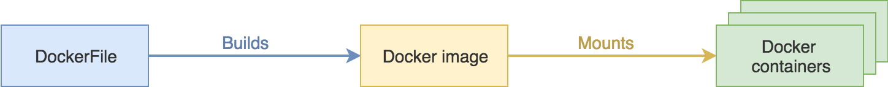
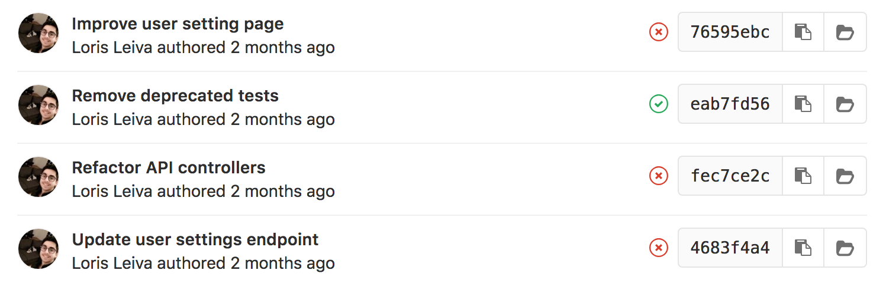
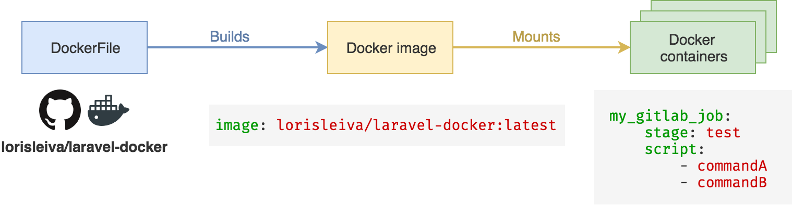

# Using GitLab's pipeline with Laravel

GitLab's pipelines can be scary at first (because you know... Docker) but they're really easy to setup and very helpful. Here's how I set up the pipelines of my Laravel applications on Gitlab.

## A quick docker intro

GitLab's pipelines contain one or several jobs. Those jobs run in complete isolation. Meaning that, every time a job is ran, a new docker container is created by mounting a docker image which is created via a DockerFile.

I swear, it's easier than it seems. Let's go through this terminology:

* Think of a **docker container** as the box containing your code and everything it needs (operating system, composer dependencies, etc.).
* Think of a **docker image** as the factory that can create as many boxes (docker containers) as your need.
* Think of a **DockerFile** as the blueprint responsible for describing how to create a new docker image.
* A DockerFile **builds** a docker image that **gets mounted** into docker containers.



The good news is, you do not need to write your own DockerFiles. There is a place called [Docker Hub](https://hub.docker.com/) — kind of like GitHub for Docker images — where you can pull pre-configured docker images and build on top of that.

## New gitlab-ci file

Okay let's start by creating a new file named `.gitlab-ci.yml` at the root of your application. We will configure our GitLab pipelines here.

## Choose your docker image
Typically you would use an existing docker image to start with, like `php:latest` for the latest version of php. Then you'd have to manually add all of the modules and dependencies required by Laravel. GitLab has an option called `before_script` which will be called right before the start of every job. Therefore you can use it to install your required php modules, composer, etc. In your `.gitlab-ci.yml` file, it would look like that:

```yaml
image: php:latest

before_script:
    - # Install php modules
    - # Install composer
    - # ...
```

However running all of those commands for every single job is very expensive. It would be much nicer (and reduce our pipeline quota) if the mounted image already had everything that we need.

That's why I created my own DockerFile `lorisleiva/laravel-docker` which contains all of the dependencies required by Laravel. I uploaded its image into [Docker hub](https://hub.docker.com/r/lorisleiva/laravel-docker/) so that we can use it directly in our pipeline configuration file.

```yaml
image: lorisleiva/laravel-docker:latest
```

And we're all good to go. After mounting the image, GitLab will automatically `clone` and `cd` into your repository. Now let's have fun configuring some jobs.

<GithubButton url="https://github.com/lorisleiva/laravel-docker" title="See laravel-docker on GitHub" />

## Running our test suite
The first job I'd like to set up, is simply one that runs all of our tests. This job will be successful if and only if all tests are passing. This should be as easy as:

```yaml
# This is the name of our job, call it whatever you want.
phpunit:

    # This is used to categorize jobs. Jobs within the same stage are run in parallel.
    stage: test
    
    # This is the list of commands executed by the job.
    script:
        - phpunit --coverage-text --colors=never
```

However this is not going to work because our Laravel application is missing its `vendor` folder, its `.env` file and thus its encryption key. So before running our tests we need to make sure our application is initialized properly.

```yaml
phpunit:
    stage: test
    script:
        - composer install --prefer-dist --no-ansi --no-interaction --no-progress --no-scripts
        - cp .env.example .env
        - php artisan key:generate
        - phpunit --coverage-text --colors=never
```

<small>Note that these commands can only be ran once our Laravel application has been cloned and therefore cannot be added to our DockerFile: `lorisleiva/laravel-docker`.</small>

And that's it. Now every time you commit into your master branch, GitLab will start the `phpunit` job letting you know of its status via a little pass or fail icon.



## Checking our code style
Another nice job to implement is checking your code for some code style violations. Our docker image already contains the `PHP_CodeSniffer` pear extension. Thus all you need to do is run `phpcs`.

```yaml
codestyle:

    # Let's run that in parallel with phpunit.
    stage: test
    
    script:
        # We'll comply with the PSR2 standard and check all .php file in our app folder.
        - phpcs --standard=PSR2 --extensions=php app
```

## Caching our vendors
You might have noticed that, so far, every time a `phpunit` job runs, composer installs all of the dependencies from scratch. We can improve the performance of our pipelines by caching and sharing the `vendor` folder across all of the commits of one branch.

```yaml
cache:

    # We key the cache using the branch's unique identifier.
    key: ${CI_COMMIT_REF_SLUG}
    
    paths:
        # We only want to cache the vendor folder.
        - vendor/
```

This will cache and share the `vendor` folder across all of our jobs. However our `codestyle` job does not need any composer dependencies and therefore does not need the `vendor` folder altogether. We can disable the cache for one particular job like so:


```yaml
codestyle:
    stage: test
    cache: {} # Override with an empty object.
    script:
        - phpcs --standard=PSR2 --extensions=php app
```

## Conclusion
As you can see on the diagram below, GitLab allows us to abstract the complexity of docker behind a simple configuration file.



There is a lot more that can be done but this should help you getting started with GitLab's pipelines for your Laravel applications. Feel free to share your job ideas here and I might write a little series of articles that will help you improve your CI/CD.

<GithubButton url="https://github.com/lorisleiva/laravel-docker/blob/master/gitlab/.gitlab-ci.tests.yml" />

*Edit 12/06/2018:* Learn how to use GitLab's pipeline to build, test and deploy your Laravel applications in my [next article](/laravel-deployment-using-gitlab-pipelines).
