# Laravel deployment using GitLab's pipelines

In my [previous article](http://lorisleiva.com/using-gitlabs-pipeline-with-laravel/), I explained the basics of Docker images and introduced a simple GitLab pipeline that runs our test suite and checks our code style. In this article, we will set up a more complex pipeline that ends up deploying our applications using [Laravel Deployer](https://github.com/lorisleiva/laravel-deployer) 🚀.

<GithubButton
    url="https://github.com/lorisleiva/laravel-docker/blob/master/gitlab/.gitlab-ci.deployments.yml"
/>

## Pipeline specifications

Before diving into some code, let's take a minute to decide what we want our final pipeline to look like. 
1. First I'd like the pipeline to **build** our dependencies and our assets.
2. Then I'd like to make sure no **tests** were broken, nor codestyle violated.
3. Finally I'd like to use my previously built application to **deploy** into my staging and production hosts.

We can categorise those three points as `Build`, `Test` and `Deploy` which conveniently constitute the default stage definition of GitLab.

```yaml
# No need to explicitly write this on your .gitlab-ci.yml file.
# Add and edit if you want different stage configurations.
stages:
  - build
  - test
  - deploy
```

Below is the final pipeline that we'll have at the end of this article. ✨

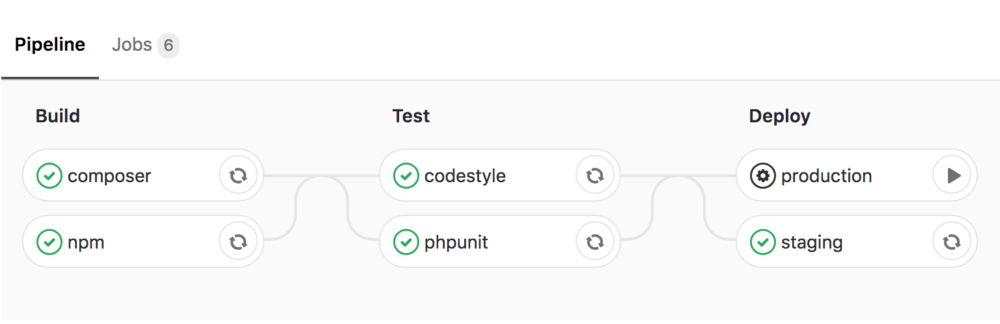

- **Build.** We'll build our composer dependencies in one job and compile our assets in another so that they can be ran in parallel and improve the performance of our pipeline.
- **Test.** We'll then run our test suite and check our codestyle also in parallel.
- **Deploy.** Finally, we'll deploy on our staging host automatically and wait for manual confirmation before deploying on our production host. That way, us humans, can review our changes on the staging environment and **play** the production deployment if and only if we are satisfied with the results. If you're not using any staging environment you can simply delete the `staging` job. If you can move mountains you can move molehills.

## Sharing files between jobs
GitLab provides two ways of sharing files across your jobs. This is helpful for our pipeline because we are relying on the output of the `composer` and `npm` jobs for the rest of our jobs. If we had to build before every job, there wouldn't be much point having a `build` stage in the first place.

### Cache
The first mechanism provided by GitLab is caching. It is very similar to caching in Laravel, you describe what you want to cache and provide a key to retrieve the potentially cached content later.

This is mostly useful when using the branch as a key, e.g. `master`. That way we can share content across all of the pipeline within a branch and improve our pipeline performances.

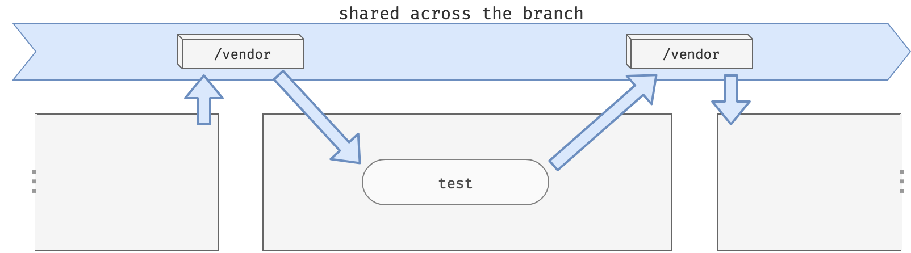

<small>On the image above, the `test` job is still running `composer install` in case we updated the dependencies but it will update from the previous `/vendor` folder and not an empty one.</small>

### Artifacts
The second mechanism provided by GitLab consists of generating **artifacts**. You can think of artifacts as the **output of a job** which will be automatically provided to the following stages. This output is simply a set of predefined files and folders that is zipped at the end of a job.

Let's say I have three jobs: build, test and deploy which are respectively in the stages build, test and deploy. If I define some artifacts on the `build` job then the `test` and `deploy` jobs will automatically download them before they start.

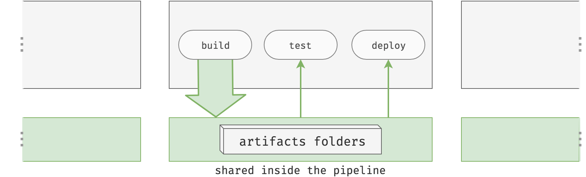

A cool side effect of artifacts is that you can download them directly from GitLab's UI when your pipeline is finished.


### Cache and artifacts together

No need to choose when we can have both.
- We'll use **artifacts** within the jobs of our `build` stage to provide content to the other jobs of the pipeline. 
- We'll also use **caching** in our building jobs to make sure that the `vendor` and `node_modules` folders are not created from scratch at every pipeline.

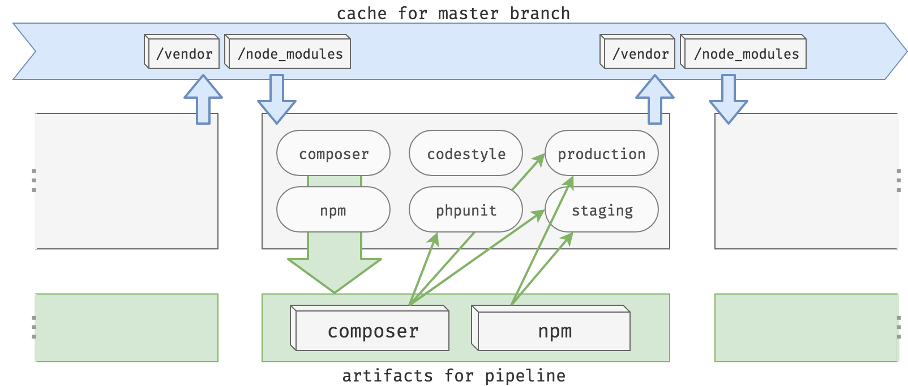

<small>Note that the `phpunit` job only needs the composer artifacts and the `codestyle` job doesn't need any artifacts at all. We'll describe this in the configurations to avoid unnecessary downloads.</small>

## The gitlab-ci file
Finally, let's write some code! Create a `.gitlab-ci.yml` file at the root of your project if you don't already have one.

We'll be using my public [Laravel Docker](https://github.com/lorisleiva/laravel-docker) image which contains everything we need to use GitLab's pipeline on Laravel applications. Don't worry too much about what's inside for now, just plug and play.

```yaml
image: lorisleiva/laravel-docker:latest

# TODO: Define our jobs.
```

## The build stage

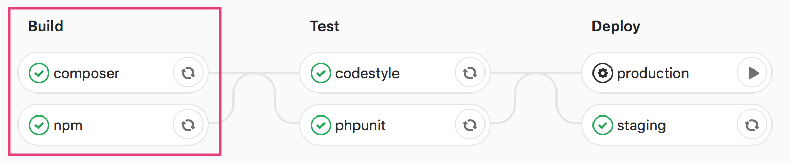

### Composer
The purpose of this job is to properly initialise our Laravel application by running `composer install` and making sure our `.env` file is valid.

```yaml
# The job's name.
composer:

  # The job's stage (build, test or deploy).
  stage: build
  
  # What to run on the job.
  script:
      - composer install --prefer-dist --no-ansi --no-interaction --no-progress --no-scripts
      - cp .env.example .env
      - php artisan key:generate
```

Pretty simple stuff. Now we want to "output" the `vendor` folder and the `.env` file using artifacts so that jobs from the next stages can automatically inherit them.

```yaml
composer:
  # ...
  artifacts:
  
    # (Optional) Give it an expiration date, 
    # after that period you won't be able to 
    # download them via the UI anymore.
    expire_in: 1 month
    
    # Define what to output from the job.
    paths:
      - vendor/
      - .env
```

Finally, we want to cache the `vendor` folder to make sure the `composer` job of our next pipeline will not create it again from scratch.

```yaml
composer:
  # ...
  cache:
  
    # The variable CI_COMMIT_REF_SLUG 
    # refers to the slug of the branch.
    # For example: `master` for the master branch.
    # We use the `composer` suffix to avoid conflicts with
    # the `npm` cache that we'll define next.
    key: ${CI_COMMIT_REF_SLUG}-composer
    
    # Define what to cache.
    paths:
      - vendor/
```

### Npm
Very similarly to the `composer` job, we define a `npm` job responsible for installing our node dependencies and compiling our assets.

```yaml
npm:

  # Same stage as `composer` so that they run in parallel.
  stage: build
  
  # Cache the `node_modules` folder
  # using the `npm` suffix on the key.
  cache:
    key: ${CI_COMMIT_REF_SLUG}-npm
    paths:
      - node_modules/

  # Install and compile.
  script:
      - npm install
      - npm run production

  # Provide the other jobs of the pipeline with
  # the node dependencies and the compiled assets.
  artifacts:
    expire_in: 1 month
    paths:
      - node_modules/
      - public/css/
      - public/js/
```

## The test stage

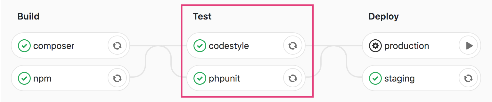

### Phpunit

The `phpunit` job automatically inherits all of the artifacts from the `composer` and `npm` jobs. Therefore our composer dependencies and our `.env` file are ready to use. All that's left to do is to run `phpunit`.

```yaml
phpunit:
  stage: test
  script:
    - phpunit --coverage-text --colors=never
```

Nice and simple. However, the `npm` artifacts are not necessary for phpunit to run successfully. We can avoid downloading unnecessary artifacts by explicitly telling the job what to use:

```yaml
phpunit:
  stage: test
  
  # List of jobs from which it will download the artifacts.
  dependencies:
    - composer

  script:
    - phpunit --coverage-text --colors=never
```

### Codestyle

Since the `lorisleiva/laravel-docker` image already contains `PHP_CodeSniffer`, the `codestyle` job can run `phpcs` directly. Moreover it doesn't need any artifacts from any previous job to run successfully and can therefore disable all dependencies. We can do this by assigning `[]` to the `dependencies` key.

```yaml
codestyle:
  stage: test
  dependencies: []
  script:
    - phpcs --standard=PSR2 --extensions=php --ignore=app/Support/helpers.php app
```

## The deploy stage

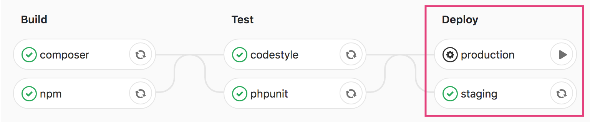

### The blueprints
The deploying jobs are going to be a little bit more challenging then the previous ones. Let's start by roughly describing what the job should do. For convenience we'll only work with the `staging` job for now since it will be very similar to the `production` job.

```yaml
staging:
  stage: deploy
  
  # Pseudocode describing roughly what we're trying to achive
  script:
    - Initialise an SSH connection
    - Deploy to the staging host using Laravel Deployer

  # Define an GitLab environment.
  # This makes GitLab aware of your latest deployments
  # and provides a button to check out the provided url.
  environment:
    name: staging
    url: http://dev.yourdomain.com
    
  # (Optional) Only deploy if we're in the master branch
  # Other branches will only build and test.
  only:
    - master
```

All that's left to do is make the pseudocode work.

### Initialise an SSH connection

You might be wondering, how the hell are we going to make our GitLab pipelines communicate with our server?

In a usual environment, we would generate a new SSH key pair and give the public key to the server. However, if we generate a new SSH key in every pipeline, we're going to have to update the server's trusted keys every single time we run a pipeline. So that's obviously not an option.

The idea is much simpler.

1. We create a new SSH key pair locally on our machine.
2. We give the public key to our server.
3. We give the private key to GitLab using secret variables.
4. We use that private key in our pipelines.

<small>Source: [GitLab Documentation - GitLab and SSH keys](https://docs.gitlab.com/ee/ci/ssh_keys/)</small>

#### 1. New SSH key pair

Generate a new SSH key pair via `ssh-keygen` but be careful: 🚨
- **Do not provide any paraphrase** otherwise your pipelines will be aimlessly waiting for someone to enter it before connecting.
- Make sure **not to override your own SSH key**, name it something like `~/.ssh/id_rsa_gitlab`.

```bash
ssh-keygen -t rsa -C "gitlab@yourdomain.com" -b 4096
```

#### 2. Give the public key to the server

❑ &nbsp;Copy the **public key**. `pbcopy < ~/.ssh/id_rsa_gitlab.pub` \
❑ &nbsp;Connect to your server \
❑ &nbsp;Paste the public key at the end of the `~/.ssh/authorized_keys` \
❑ &nbsp;If you are using Laravel Forge to maintain your servers, you can paste it using Forge's UI.

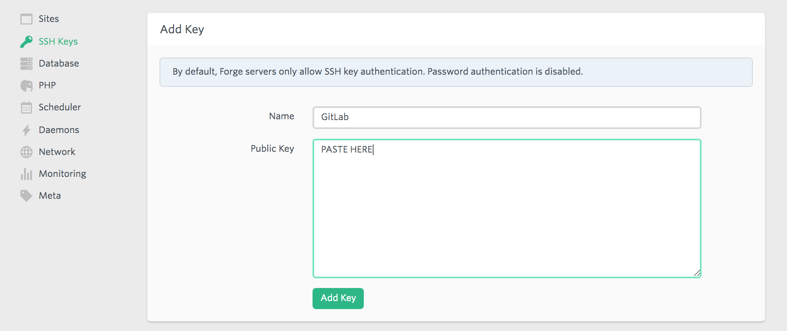

#### 3. Give the private key to GitLab
❑ &nbsp;Copy the **private key**. `pbcopy < ~/.ssh/id_rsa_gitlab` \
❑ &nbsp;Connect to GitLab and go to your project settings. \
❑ &nbsp;Add a new variable called `SSH_PRIVATE_KEY` and give it the private key as value.

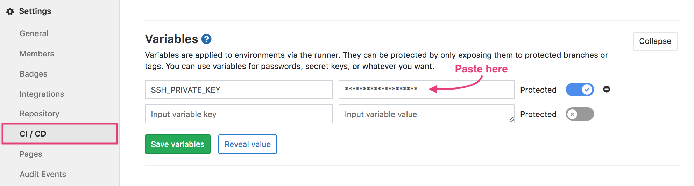

#### 4. Initialise SSH on the pipeline
Now we can start a ssh-agent and tell it to use our `$SSH_PRIVATE_KEY` variable that we added on the previous point. GitLab provides us with a little script that does just that.

```yaml
staging:
  # ...
  script:
    - eval $(ssh-agent -s)
    - echo "$SSH_PRIVATE_KEY" | tr -d '\r' | ssh-add - > /dev/null
    - mkdir -p ~/.ssh
    - chmod 700 ~/.ssh
    - [[ -f /.dockerenv ]] && echo -e "Host *\n\tStrictHostKeyChecking no\n\n" > ~/.ssh/config
```

Note that the last line disables host checking which is convenient but can lead to man-in-the-middle attacks. If you'd rather manually define `yourdomain.com` as a known host, replace the last line with:

```yaml
    - ssh-keyscan yourdomain.com >> ~/.ssh/known_hosts
    - chmod 644 ~/.ssh/known_hosts
```

Since, we'll be reusing all of that script for our `production` job and potentially others in the future, let's extract it into a YAML template.

```yaml
# Add a `.` in front of a job to make it hidden.
# Add a `&reference` to make it a reusable template.
# Note that we don't have dashes anymore.
.init_ssh: &init_ssh |
  eval $(ssh-agent -s)
  echo "$SSH_PRIVATE_KEY" | tr -d '\r' | ssh-add - > /dev/null
  mkdir -p ~/.ssh
  chmod 700 ~/.ssh
  [[ -f /.dockerenv ]] && echo -e "Host *\n\tStrictHostKeyChecking no\n\n" > ~/.ssh/config
  
staging:
  # ...
  script:
  
    # Reuse a template by calling `*reference`
    - *init_ssh

    # Next section
    - Deploy to the staging host using Laravel Deployer
```

### Installing Laravel Deployer
In order to deploy our Laravel application, we'll be using Laravel Deployer. It's a Laravel package I made that gives `php artisan` the power of zero-downtime deployment.

If you already have Laravel Deployer installed, you can skip these few steps:
1. Run locally `composer require lorisleiva/laravel-deployer`
2. Next run `php artisan deploy:init`. It will ask you a few questions to help getting started and generate a `config/deploy.php` file.
3. (Optional) If you have a staging host (like dev.yourdomain.com), open the new `config/deploy.php` file and add your staging host.
4. Run `php artisan deploy` locally and make sure everything works properly.
5. Commit and push your changes.

```php
# Example of staging and production hosts
# in config/deploy.php

'hosts' => [
    'yourdomain.com' => [
        'deploy_path' => '/home/forge/yourdomain.com',
        'user' => 'forge',
    ],
    'dev.yourdomain.com' => [
        'deploy_path' => '/home/forge/dev.yourdomain.com',
        'user' => 'forge',
    ],
],
```

<small>For more deployment configuration check out the [documentation](https://github.com/lorisleiva/laravel-deployer/blob/master/docs/README.md) or the [video tutorials](https://www.youtube.com/playlist?list=PLP7iaQb3O2XsexM_5HMrcKNCu0IOcxIDh).</small>


### Using Laravel Deployer in your pipelines
Now that we have installed Laravel Deployer and established an SSH communication between GitLab and our server, we can call `php artisan deploy` directly within our pipelines.

If we have multiple hosts defined on our `config/deploy.php`, running `php artisan deploy` will deploy on all of them. Therefore on each deploying job, we have to specify on which host we'd like to deploy to. For example, running `php artisan deploy dev.yourdomain.com` will only deploy on our staging server.

Moreover, by default Laravel Deployer will use the `basic` strategy to deploy on your server. The basic strategy will create a new release on your server, build everything on it and, when its ready, attach it to the `current` symlink to make it live.

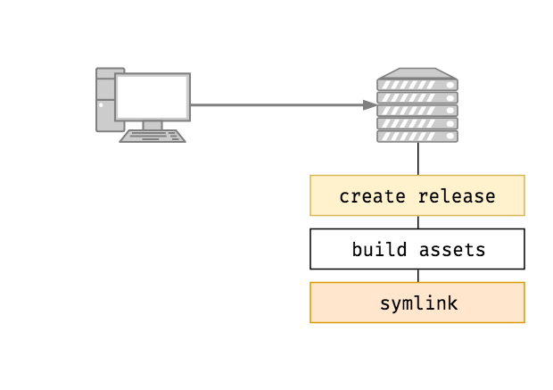

It's a shame because, within our `composer` and `npm` jobs we've already built everything. Basically, when reaching the deploying jobs, the content of our application is production ready. All we need to do is upload it into a new release. Which is precisely what the `upload` strategy does for us.

<small>The `upload` strategy is available from version `0.2.3` of Laravel Deployer.</small>

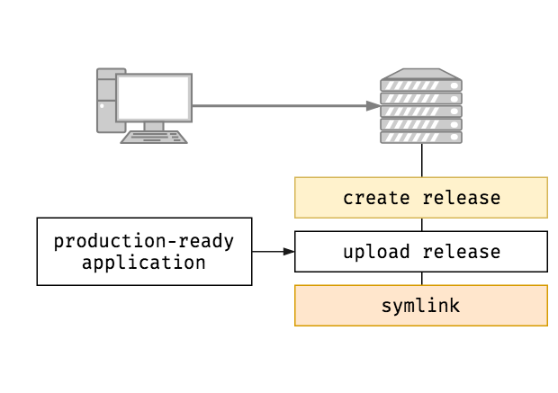

To specify which strategy to use on the command line, we can use the `--strategy` or `-s` option. Therefore we end up with the following command: `php artisan deploy dev.yourdomain.com -s upload`.


```yaml
staging:
  stage: deploy
  script:
    - *init_ssh
    - php artisan deploy dev.yourdomain.com -s upload
  environment:
    name: staging
    url: http://dev.yourdomain.com
  only:
    - master
```

Yes! finally! 🔥

### A manual production deployment
We can now copy/paste the `staging` job to create the `production` job. It is basically the same except that the domain and the environment name change. We also add the `when: manual` option which makes sure the job won't be executed until someone clicks on the "play" button.

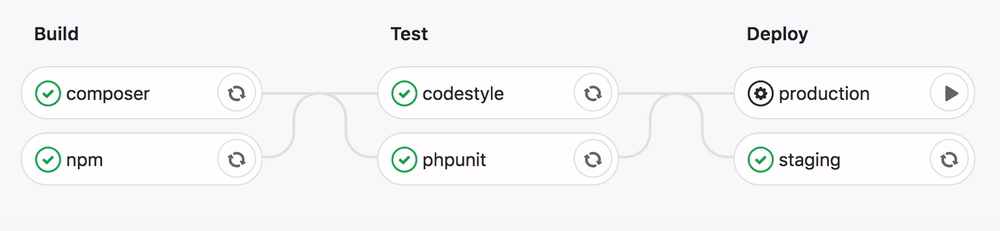

```yaml
production:
  stage: deploy
  script:
    - *init_ssh # This is pretty convenient now.
    - php artisan deploy yourdomain.com -s upload
  environment:
    name: production
    url: http://yourdomain.com
    
  # Do not run automatically.
  # Wait for a human to click on play.
  when: manual
  
  only:
   - master
```

### File permissions

One last thing. There is *currently* an [issue on GitLab](https://gitlab.com/gitlab-org/gitlab-runner/issues/1736) regarding the file permissions used by default when cloning on pipelines. Basically the file permissions are not strict enough but if they change it, it will break some existing features. This is a security issue for us because we are deploying those files with those "lazy" permissions on our production server.

I have no doubt an official solution will arise from this eventually but in the meantime, it is safer to change the permissions to what Laravel uses by default. We create a new template script that we then use in our deploying jobs.

```yaml
.change_file_permissions: &change_file_permissions |
  find . -type f -not -path "./vendor/*" -exec chmod 664 {} \;    
  find . -type d -not -path "./vendor/*" -exec chmod 775 {} \;
  
staging:
  # ...
  script:
    - *init_ssh
    - *change_file_permissions
    - php artisan deploy dev.yourdomain.com -s upload
  
production:
  # ...
  script:
    - *init_ssh
    - *change_file_permissions
    - php artisan deploy yourdomain.com -s upload
```

<small>Note that we omit the vendor folder because otherwise our jobs won't be able to access the binaries that allow us to deploy our application. The `upload` strategy updates the vendor folder anyway as it doesn't cost much thanks to composer's cache.</small>

## Conclusion
Phew we did it. It is a pretty hardcore thing to set up but once its done, its hugely useful! I hope you didn't hit too many problems along the road. Don't hesitate to share your questions and ideas in the comments.


<GithubButton
    url="https://github.com/lorisleiva/laravel-docker/blob/master/gitlab/.gitlab-ci.deployments.yml"
/>