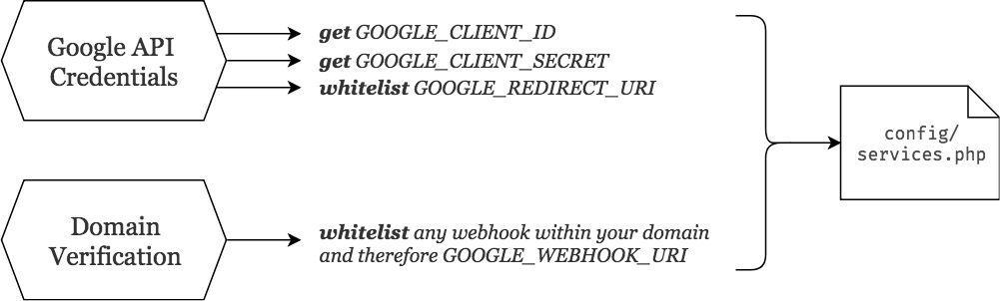
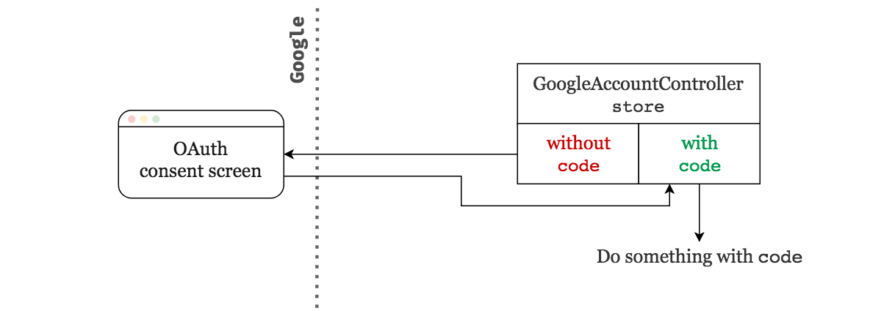
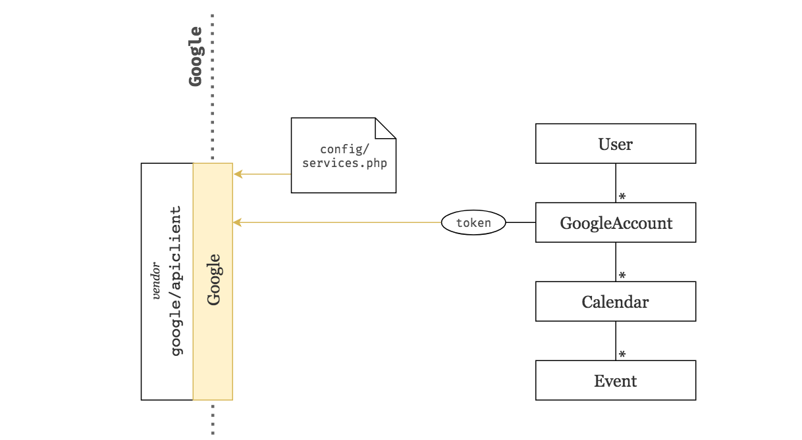
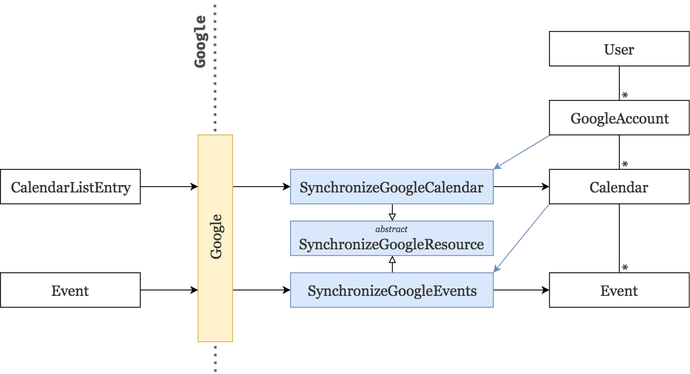
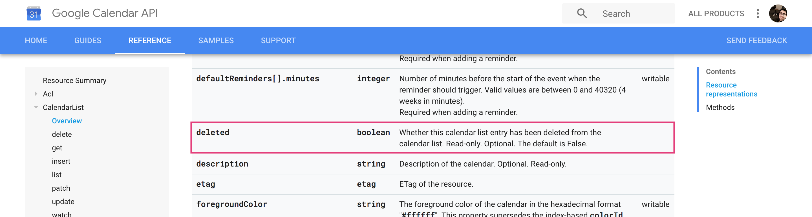
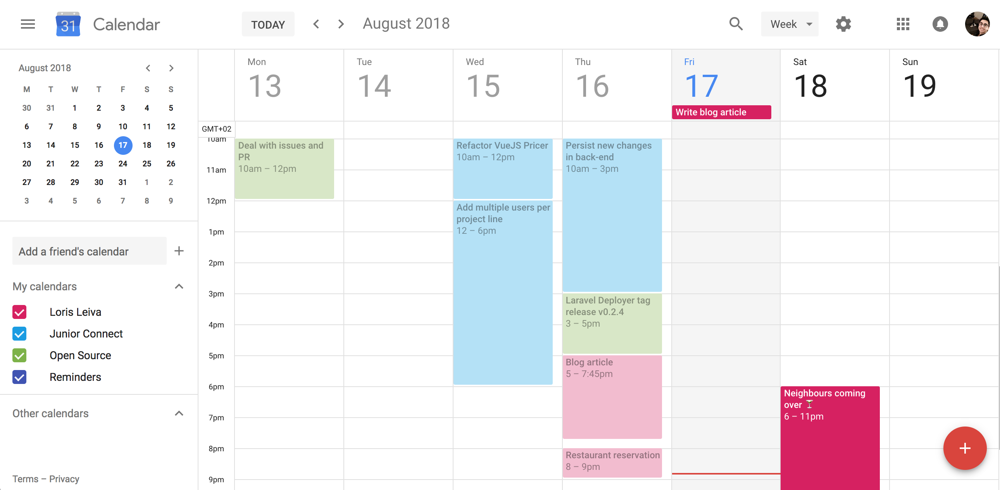

# Google Calendar part 1: Integration

You are about to learn how to allow our users to integrate all of their Google calendars and events within our application. In a series of articles we are going to see how to fetch and map Google data into beloved Laravel models and keep that data up-to-date at all times. 

Whilst your application might not urgently need such integrations, we will go through several patterns and learn some clean ways to clip external data to your projects. If you haven't worked with the Google API before, you will see that it brings lots of challenges and weirdness that require us to be extra vigilant to the organization of our code which makes it a good recreational-programming exercise.

In this first article we are going to define our models, set up the Google API as a service and finally fetch, map and display calendars and events.

## Some first requirements
Before diving into the code, let's take a step back and define the very first specifications of our application.

* It isn't unlikely that users have more than one Google account. Therefore, it would be good if our application had a page to list, add and delete Google accounts. Each Google account will go through its own OAuth process and will save its own authorization token.
* We should also import calendars and events upon creation of each Google account and map them into our own representation of those models.
* Finally we want our users to browse through their events across all of the calendars of all of their Google accounts. For this purpose, we will need a page that sorts event by descending starting time with a little badge that indicates from which calendar this event comes from.

Looks like we've found our models.


## Models

### User
The user model stays the same but gets a `hasMany` relationship to the `GoogleAccount` model.

```php
class User extends Authenticatable
{
    // ...
    public function googleAccounts()
    {
        return $this->hasMany(GoogleAccount::class);
    }
}
```

### GoogleAccount
Every model that comes from the Google API, i.e. `GoogleAccount`, `Calendar` and `Event` have a column `google_id` which keeps track of the identifier of the resource that Google understands. This will be helpful at a later stage to know if we need to create a new resource or simply update an existing one. 

For the GoogleAccount model, it will be helpful to ensure a user doesn't enter twice the same account. This model also has a `name` (typically the email address of the account) and an authentication `token` which is stored as JSON.


```php
class GoogleAccount extends Model
{
    protected $fillable = ['google_id', 'name', 'token'];
    protected $casts = ['token' => 'json'];

    public function user()
    {
        return $this->belongsTo(User::class);
    }

    public function calendars()
    {
        return $this->hasMany(Calendar::class);
    }
}
```

### Calendar
Aside from its `name` and `google_id`, our simplified Calendar model also has a `color` and a `timezone`.

```php
class Calendar extends Model
{
    protected $fillable = ['google_id', 'name', 'color', 'timezone'];

    public function googleAccount()
    {
        return $this->belongsTo(GoogleAccount::class);
    }

    public function events()
    {
        return $this->hasMany(Event::class);
    }
}
```


### Event
Finally our Event model has a `name`, a `description` and a starting and ending `datetime` with an `allday` flag letting us know if we should ignore the time of our datetime columns.

Instead of just casting our datetime columns, we provide custom accessors to incorporate the calendar's timezone into the parsed Carbon instance. We also define an accessor to retrieve the event's duration.

```php
class Event extends Model
{
    protected $with = ['calendar'];
    protected $fillable = ['google_id', 'name', 'description', 'allday', 'started_at', 'ended_at'];

    public function calendar()
    {
        return $this->belongsTo(Calendar::class);
    }

    public function getStartedAtAttribute($start)
    {
        return $this->asDateTime($start)->setTimezone($this->calendar->timezone);
    }

    public function getEndedAtAttribute($end)
    {
        return $this->asDateTime($end)->setTimezone($this->calendar->timezone);
    }

    public function getDurationAttribute()
    {
        return $this->started_at->diffForHumans($this->ended_at, true);
    }
}
```

<small>🐙 [See changes on GitHub](https://github.com/lorisleiva/blog-google-calendar/commit/6b9fe6505e6b0deccf32e91ca2f0901f425f41f0)</small>

## Enabling the Google API
In order to communicate with the Google API, let's start by installing their PHP client.

```bash
composer require google/apiclient
```

Next, we need to get some credentials from the API and whitelist a few URIs. This is a pretty long and boring set up so I've externalised it into a gist that describes the entire process with a lot of screenshots.

Basically, we will end up with two environment variables `GOOGLE_CLIENT_ID` and `GOOGLE_CLIENT_SECRET` and we will whitelist the following URIs also defined as environment variables:

```bash
GOOGLE_REDIRECT_URI="${APP_URL}/google/oauth"
GOOGLE_WEBHOOK_URI="${APP_URL}/google/webhook"
```



Before you do (or do not) go through this Google API set up, please note a few things:
* **Domain verification** will be necessary when receiving webhook notifications from Google. Therefore it will not be used in the article but in part 3 of this series. However I recommend you to get it over and done with now.
* I will be using `valet share` to obtain a **live domain to share to Google**. If you wish to do the same (because you want to try this locally), I highly recommend you to sign up for a [free ngrok plan](https://ngrok.com/upgrade) and [link it to valet](https://joelennon.com/using-reserved-ngrok-subdomains-in-laravel-valet). If you use ngrok without any account, your server will expire after a few hours which will make you go through a big chunk of the set up again.
* If you've done this before and you know what you're doing: we’re going to enable the "Google Calendar API" and the "Google+ API".

<p class="text-center">
    ⚡️ Okay so <a href="https://gist.github.com/lorisleiva/36c0173ddf082f1495d25aca119ace7e">here is the gist</a> ⚡️
</p>

<p class="text-center">
    See you back in a mo.
</p>

## Google as a service
Welcome back, 👋 at this point you should be able to add the following variables to your `.env` file:

```bash
GOOGLE_CLIENT_ID=
GOOGLE_CLIENT_SECRET=
GOOGLE_REDIRECT_URI="${APP_URL}/google/oauth"
GOOGLE_WEBHOOK_URI="${APP_URL}/google/webhook"

# In my case:
APP_URL=https://b3093b51.ngrok.io
```

Within our `config/services.php` file, we configure a new `google` service containing everything we need to start up a Google client. It registers our environment variables but also configures some extra options. 

```php
return [
    // ...
    
    'google' => [
        // Our Google API credentials.
        'client_id' => env('GOOGLE_CLIENT_ID'),
        'client_secret' => env('GOOGLE_CLIENT_SECRET'),
        
        // The URL to redirect to after the OAuth process.
        'redirect_uri' => env('GOOGLE_REDIRECT_URI'),
        
        // The URL that listens to Google webhook notifications (Part 3).
        'webhook_uri' => env('GOOGLE_WEBHOOK_URI'),
        
        // Let the user know what we will be using from his Google account.
        'scopes' => [
            // Getting access to the user's email.
            \Google_Service_Oauth2::USERINFO_EMAIL,
            
            // Managing the user's calendars and events.
            \Google_Service_Calendar::CALENDAR,
        ],
        
        // Enables automatic token refresh.
        'approval_prompt' => 'force',
        'access_type' => 'offline',
        
        // Enables incremental scopes (useful if in the future we need access to another type of data).
        'include_granted_scopes' => true,
    ],
];
```

Whilst the native php client written by Google is quite powerful, we will create a new `App\Services\Google` class to provide an additional layer of encapsulation that we can control and that acts as our own representation of the interface between the Google API and our application.


Whenever we create a new instance of that class, we will boot up an underlying php client with all of the configurations defined earlier.

```php
namespace App\Services;

class Google
{
    protected $client;

    function __construct()
    {
        $client = new \Google_Client();
        $client->setClientId(config('services.google.client_id'));
        $client->setClientSecret(config('services.google.client_secret'));
        $client->setRedirectUri(config('services.google.redirect_uri'));
        $client->setScopes(config('services.google.scopes'));
        $client->setApprovalPrompt(config('services.google.approval_prompt'));
        $client->setAccessType(config('services.google.access_type'));
        $client->setIncludeGrantedScopes(config('services.google.include_granted_scopes'));
        $this->client = $client;
    }
}
```

In order to bring all of the power of the underlying client to our `Google` service, we proxy all method calls to that client through the magic method `__call()`.

```php
class Google
{
    // ... 
    
    public function __call($method, $args)
    {
        if (! method_exists($this->client, $method)) {
            throw new \Exception("Call to undefined method '{$method}'");
        }

        return call_user_func_array([$this->client, $method], $args);
    }
}
```

That doesn't stop us from adding more functionalities to our `Google` class. For example, creating a service with the Google API always follows the convention `new \Google_Service_Xxx($client)` where `Xxx` is the capitalised name of the service we want to use. Therefore, we can easily add a little helper for this:

```php
class Google
{
    // ... 
    
    public function service($service)
    {
        $classname = "Google_Service_$service";

        return new $classname($this->client);
    }
}
```

<small>🐙 [See changes on GitHub](https://github.com/lorisleiva/blog-google-calendar/commit/f6639340f588d49dce5fb8c33f98148c0a14882c)</small>

## Managing Google accounts

### Front-end
Before implementing the OAuth process, let's bootstrap a simple page that lists all Google accounts. 


I simply ran `php artisan make:auth` to generate the typical authentication boilerplate, tweaked the navigation and added a new page.

All that's left to do is making our front-end accessible by creating new routes and controllers. Semantically this page calls for a `GoogleAccountController` with only three actions to list (`index`), add (`store`) and delete (`destroy`) accounts.  We do not need an additional `create` action to request additional data from the user since all data will be collected through the Google API.

```php
class GoogleAccountController extends Controller
{
    public function __construct()
    {
        $this->middleware('auth');
    }

    public function index()
    {
        return view('accounts', [
            'accounts' => auth()->user()->googleAccounts,
        ]);
    }

    public function store(Request $request, Google $google)
    {
        // TODO:
        // - Handle the OAuth process.
        // - Create a new Google Account.
    }

    public function destroy(GoogleAccount $googleAccount)
    {
        // TODO:
        // - Revoke the authentication token.
        // - Delete the Google Account.
    }
}
```

Finally, let's define some routes for this controller. 

```php
// Managing Google accounts.
Route::name('google.index')->get('google', 'GoogleAccountController@index');
Route::name('google.store')->get('google/oauth', 'GoogleAccountController@store');
Route::name('google.destroy')->delete('google/{googleAccount}', 'GoogleAccountController@destroy');
```

<small>Note that the `store` action is using the `GET` method instead of the typical `POST` method — for the same reason as before, i.e. we do not request additional data via a form.</small>

<small>🐙 [See changes on GitHub](https://github.com/lorisleiva/blog-google-calendar/commit/433195f2af93b00c96d971b918db32f00623e08d)</small>

### Adding Google accounts

Now that we've got our Google service all set up, it is actually pretty simple to navigate the user through the OAuth process. We start by redirecting the user to the Google's consent screen.

```php
// Remember that we have access to all the methods of the Google’s client through our encapsulation.
return redirect($google->createAuthUrl());
```

At this point the user is in Google land. Once it has logged in and agreed with the scopes of our application, it is redirected back to our `GoogleAccountController@store` action except that, this time, we receive a `code` in the body of our request.



```php
// We use Laravel's automatic injections to grasp a fresh instance of the Google service by simply type-hinting it.
public function store(Request $request, Google $google)
{
    if (! $request->has('code')) {
        // Send the user to the OAuth consent screen.
        return redirect($google->createAuthUrl());
    }

    // Do something with $request->get('code');
    // ...

    // Return to the account page.
    return redirect()->route('google.index');
}
```

We then need to use this `code` in order to generate an authentication `token` that we can store in our brand new `GoogleAccount` instance.


```php
public function store(Request $request, Google $google)
{
    if (! $request->has('code')) {
        return redirect($google->createAuthUrl());
    }

    // Use the given code to authenticate the user.
    $google->authenticate($request->get('code'));
    
    // Make a call to the Google+ API to get more information on the account.
    $account = $google->service('Plus')->people->get('me');

    auth()->user()->googleAccounts()->updateOrCreate(
        [
            // Map the account's id to the `google_id`.
            'google_id' => $account->id,
        ],
        [
            // Use the first email address as the Google account's name.
            'name' => head($account->emails)->value,
            
            // Last but not least, save the access token for later use.
            'token' => $google->getAccessToken(),
        ]
    );

    return redirect()->route('google.index');
}
```

The `updateOrCreate` method will first check if there exists a `GoogleAccount` associated with the authenticated user which also has that `google_id`. If this is the case, it will simply update the entry instead of creating a new one. This prevents the user from adding multiple times the same Google account but still allows two different users to use the same Google account.

Anyway, this is how it looks 👀


Before we deal with deleting accounts, let's add a little helper method in our Google service to authenticate the client with a given token.

```php
class Google
{
    // ...
    
    public function connectUsing($token)
    {
        $this->client->setAccessToken($token);

        return $this;
    }
}
```

By writing this method and returning `$this`, we can make API calls by chaining methods together.

```php
$google
    ->connectUsing($googleAccount->token)
    ->service('Calendar')
    ->...
```



<small>🐙 [See changes on GitHub](https://github.com/lorisleiva/blog-google-calendar/commit/a9ba39b2ca6ad08f28ac7f55200e6657ab69033f)</small>

### Deleting Google accounts

Nothing new here. We've done this countless times.

```php
public function destroy(GoogleAccount $googleAccount)
{
    $googleAccount->delete();

    return redirect()->back();
}
```

However, we need to tell Google that we will not be using the token associated to this account anymore. This calls for a new method on the Google service.

```php
class Google
{
    //...
    
    public function revokeToken($token = null)
    {
        $token = $token ?? $this->client->getAccessToken();

        return $this->client->revokeToken($token);
    }
}
```

```php
public function destroy(GoogleAccount $googleAccount, Google $google)
{
    $googleAccount->delete();

    // Event though it has been deleted from our database,
    // we still have access to $googleAccount as an object in memory.
    $google->revokeToken($googleAccount->token);

    return redirect()->back();
}
```

<small>🐙 [See changes on GitHub](https://github.com/lorisleiva/blog-google-calendar/commit/bd25acbfd10a79c86b9a07a6373c65fd0314384b)</small>

## Fetching data
Finally, we are all sorted with adding/removing Google accounts and we can start making interesting API calls. For this article we are going to focus on importing everything once. The next couple of articles will deal with how to make sure the imported data stays up-to-date.

### Code architecture
Since importing a lot of data from an API is a long procedural process, it can very quickly make your code dirty. Thus, we will extract that logic into several jobs that each take care of a particular resource type. That is:
* one job that imports `Calendars` within a given `GoogleAccount`.
* one job that imports `Events` within a given `Calendar`.

Moreover, the Google API uses an identical process to browse through multiple resources of the same type. So it makes sense for us to implement an abstract super class that orchestrates the logic of browsing through the API whilst the sub classes focus solely on providing the right endpoints and mapping the raw fetched data into a Laravel model.


Here is the architecture that we will be using:



All jobs are prefixed with `Synchronize` instead of `Fetch` because when used multiple times they will update existing resources instead of creating duplicate ones (similar concept to the Google accounts using `updateOrCreate()` on the `google_id` column). 

<small>Furthermore, in the next articles, these jobs will support synchronization tokens (from the Google API) in order to fetch the changes in Google's data since the last time the job was called.</small>

### SynchronizeGoogleResource
Let's start with the abstract class. The Google API allows us to browse through its resources by using pagination tokens. This means, at the end of the first call, if there is more data to fetch, we get a `nextPageToken`. We then need to do the exact same API call again but this time by adding this token in the request. We carry on like this until `nextPageToken` is `null` which means there are no more resources to fetch.


Let's implement this logic in a job.

```php
namespace App\Jobs;

abstract class SynchronizeGoogleResource
{
    public function handle()
    {
        // Start with an empty page token.
        $pageToken = null;
        
        // Delegate service instantiation to the sub class.
        $service = $this->getGoogleService();

        do {
            // Ask the sub class to perform an API call with this pageToken (initially null).
            $list = $this->getGoogleRequest($service, compact('pageToken'));

            foreach ($list->getItems() as $item) {
                // The sub class is responsible for mapping the data into our database.
                $this->syncItem($item);
            }

            // Get the new page token from the response.
            $pageToken = $list->getNextPageToken();
            
        // Continue until the new page token is null.
        } while ($pageToken);
    }

    abstract public function getGoogleService();
    abstract public function getGoogleRequest($service, $options);
    abstract public function syncItem($item);
}
```

Now, our two sub classes simply need to implement those three abstract functions.

### SynchronizeGoogleCalendars
Here is the skeleton of the job responsible for importing Google calendars.

```php
class SynchronizeGoogleCalendars extends SynchronizeGoogleResource implements ShouldQueue
{
    use Dispatchable, InteractsWithQueue, Queueable, SerializesModels;

    protected $googleAccount;

    public function __construct($googleAccount)
    {
        $this->googleAccount = $googleAccount;
    }

    public function getGoogleService()
    {
        // TODO
    }

    public function getGoogleRequest($service, $options)
    {
        // TODO
    }

    public function syncItem($googleCalendar)
    {
        // TODO
    }
}
```

The first method simply requires us to boot up a new Google client and generate the service associated to the **Google Calendar API**.

```php
public function getGoogleService()
{
    return app(Google::class)
        ->connectUsing($this->googleAccount->token)
        ->service('Calendar');
}
```

The second one is also straightforward and only requires us to do a bit of research in the [Google API documentation](https://developers.google.com/calendar/v3/reference/).

```php
public function getGoogleRequest($service, $options)
{
    return $service->calendarList->listCalendarList($options);
}
```

The last one is a bit trickier. We could simply map the [calendar data provided by Google](https://developers.google.com/calendar/v3/reference/calendarList) into a new instance of our `Calendar` model like this:

```php
public function syncItem($googleCalendar)
{
    $this->googleAccount->calendars()->create([
        'google_id' => $googleCalendar->id,
        'name' => $googleCalendar->summary,
        'color' => $googleCalendar->backgroundColor,
        'timezone' => $googleCalendar->timeZone,
    ]);
}
```

However, this method is called `syncItem`, not `mapItem`. Which means that it will be used all along this series to not only fetch but also update and delete resources. Thus, we must start by upserting our data via the `updateOrCreate` method.

```php
public function syncItem($googleCalendar)
{
    $this->googleAccount->calendars()->updateOrCreate(
        [
            'google_id' => $googleCalendar->id,
        ],
        [
            'name' => $googleCalendar->summary,
            'color' => $googleCalendar->backgroundColor,
            'timezone' => $googleCalendar->timeZone,
        ]
    );
}
```
 
Finally we must find out how to recognise a deleted calendar from Google's API. 



It turns out that a `CalendarListItem` has a `deleted` boolean indicating whether or not the calendar has been deleted.

<small>Note that we use items from the `CalendarList` and not actual calendars since they provide more information, enable us to iterate through them and convey the actual list of calendars that the user wants to use. [Read more about this](https://developers.google.com/calendar/concepts/events-calendars#calendar_and_calendar_list) in the Google documentation.</small>

```php
public function syncItem($googleCalendar)
{
    if ($googleCalendar->deleted) {
        return $this->googleAccount->calendars()
            ->where('google_id', $googleCalendar->id)
            ->get()->each->delete();
    }

    $this->googleAccount->calendars()->updateOrCreate(
        [
            'google_id' => $googleCalendar->id,
        ],
        [
            'name' => $googleCalendar->summary,
            'color' => $googleCalendar->backgroundColor,
            'timezone' => $googleCalendar->timeZone,
        ]
    );
}
```

### SynchronizeGoogleEvents
Very similarly to the previous section, we defined the job responsible for importing [Google events](https://developers.google.com/calendar/v3/reference/events) from a given `Calendar`.

```php
class SynchronizeGoogleEvents extends SynchronizeGoogleResource implements ShouldQueue
{
    use Dispatchable, InteractsWithQueue, Queueable, SerializesModels;
 
    protected $calendar;

    public function __construct($calendar)
    {
        $this->calendar = $calendar;
    }

    public function getGoogleService()
    {
        return app(Google::class)
            // We access the token through the `googleAccount` relationship.
            ->connectUsing($this->calendar->googleAccount->token)
            ->service('Calendar');
    }

    public function getGoogleRequest($service, $options)
    {
        return $service->events->listEvents(
            // We provide the Google ID of the calendar from which we want the events.
            $this->calendar->google_id, $options
        );
    }

    public function syncItem($googleEvent)
    {
        // A Google event has been deleted if its status is `cancelled`.
        if ($googleEvent->status === 'cancelled') {
            return $this->calendar->events()
                ->where('google_id', $googleEvent->id)
                ->delete();
        }

        $this->calendar->events()->updateOrCreate(
            [
                'google_id' => $googleEvent->id,
            ],
            [
                'name' => $googleEvent->summary,
                'description' => $googleEvent->description,
                'allday' => $this->isAllDayEvent($googleEvent), 
                'started_at' => $this->parseDatetime($googleEvent->start), 
                'ended_at' => $this->parseDatetime($googleEvent->end), 
            ]
        );
    }

    // See next changes on GitHub to check out these helper methods.
    protected function isAllDayEvent($googleEvent) { ... }
    protected function parseDatetime($googleDatetime) { ... }
}
```

### Dispatching the jobs
Okay so now that our jobs are ready to use, let's make sure they are run every time a new `GoogleAccount` or `Calendar` is created.

```php
class GoogleAccount extends Model
{
    // ...

    public static function boot()
    {
        parent::boot();

        static::created(function ($googleAccount) {
            SynchronizeGoogleCalendars::dispatch($googleAccount);
        });
    }
}
```

```php
class Calendar extends Model
{
    // ...

    public static function boot()
    {
        parent::boot();

        static::created(function ($calendar) {
            SynchronizeGoogleEvents::dispatch($calendar);
        });
    }
}
```

Now you can be sure that when the user adds a Google account, it will start importing all of its calendars, which in turn will start importing all of their associated events.

<small>Note that, when deleting a Google account, all associated data will be deleted only if you used `onDelete('cascade')` in the relevant relationships of your migrations.</small>

<small>🐙 [See changes on GitHub](https://github.com/lorisleiva/blog-google-calendar/commit/7cac0f3a9778df23d4f2aa6021f4dc89a9d5a91d)</small>

## Viewing events
After all this work, it will be a shame not to see the data we've imported. Therefore let's bootstrap a little page that lists all of our events ordered by descending starting time (from most recent to oldest).

First, we need to create a query that accesses all of the events from a given user. Unfortunately we cannot use the `hasManyThrough` relationship since the `Event` model is three levels deep from the `User` model. That is, we could fetch the calendars (`User → GoogleAccount → Calendar`) but not one level deeper.

There is actually a [package](https://github.com/staudenmeir/eloquent-has-many-deep) that defines a new Laravel relationship called `hasManyDeep` which would allow us to reach the `Event` model from the `User` model. However, for the purpose of this article, I'd rather not include yet another package. So here is my quick and simple implementation:

```php
class User extends Authenticatable
{
    //...
    
    public function events()
    {
        return Event::whereHas('calendar', function ($calendarQuery) {
            $calendarQuery->whereHas('googleAccount', function ($accountQuery) {
                $accountQuery->whereHas('user', function ($userQuery) {
                    $userQuery->where('id', $this->id);
                });
            });
        });
    }
}
```

Okay next, let's create an `EventController` with only one `index` action.

```php
class EventController extends Controller
{
    public function index()
    {
        $events = auth()->user()->events()
            ->orderBy('started_at', 'desc')
            ->get();

        return view('events', compact('events'));
    }
}
```

Finally let's define a route for this.

```php
Route::name('event.index')->get('event', 'EventController@index');
```

<small>If you'd like to see the front-end's code, please check the changes on GitHub below.</small>

Here is what my (made up) calendar events look like on the Google calendar app.



Here is what they look like on our application. 🍺


<small>🐙 [See changes on GitHub](https://github.com/lorisleiva/blog-google-calendar/commit/9989439a256afb5a32d09fdd6dfc5cbeee95c465)</small>

## Conclusion
When dealing with any API integration (and especially the Google API), it can be very quickly overwhelming. I've tried to make this article as complete as possible so that we can move on to more interesting things on the next ones. I still hope you had fun during that little journey and that you are excited about the new possibilities that your application can now offer.

The next article will deal with synchronizations at regular intervals which means using yet ANOTHER token provided by Google: the `syncToken`. Instead of giving our existing model the burden of synchronizing themselves we will create a new model that will handle this responsibility.

See ya soon 👋

⌚️ [Google Calendar part 2: Periodic synchronizations](/google-calendar-part-2-periodic-synchronizations)