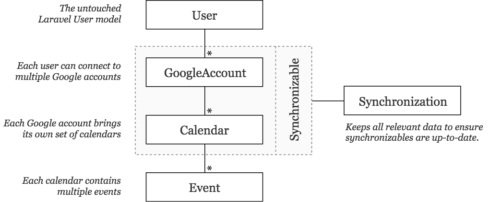
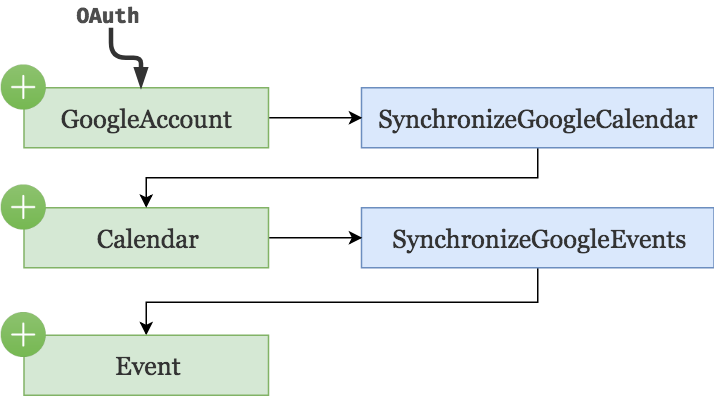
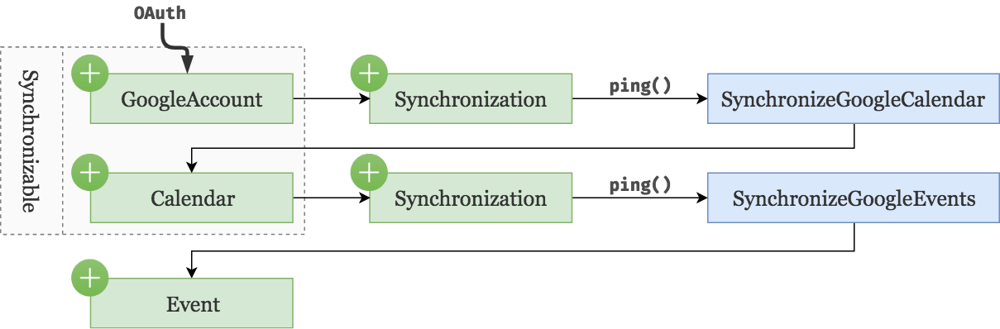
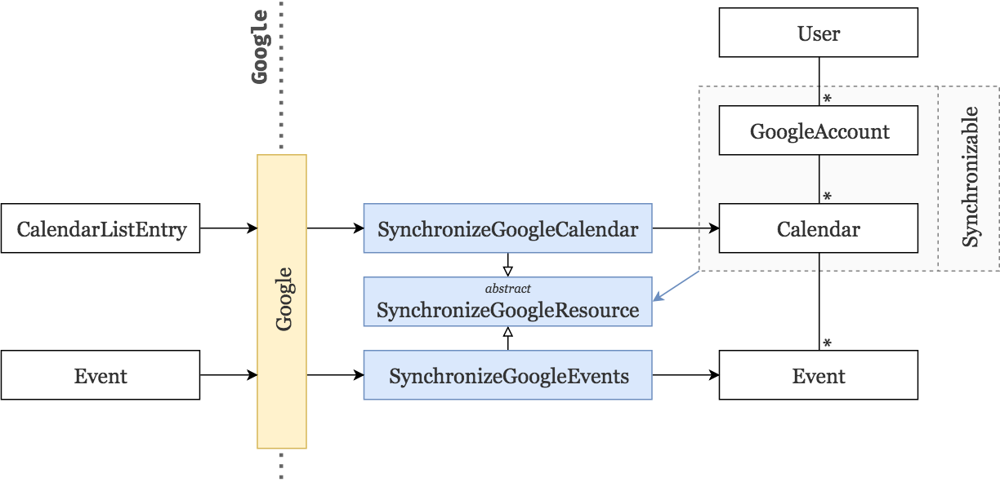

# Google Calendar part 2: Periodic synchronizations

In a [previous article](/google-calendar-part-1-integration), we've seen how to fetch all calendars and events from multiple Google accounts. However, we haven't yet made any effort to ensure this data stays up-to-date. In this article, we will introduce a new `Synchronization` model and schedule jobs to periodically synchronize our data.

## The need for a new model
Consider the following premises:

* Our `GoogleAccount` and `Calendar` models have one important thing in common: they both need to fetch and synchronize their children elements (respectively `Calendar`s and `Event`s) from the Google API.
* Keeping track of their synchronization status requires **storing additional data**. E.g. we might want to store a timestamp informing us of the last time the resource was synchronized.
* In the next article, synchronizations will encapsulate a new Google API resource called **Google Channels** in order to listen to changes via webhooks.

Therefore, it makes sense to start creating a new model called `Synchronization` that clips itself to either a `GoogleAccount` or a `Calendar`. Its job is purely to ensure the data of the associated model is up-to-date.

Since `Synchronization` models can be associated with two different models, it also makes sense to create a `Synchronizable` aggregation that regroups `GoogleAccount`s and `Calendar`s. This gives us the following updated model diagram.



## Pre-refactoring brainstorming
Before we start refactoring our current code, let's take a minute to understand:

1. How the user's data is currently fetched.
2. How we can fetch this same data using the `Synchronization` model.
3. The benefits of this new way of fetching the data.

### How the user's data is currently fetched
As you can see in the following diagram, after going through the OAuth process — i.e. registering a new Google account — it automatically calls a job that will store all associated calendars in our database. In turn, when these calendars are created, each automatically calls a job that will create all associated events in our database.



Remember, the "automatic" part occurs in the `boot` function of the `GoogleAccount` and `Calendar` model.

```php
class GoogleAccount extends Model
{
    // ...
    
    public static function boot()
    {
        parent::boot();

        static::created(function ($googleAccount) {
            SynchronizeGoogleCalendars::dispatch($googleAccount);
        });
    }
}

class Calendar extends Model
{
    // ...

    public static function boot()
    {
        parent::boot();

        static::created(function ($calendar) {
            SynchronizeGoogleEvents::dispatch($calendar);
        });
    }
}
```

### How to fetch using the `Synchronization` model
We can achieve the same results as before by delegating to the `Synchronization` model. That is, instead of letting `GoogleAccounts` and `Calendars` call the jobs that will synchronize their children elements, we simply create and associate a new `Synchronization` model. Now, every time a new `Synchronization` object is created, we can call a new `ping()` method which is responsible to start the synchronization process of its associated synchronizable.



### The benefits of this new approach
At first, this new approach might seem like an unnecessary addition of complexity. However, it gives us a significant advantage from the previous approach: a new entry point to synchronize data.


Anytime we want to synchronize the user's data, we can simply run through all of the synchronizations in our database (ignoring the underlying synchronizable) and simply `ping()` it.

In other words, we've opened a **new door for future synchronizations**. 🚪

## Synchronization model
Okay let's start with a few notes on this `Synchronization`  model:

* It will use [UUIDs](https://github.com/ramsey/uuid) instead of regular auto-increment integers. The reason behind this is that, when registering new webhook listeners in the next article, we will need a unique identifier available before storing the model. We could make it work with regular auto-increments but UUIDs will make our life a lot easier later on.
* We store a synchronization `token` provided by the Google API. More on this below.
* We store a `last_synchronized_at` datetime.
* When creating a new synchronization object, we use model listeners to automatically initialize a new randomly generated UUID and set the `last_synchronized_at` to now.
* When the synchronization object has been created, we call the `ping()` method to make sure the data is initially fetched.
* The ping method refers to the synchronizable to decide which job should be dispatched.

We start by requiring the [UUID package](https://github.com/ramsey/uuid).

```
composer require ramsey/uuid
```

Next we run `php artisan make:model Synchronization -m` to generate both the model and the migration. 

```php
class Synchronization extends Model
{
    // Tell Laravel we are not auto-incrementing.
    public $incrementing = false;

    protected $fillable = [
        'token', 'last_synchronized_at'
    ];

    protected $casts = [
        'last_synchronized_at' => 'datetime',
    ];
    
    // Ask the synchronizable to dispatch the relevant job.
    public function ping()
    {
        return $this->synchronizable->synchronize();
    }

    // Create a polymorphic relationship to Google accounts and Calendars.
    public function synchronizable()
    {
        return $this->morphTo();
    }

    // Add global model listeners
    public static function boot()
    {
        parent::boot();

        // Before creating a new synchronization,
        // ensure the UUID and the `last_synchronized_at` are set.
        static::creating(function ($synchronization) {
            $synchronization->id = Uuid::uuid4();
            $synchronization->last_synchronized_at = now();
        });
        
        // Initial ping.
        static::created(function ($synchronization) {
            $synchronization->ping();
        });
    }
}
```

```php
Schema::create('synchronizations', function (Blueprint $table) {
    $table->string('id');

    // Relationships.
    $table->morphs('synchronizable');

    // Data.
    $table->string('token')->nullable();

    // Timestamps.
    $table->datetime('last_synchronized_at');
    $table->timestamps();
});
```

Finally, don't forget to `php artisan migrate`.

<small>🐙 [See changes on GitHub](https://github.com/lorisleiva/blog-google-calendar/commit/e8ffdb52d80b73a31bc924a915d26b1fcf801daa)</small>

## Refactoring using Synchronizable
Since we've aggregated `GoogleAccount`s and `Calendar`s as synchronizables, let's create a new `Syncronizable` trait shared by both of these models. We can then use this trait to:
* Automatically create and associate a new synchronization every time a synchronizable is created.
* Provide access to the associated synchronization model.
* Delete the associated synchronization (if any) when the synchronizable is being deleted.
* Force them to implement the `synchronize` method using the abstract keyword.
* And even more in the next article.

```php
namespace App\Concerns;

trait Synchronizable
{
    // We use Laravel's naming convention "bootNameOfTheTrait"
    // to add boot logic to our synchronizables.
    public static function bootSynchronizable()
    {
        // Start a new synchronization once created.
        static::created(function ($synchronizable) {
            $synchronizable->synchronization()->create();
        });

        // Stop and delete associated synchronization.
        static::deleting(function ($synchronizable) {
            optional($synchronizable->synchronization)->delete();
        });
    }
    
    public function synchronization()
    {
        // We only expect one synchronization model per synchronizable.
        return $this->morphOne(App\Synchronization::class, 'synchronizable');
    }
    
    abstract public function synchronize();
}
```

Then, we need to tell our models to use this trait and to implement its abstract method.


```php
use App\Concerns\Synchronizable;

class GoogleAccount extends Model
{
    use Synchronizable;
    
    public function synchronize()
    {
        SynchronizeGoogleCalendars::dispatch($this);
    }
    
    // ...
}

class Calendar extends Model
{
    use Synchronizable;
    

    public function synchronize()
    {
        SynchronizeGoogleEvents::dispatch($this);
    }
    
    // ...
}
```

Finally we can remove the static `boot()` methods from those models since we've delegated that responsibility to the `Synchronization` model.

<small>🐙 [See changes on GitHub](https://github.com/lorisleiva/blog-google-calendar/commit/9e0fa4b4965695049e23944dc6041542c3935d07)</small>

## Delete on cascade issue
Currently, we've shaped our database schema so that when a Google account is deleted, it will cascade to delete its calendars which will themselves cascade to delete their events.

The issue here is that we now have a `deleting` event listener on the `Calendar` model which is not being called since the deleting happens at the database level.

To fix this, we need to make sure calendars are deleted one by one before deleting the Google account. Thus, let's add a new line in our `GoogleAccountController@destroy` action.

```php
public function destroy(GoogleAccount $googleAccount, Google $google)
{
    // Delete each calendar one by one to ensure model listeners are triggered.
    $googleAccount->calendars->each->delete();

    $googleAccount->delete();

    $google->revokeToken($googleAccount->token);

    return redirect()->back();
}
```

<small>🐙 [See changes on GitHub](https://github.com/lorisleiva/blog-google-calendar/commit/7c0fe4bcf730c47ecd1f5e6fe26e7989799a8b03)</small>

## Sync tokens
You might remember the following communication protocol between our application and the Google API from the previous article.


We saw that Google uses token based pagination and that we simply need to add the `pageToken` to our next request to continue browsing through Google resources. It turns out, there is another type of token we can leverage from: the `syncToken`.


As you can see, on the last response from Google, not only the `pageToken` is `null` (indicating the end of the pagination) but we are also given a `syncToken`. This `syncToken` is Google's way of saying: "Right, I know exactly which resources you've requested so far, just give me this token on your next request so I only send you the resources that have changed".

And fair enough, the next time we want to synchronize our data, we just go through the exact same process but we attach the `syncToken` to all of our requests.


Again, we receive a new `syncToken` at the end for the next synchronization.

Now that we are aware of this feature from the Google API, let's use it!

## Saving and using the syncToken
In this section we will make sure to keep track of the latest `syncToken` provided by Google and use it to only fetch the data that has changed.

### Update the fetching process
Since this changes the overall process of fetching data from the Google API, let's update the abstract job `SynchronizeGoogleResource`.

We are going to need access to the `Synchronization` model from this class. Therefore we need to push the synchronizable argument to the super class.

```php
abstract class SynchronizeGoogleResource
{
    protected $synchronizable;
    protected $synchronization;

    public function __construct($synchronizable)
    {
        $this->synchronizable = $synchronizable;
        $this->synchronization = $synchronizable->synchronization;
    }
    
    // ...
}
```



Next, we need to update the `handle` method. We simply provide the `token` attribute from the `Synchronization` model and store the new one at the end.

```php
public function handle()
{
    $pageToken = null;
    
    // Get the last syncToken from the synchronization model (initially null).
    $syncToken = $this->synchronization->token;
    
    $service = $this->getGoogleService();

    do {
    
        // Provide both tokens to the requests.
        $tokens = compact('pageToken', 'syncToken');
        
        $list = $this->getGoogleRequest($service, $tokens);

        foreach ($list->getItems() as $item) {
            $this->syncItem($item);
        }

        $pageToken = $list->getNextPageToken();
    } while ($pageToken);

    // When we're done, store the next syncToken and update the last_synchronized_at datetime.
    $this->synchronization->update([
        'token' => $list->getNextSyncToken(),
        'last_synchronized_at' => now(),
    ]);
}
```

### Expired syncTokens
The annoying thing is that `syncToken`s expire. If we haven't used them to synchronize our data after a little while — around one hour — they cannot be used anymore. According to the Google API we should, at this point, delete all previously fetched data from our database and start fresh — i.e. without any `syncToken`.

If we try to request data using a expired `syncToken`, we get a `Google_Service_Exception` with a 410 status code. Thus, let's make our `handle` method deal with this particular case using a try/catch.

```php
// Before (in the handle method).
$list = $this->getGoogleRequest($service, $tokens); 
```

```php
// After.
try {
    $list = $this->getGoogleRequest($service, $tokens); 

// If we catch a Google_Service_Exception with a 410 status code.
} catch (\Google_Service_Exception $e) {    
    if ($e->getCode() === 410) {    

        // Remove the synchronization's token.
        $this->synchronization->update(['token' => null]);  

        // Drop all items (delegate this task to the subclasses).
        $this->dropAllSyncedItems();    

        // Start again.
        return $this->handle(); 
    }   
    throw $e;   
}
```

We also add the abstract method `dropAllSyncedItems` to force subclasses to implement it.

### Update the subclasses
Speaking of subclasses, let's make sure we update them accordingly to our new changes.

We start by removing their constructors since the `synchronizable` argument is now given to the superclass.


We also need to rename all instances of `$this->googleAccount` and `$this->calendar` to `$this->synchronizable`.

Finally, we implement the `dropAllSyncedItems` method.

```php
// In SynchronizeGoogleCalendars
public function dropAllSyncedItems()    
{
    // Here we use `each->delete()` to make sure model listeners are called.
    $this->synchronizable->calendars->each->delete();   
}

// In SynchronizeGoogleEvents
public function dropAllSyncedItems()    
{   
    $this->synchronizable->events()->delete();  
}
```

And that's it! Now every time we `ping()` a synchronization, we will only fetch the data that has changed since the last synchronization and not everything from scratch.

Which bring us to the last part of this article: scheduling a job that periodically `ping()` our synchronizations.

<small>🐙 [See changes on GitHub](https://github.com/lorisleiva/blog-google-calendar/commit/35ea0dac6ec70fae23a84a1a2ea263029fcf4512)</small>

## Periodic synchronizations
Because of all the preliminary work we've done so far, this task is extremely simple. We create a new job using artisan `php artisan make:job PeriodicSynchronizations` which goes through our synchronizations and `ping`s them.

```php
namespace App\Jobs;

class PeriodicSynchronizations implements ShouldQueue
{
    use Dispatchable, InteractsWithQueue, Queueable, SerializesModels;

    public function handle()
    {   
        Synchronization::get()->each->ping();
    }
}
```

Then, we update our console's kernel, to schedule this job every 15 minutes.

```php
// app/Console/Kernel.php
protected function schedule(Schedule $schedule)
{
    $schedule->job(new PeriodicSynchronizations())->everyFifteenMinutes();
}
```

Done! You can see it for yourself by updating your Google events in [their application](https://calendar.google.com/) and seeing the changes replicate automatically on your application every 15 minutes. Or better yet, test it with tinker.

<small>🐙 [See changes on GitHub](https://github.com/lorisleiva/blog-google-calendar/commit/d06b8a88c91c61b813c61951040734ce7e250045)</small>


## Conclusion
In this article we've managed to extract the synchronization logic into its own model and use it to provide periodic synchronization. However, using this new synchronization/synchronizable architecture, we can go even further. Wouldn't it be nice if we didn't have to wait 15 minutes for our changes to update?

In our next article, we will see how to use Google's push notifications to obtain instant updates and how to encapsulate its logic within our existing `Synchronization` model.

⚡️ [Google Calendar part 3: Webhook synchronizations](/google-calendar-part-3-webhook-synchronizations)