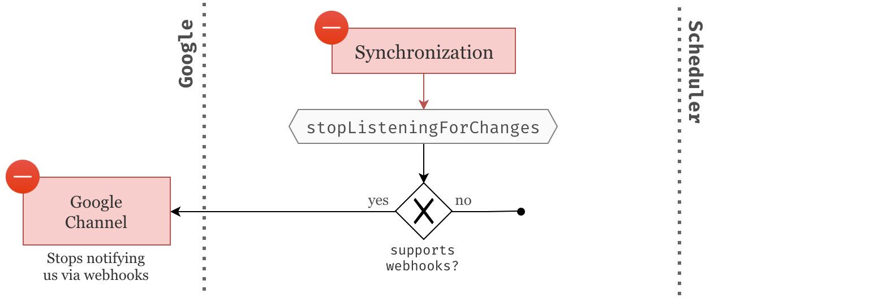
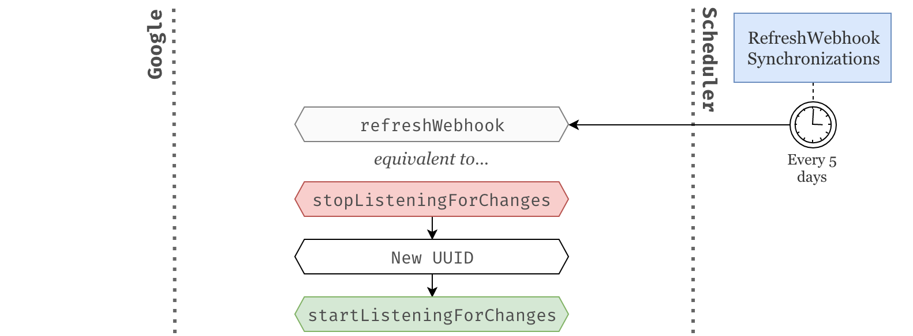
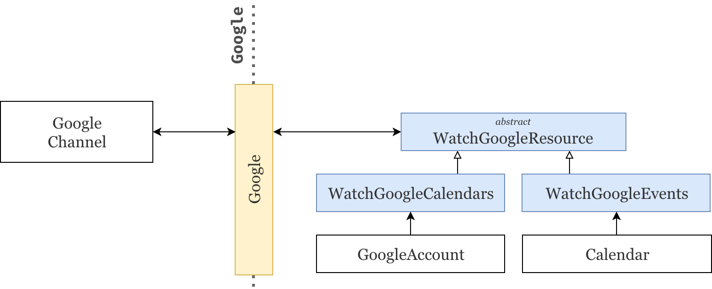
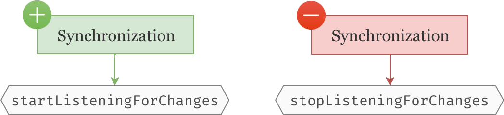
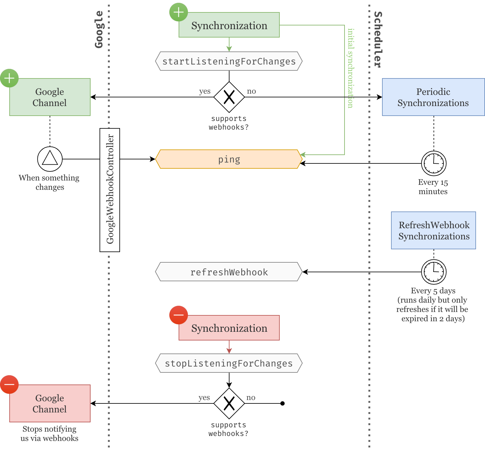

# Google Calendar part 3: Webhook synchronizations

Now that our users' calendars and events are being [fetched (part1)](/google-calendar-part-1-integration) and [periodically synchronized (part2)](/google-calendar-part-2-periodic-synchronizations), let's go one step further and ask the Google API to notify us of any changes that we should be aware of.

## Brainstorming

Let's start by working our way towards a solution that makes sense for our application without using any code.

### What we have
Currently whenever a `Synchronization` object is created, it is initially `ping`ed to ensure the data is originally fetched and then `ping`ed again every 15 minutes through the scheduled `PeriodicSynchronizations` job.


### What we want
In this article, we want to reach a point were we do not need to wait 15 minutes anymore but rather we let Google tell us when something needs to be updated.

Fortunately for us, the Google API allows webhook notifications through what they call `Google Channels`. As soon as a `Synchronization` is created, we will send a request to Google to create a new `Google Channel` specifying which resource we want to listen to and which URL we should be notified on. Once a `Google Channel` is created, it will use the provided parameters to notify us as soon as the resource is updated.

However, the way Google notifies us is very minimalistic. It does not tell us what changed exactly nor whether the resource should be deleted. All it does is call the provided URL with the resource identifier in the body of the request, basically telling us: "Look, I don't know what happened exactly but something changed with this resource". It is then our responsibility to find out what changed by making additional calls to the Google API.

At this point, the decisions made in the previous articles should start to make more sense. Google webhooks are just "update pings" which is exactly how we've structured our `Synchronization` model. Whenever a `Google Channel` is telling us that a resource was updated, all we need to do is find the appropriate `Synchronization` model and `ping()` it. That's it!


<small>We will use a dedicated `GoogleWebhookController` to listen to those Google updates. Also note that, even though we are setting up webhook notifications for resources like `GoogleAccounts` and `Calendars`, we are only dealing with `Synchronizations` which free the formers of that burden.</small>

### A hybrid solution
To make things more complicated, some Google resources do not support webhook notifications, i.e. creating a `Google Channel` for that resource will raise an exception. This is typically the case for globally shared calendars like "Public holidays in the US".

So when that happens, we will simply catch that exception and fallback to periodic synchronizations. At least our previous implementation was not done in vain.


### Stopping webhooks
Whenever a `Synchronization` is deleted, we should make sure we stop listening for changes on its associated resource. We simply do this by deleting the `Google Channel` that was created for that purpose.

Trivially if the resource does not support webhooks, no `Google Channel` was created and there is nothing to do here.



### Refreshing webhooks

One last piece of bad news: like almost everything in the Google API, `Google Channels` expire. Whenever a new `Google Channel` is created we also get an expiration timestamp that is usually about a week from now.

Therefore, we need a new job that periodically goes through each `Synchronization` associated with a `Google Channel` and refreshes the ones that are about to expire.

We refresh a synchonization by turning the webhook notifications off and on again. We also need to make sure a new UUID is provided to the `Synchronization` since the current UUID has already been used to create the previous `Google Channel`.



## Preparing for changes

### Boosting up synchronizations
Now that `Synchronizations` will be used to create `Google Channels` and associated with a particular resource identifier, we need to update its schema.

Particularly, we are going to add a `resource_id` string and a `expired_at` datetime, both provided by the newly create `Google Channel`. Since some resources don't support webhook notifications we need to make sure those new fields are `nullable`.

```php
Schema::create('synchronizations', function (Blueprint $table) {
    // ...
    $table->string('resource_id')->nullable();
    $table->datetime('expired_at')->nullable();
});
```

We also need to make sure these fields are mass-assignable and casted properly.

```php
class Synchronization extends Model
{
    protected $fillable = [
        // ...
        'resource_id', 'expired_at'
    ];

    protected $casts = [
        // ...
        'expired_at' => 'datetime',
    ];
    
    // ...
```

Finally, we refresh our database by running `php artisan migration:fresh` since we've updated our migrations.

<small>Alternatively, you can always create a new migration and run `php artisan migrate`.</small>

<small>🐙 [See changes on GitHub](https://github.com/lorisleiva/blog-google-calendar/commit/02ca77e45925782378e2646f757fa6e3a7c804c6)</small>

### Refactoring the way we access Google tokens
There is a little bit a refactoring that I think we should do before continuing. Whenever we need to make calls to the Google API through our `Google` service, we need to provide a authentication token that lives in the `GoogleAccount` model. However, `Synchronizables` can be `GoogleAccounts` but also `Calendars`. Therefore whether the `Synchronization` is associated with one or the other, it changes the way we need to access this authentication token.

Currently, we are dealing with this in the subclasses of the `SynchronizeGoogleResource` job.

```php
// app/Jobs/SynchronizeGoogleCalendars
public function getGoogleService()
{
    return app(Google::class)
        ->connectUsing($this->synchronizable->token) // Here we access the token directly.
        ->service('Calendar');
}

// app/Jobs/SynchronizeGoogleEvents
public function getGoogleService()
{
    return app(Google::class)
        ->connectUsing($this->synchronizable->googleAccount->token) // Here we access it through the googleAccount relationship.
        ->service('Calendar');
}
```

In my opinion, this is a perfectly valid place to keep that logic whithin the current state of our application. However, we are about to need more and more access to Google tokens and it seems like a good time to extract that logic into a more appropriate location.

Wouldn't it be easier if the `Google` service could take resposibility of finding the right token from a `Synchronizable`? We could have a `connectWithSynchronizable` method that simply accepts a `Synchronizable` and takes care of authenticating us to the Google API. Let's try that.

```php
class Google
{
    // ...
    
    public function connectWithSynchronizable($synchronizable)
    {
        $token = $this->getTokenFromSynchronizable($synchronizable);
        
        return $this->connectUsing($token);
    }

    protected function getTokenFromSynchronizable($synchronizable)
    {
        switch (true) {
            case $synchronizable instanceof GoogleAccount:
                return $synchronizable->token;

            case $synchronizable instanceof Calendar:
                return $synchronizable->googleAccount->token;
            
            default:
                throw new \Exception("Invalid Synchronizable");
        }
    }
}
```

<small>Note the use of `switch (true)` instead of multiple `if` statements. This trick can be useful to bring more clarity to your conditionals and display your logic in a more "pattern matching" style.</small>

We can now change the previous synchronization jobs to use this new method.

```php
// app/Jobs/SynchronizeGoogleCalendars
public function getGoogleService()
{
    return app(Google::class)
        ->connectWithSynchronizable($this->synchronizable)
        ->service('Calendar');
}

// app/Jobs/SynchronizeGoogleEvents
public function getGoogleService()
{
    return app(Google::class)
        ->connectWithSynchronizable($this->synchronizable)
        ->service('Calendar');
}
```

Since these methods are now completely identical we can delete them altogether, and push that logic to the super class. Even better, we can create a helper function on the `Synchronizable` trait that authenticates us to the Google API and returns the desired Google service.

```php
trait Synchronizable
{
    // ...

    public function getGoogleService($service)
    {
        return app(Google::class)
            ->connectWithSynchronizable($this)
            ->service($service);
    }
}
```

```php
abstract class SynchronizeGoogleResource
{
    public function handle()
    {
        // ...
        
        $service = $this->synchronizable->getGoogleService('Calendar');
        
        // ...
    }
}
```

<small>🐙 [See changes on GitHub](https://github.com/lorisleiva/blog-google-calendar/commit/9959fd34e5932b0a89c3c0defd4f0e424163430b)</small>

## Watching Google resources
We're now all ready to get started with webhook synchronizations. As we've seen in the brainstorming section, we first need to create a `Google Channel` associated with the right resource. That is:
* A `GoogleAccount` if we want to listen for changes within its calendars.
* A `Calendar` if we want to listen for changes within its events.

Similarly to the jobs responsible to synchronize calendars and events from the Google API, we will create one abstract class that describes the communication protocol of creating a new `Google Channel` and two specific sub-classes that fill the missing gaps.



### The abstract class

Let's start by defining the skeleton of the abstract class `WatchGoogleResource`. Similarly to the `SynchronizeGoogleResource`, it accepts a `Synchronizable` and forces the sub-classes to implement a `getGoogleRequest` method.

```php
namespace App\Jobs;

abstract class WatchGoogleResource
{
    protected $synchronizable;

    public function __construct($synchronizable)
    {
        $this->synchronizable = $synchronizable;
    }

    public function handle()
    {
        // Make a call to the Google API
        // to create a new Google Channel.
    }

    abstract public function getGoogleRequest($service, $channel);
}
```

Starting a webhook on a Google resource is a rather simple process, we need to:
1. Request the **creation of a Google Channel**. Since this task is delegated to the sub-classes, we simply need to give them the right data. I.e. the Google calendar service and the webhook parameters as a `Google_Service_Calendar_Channel` object — implemented in the next section.
2. Use the response to **update the synchronization model**. This part is important to ensure we can link a `resouce_id` — the only information provided by the webhooks — with the right `Synchronization`.

```php
public function handle()
{
    $synchronization = $this->synchronizable->synchronization;

    $response = $this->getGoogleRequest(
        
        // Thanks to our previous refactoring we can now grab the
        // Google Calendar service directly from the synchronizable.
        $this->synchronizable->getGoogleService('Calendar'),
        
        // We will implement this in the next section.
        // It uses the synchronization's data to create
        // a new \Google_Service_Calendar_Channel object.
        $synchronization->asGoogleChannel()
    );

    // We can now update our synchronization model
    // with the provided resource_id and expired_at.
    $synchronization->update([
        'resource_id' => $response->getResourceId(),
        'expired_at' => Carbon::createFromTimestampMs($response->getExpiration())
    ]);
}
```

However, we've seen that some resources cannot be watched via webhooks and will raise an exception if you try to create a `Google Channel` associated with them. Therefore we need to wrap all of that in a try/catch and ignore the right exception. 

```php
public function handle()
{
    try {
        // ...

    } catch (\Google_Service_Exception $e) {
        // If we reach an error at this point, it is likely that
        // webhook notifications are forbidden for this resource.
        // Instead we will sync it manually at regular interval.
    }
}
```

The synchronizations associated with resources that do not support webhook notifications will now have an empty `resource_id` and `expired_at`. Thus, we need to update our scheduled `PeriodicSynchronizations` job to only `ping()` the synchronizations without a `resource_id`.

```php
class PeriodicSynchronizations implements ShouldQueue
{
    // ...

    public function handle()
    {   
        Synchronization::whereNull('resource_id')->get()->each->ping();
    }
}
```

### From synchronizations to channels

As mentioned above, a `Google_Service_Calendar_Channel` object is required to start a webhook. This object accepts four parameters:
* A unique `id` within the scope of our application. We can provide whatever we want but the same `id` can never *ever* be used twice. Using UUIDs instead of auto-incremented integers makes this task a lot easier.
* A `resourceId` if the synchronization already has an associated `Google Channel`. At first — when starting a new webhook — this will be `null` and therefore can be ignored. However, this will be useful later on when we need to stop the webhook.
* A `type` which simply needs to be `"web_hook"`.
* Finally, the `address` we want Google to use to notify us. In our case, we've already defined this in the configurations in [part 1](/google-calendar-part-1-integration#googleasaservice) of this series.

```php
class Synchronization extends Model
{
    // ...

    public function asGoogleChannel()
    {
        return tap(new \Google_Service_Calendar_Channel(), function ($channel) {
            $channel->setId($this->id);
            $channel->setResourceId($this->resource_id);
            $channel->setType('web_hook');
            $channel->setAddress(config('services.google.webhook_uri'));
        });
    }
}
```

### The sub-classes
Now that the main communication protocol has been established, we simply need to create two sub-classes that fill the missing pieces, i.e. implement the `getGoogleRequest` method. A quick browse through the Google API and we're good to go.

```php
class WatchGoogleCalendars extends WatchGoogleResource implements ShouldQueue
{
    use Dispatchable, InteractsWithQueue, Queueable, SerializesModels;
    
    public function getGoogleRequest($service, $channel)
    {
        return $service->calendarList->watch($channel);
    }
}
```

```php
class WatchGoogleEvents extends WatchGoogleResource implements ShouldQueue
{
    use Dispatchable, InteractsWithQueue, Queueable, SerializesModels;

    public function getGoogleRequest($service, $channel)
    {
        return $service->events->watch(
            $this->synchronizable->google_id, $channel
        );
    }
}
```

<small>🐙 [See changes on GitHub](https://github.com/lorisleiva/blog-google-calendar/commit/3e75ff9458d3f25ce37d9d2e9ab3d6816017801e)</small>

## Controlling webhooks
In this section we will add some logic to the `Synchronization` model and the `Synchronizable` trait in order to start, stop and refresh webhooks.

### Start


Most of the work has been done here. All we need is a nice way to call the relevant `WatchGoogleXXX` jobs. We will use a similar approach to the way we currently call the `SynchronizeGoogleXXX` jobs.

First, we implement our starting point `startListeningForChanges` which delegates to the associated `Synchronizable`.

```php
class Synchronization extends Model
{
    // ...
    
    public function startListeningForChanges()
    {
        return $this->synchronizable->watch();
    }
}
```

Next, we force synchronizables to implement this `watch` method.

```php
trait Synchronizable
{
    // ...
    
    abstract public function watch();
}
```

Finally, we implement it for the `GoogleAccount` and `Calendar` models.

```php
class GoogleAccount extends Model
{
    // ...

    public function watch()
    {
        WatchGoogleCalendars::dispatch($this);
    }
}
```

```php
class Calendar extends Model
{
    // ...

    public function watch()
    {
        WatchGoogleEvents::dispatch($this);
    }
}
```

### Stop


Stopping a webhook is relatively simple and always done via the same endpoint. Therefore there is no need to create yet another set of jobs for this purpose.

```php
class Synchronization extends Model
{
    // ...

    public function stopListeningForChanges()
    {
        // If resource_id is null then the synchronization
        // does not have an associated Google Channel and
        // therefore there is nothing to stop at this point.
        if (! $this->resource_id) {
            return;
        }

        $this->synchronizable
            ->getGoogleService('Calendar')
            ->channels->stop($this->asGoogleChannel());
    }
}
```

### Event listeners



Let's now add some event listeners on the `Synchronization` model so that it starts the webhook upon creation and stops it upon deletion.

```php
class Synchronization extends Model
{
    public static function boot()
    {
        // ...

        // We start the webhook (if possible) as soon
        // as the synchronization is created and
        // perform an initial synchronization.
        static::created(function ($synchronization) {
            $synchronization->startListeningForChanges();
            $synchronization->ping();
        });

        // We stop the webhook (if applicable) right
        // before the synchronization is deleted.
        static::deleting(function ($synchronization) {
            $synchronization->stopListeningForChanges();
        });
    }
}
```

### Refresh


Since webhooks expire, we need to have a way of refreshing them. This is as simple as stoping and restarting the webhook except that, before starting it again, we need to generate a new synchronization UUID.

```php
class Synchronization extends Model
{
    // ...

    public function refreshWebhook()
    {
        $this->stopListeningForChanges();

        // Update the UUID since the previous one has 
        // already been associated to a Google Channel.
        $this->id = Uuid::uuid4();
        $this->save();

        $this->startListeningForChanges();

        return $this;
    }
}
```

Finally, let's create a new scheduled job — `php artisan make:job RefreshWebhookSynchronizations` — to monitor webhook synchronizations and make sure they are refreshed before they expire.

We select every synchronization that has a `resource_id` — i.e. an associated `Google Channel` — and an `expired_at` that is about to expire — i.e. will be expired two days from now. We then call `refreshWebhook()` on all of these synchronizations.

```php
class RefreshWebhookSynchronizations implements ShouldQueue
{
    use Dispatchable, InteractsWithQueue, Queueable, SerializesModels;

    public function handle()
    {
        Synchronization::query()
            ->whereNotNull('resource_id')
            ->whereNull('expired_at')
            ->orWhere('expired_at', '<', now()->addDays(2))
            ->get()
            ->each->refreshWebhook();
    }
}
```

We will run this job daily to make sure we never reach a state were a synchronization has expired.

```php
// app/Console/Kernel.php
protected function schedule(Schedule $schedule)
{
    $schedule->job(new PeriodicSynchronizations())->everyFifteenMinutes();
    $schedule->job(new RefreshWebhookSynchronizations())->daily();
}
```

<small>🐙 [See changes on GitHub](https://github.com/lorisleiva/blog-google-calendar/commit/0f853f7d3e705acf02fe3ee7cb4e963215c4cd94)</small>

## The webhook controller
We're getting there! We now just need to make sure we create the endpoint that Google will use to notify us.

We start by registering the route. Note that Google will use the `POST` method to notify us.

```php
// ...

Route::name('google.webhook')->post('google/webhook', 'GoogleWebhookController');
```

Next we create a new invokable controller — i.e. that contains only one method.

`php artisan make:controller GoogleWebhookController -i`

We then define the action of that controller. It will try to find the synchronization that matches the paramaters provided by Google. If no synchronization was find it will throw a 404, otherwise it will `ping()` it.

```php
class GoogleWebhookController extends Controller
{
    public function __invoke(Request $request)
    {
        // Webhooks can have two states `exists` or `sync`.
        // `sync` webhooks are just notifications telling us that a
        // new webhook has been created. Since we already performed
        // an initial synchronization we can safely ignore them.
        if ($request->header('x-goog-resource-state') !== 'exists') {
            return;
        }

        Synchronization::query()
            ->where('id', $request->header('x-goog-channel-id'))
            ->where('resource_id', $request->header('x-goog-resource-id'))
            ->firstOrFail()
            ->ping();
    }
}
```

We also need to remember to exclude this route from CSRF verification since it is registered in the `web` group middleware.

```php
// app/Http/Middleware/VerifyCsrfToken.php
class VerifyCsrfToken extends Middleware
{
    protected $except = [
        'google/webhook',
    ];
}
```

<small>🐙 [See changes on GitHub](https://github.com/lorisleiva/blog-google-calendar/commit/5a42e4ede72efb7ec809af0628ef845f394ac8e0)</small>

## Last details

### Domain verification
You've probably already gone through the domain verification process in part 1 of this series. This allows you to whitelist your application domain and prove that you own it so that Google can start sending webhook notifications.

* If you have gone through all of it in the first article, **just skip to the next section**.
* [If you have gone through setting up the Google API credentials but not domain verification, click here.](https://gist.github.com/lorisleiva/36c0173ddf082f1495d25aca119ace7e#domain-verification)
* [If you haven't gone through any of that process, click here.](https://gist.github.com/lorisleiva/36c0173ddf082f1495d25aca119ace7e)

<small>If you're having troubles with Google's webhooks, make sure your `APP_URL` is using `https` as Google will not notify you on an unsecure URL.</small>

### Asynchronous jobs with Laravel Horizon

Since we are now making a significant amount of calls to the Google API after registering a new Google account, it would be more efficient to install Laravel Horizon and let those jobs run asynchronously after the Google account has been created. That way, the user does not have to wait a few seconds before the page can finally load.

```bash
# Install and configure horizon.
composer require laravel/horizon
php artisan vendor:publish --provider="Laravel\Horizon\HorizonServiceProvider"

# Keep track of failed jobs.
php artisan queue:failed-table
php artisan migrate

# Start horizon (or create a deamon).
php artisan horizon
```

```bash
# Update the queue drive in your .env file.
QUEUE_DRIVER=redis
```

<small>I'm assuming you're familiar with Laravel Horizon, otherwise its [documentation](https://laravel.com/docs/5.7/horizon) is very nice and clear as usual.</small>

<small>🐙 [See changes on GitHub](https://github.com/lorisleiva/blog-google-calendar/commit/31d4139b09bf38f58ad809068826f05411430147)</small>

## Final result
We did it! We now receive instant notifications from Google when something gets updated in your users' calendars and events. Here is a quick preview:


And here is an overview of the `Synchronization` life cycle.



## Conclusion
I hope you liked this series and that you can see a whole new set of possibilities to add to your applications. ✨

I will very likely continue adding articles to this series so feel free to share any ideas of followed-up articles.