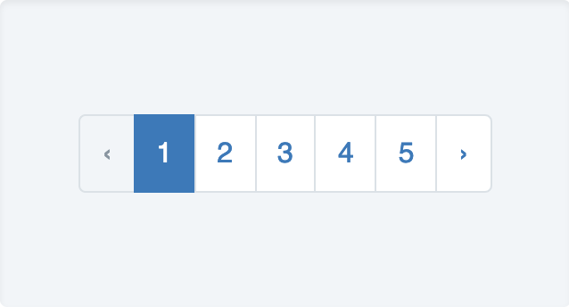
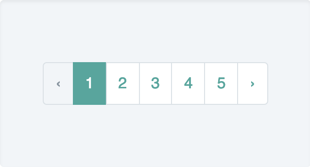
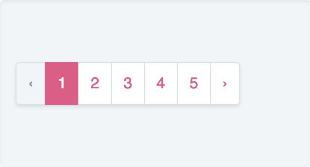
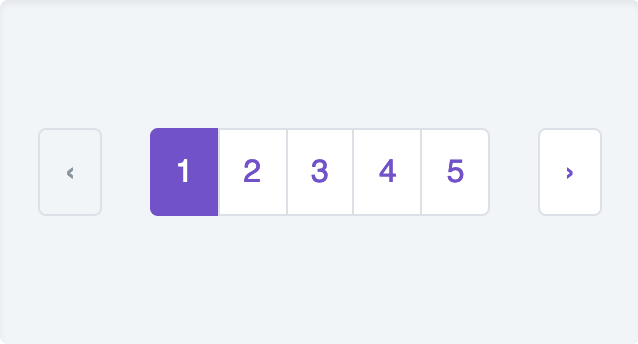
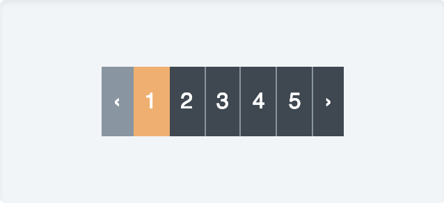
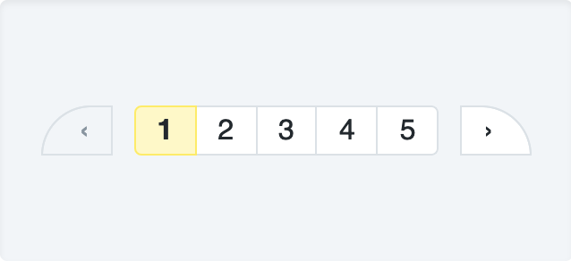

# Laravel pagination with TailwindCSS

If you’re familiar with Laravel you’re likely aware of it’s amazing pagination system.

You just terminate your query builder with `->paginate()` and you get a special object that can be used directly in your blade templates to generate some pagination links:

```php
{{ $items->links() }}                           // Default template
{{ $items->links('pagination::bootstrap-4') }}  // If you're using Bootstrap
{{ $items->links('pagination::semantic-ui') }}  // If you're using Semantic UI
```

However if you’re using TailwindCSS, there is no out-of-the-box pagination component that you can just plug and play — that would defeat its purpose.

At first, you might be tempted to publish the views, copy/paste one of the existing templates and rewrite it using TailwindCSS. Or even start with some template written by the community.

The trouble with this approach is that those pagination templates define various elements that need to be styled slightly differently whilst all being siblings of each other. If you want to be creative with your pagination you’re going to need the `$loop` variables involved in your TailwindCSS classes. For having done that a couple of times, I can assure you, you’re going to wish there was another solution.

## Another solution
Okay so instead of trying to create a new template that uses TailwindCSS, why don’t we use the default template and let TailwindCSS do the work by adding a pagination plugin.

```sh
npm i tailwindcss-plugins -D
```

Register the plugin in your tailwind configurations.

```js
plugins: [
    require('tailwindcss-plugins/pagination')({
        /* Customizations here... */
    }),
],
```

You can now display your Laravel pagination links without having to worry about creating a new template.

```php
{{ $items->links() }}
```


<GithubButton url="https://github.com/lorisleiva/tailwindcss-plugins/tree/master/pagination" title="Pagination plugin on GitHub"></GithubButton>

## Customizations
Whilst that's nice and simple, you’re very likely going to want to customize the design of those pagination links to match the style of your application.

This pagination plugin allows you to override all aspects of its design by either providing CSS-in-JS or a simple list of TailwindCSS classes. Alternatively you can change the color of the default the design.

Here are some examples of plugin configurations with their results.

<div class="-mb-12 z-10 text-center">
    
</div>

```php
{}
```

<div class="-mb-12 z-10 text-center">
    
</div>

```php
{
    color: colors['teal-dark'],
}
```

<div class="-mb-12 z-10 text-center">
    
</div>

```php
{
    color: colors['pink-dark'],
    wrapper: 'inline-flex list-reset shadow rounded'
}
```

<div class="-mb-12 z-10 text-center">
    
</div>

```php
{
    color: colors['purple-dark'],
    linkFirst: 'mr-6 border rounded',
    linkSecond: 'rounded-l border-l',
    linkBeforeLast: 'rounded-r border-r',
    linkLast: 'ml-6 border rounded',
}
```

<div class="-mb-12 z-10 text-center">
    
</div>

```php
{
    color: colors['orange-light'],
    link: 'bg-grey-darkest py-4 px-2 border-r border-grey-dark text-white no-underline',
    linkHover: 'bg-grey-dark',
    linkDisabled: 'bg-grey-dark',
    linkFirst: null,
    linkLast: 'border-0',
}
```

<div class="-mb-12 z-10 text-center">
    
</div>

```php
{
    link: 'bg-white px-3 py-1 border-r border-t border-b text-black no-underline',
    linkActive: 'bg-yellow-lighter border-yellow font-bold',
    linkSecond: 'rounded-l border-l',
    linkBeforeLast: 'rounded-r',
    linkFirst: {
        '@apply mr-3 pl-5 border': {},
        'border-top-left-radius': '999px',
    },
    linkLast: {
        '@apply ml-3 pr-5 border': {},
        'border-top-right-radius': '999px',
    },
}
```

## Conclusion
Since TailwindCSS was first released, it has taken over the why I design my applications for the best. Every step towards making TailwindCSS easier to integrate with Laravel is a win in my book. I hope this was a win for you too. Enjoy 😘

<GithubButton url="https://github.com/lorisleiva/tailwindcss-plugins/tree/master/pagination" title="Pagination plugin on GitHub"></GithubButton>