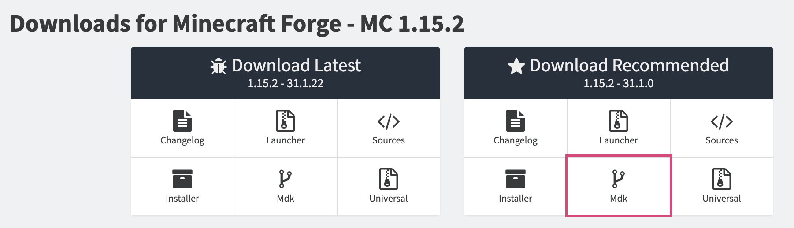
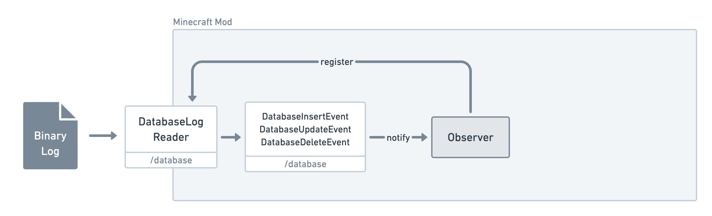
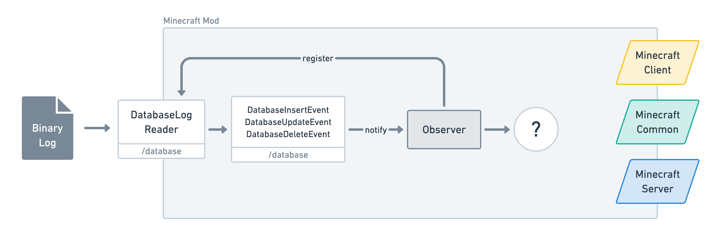
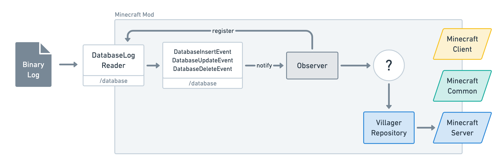
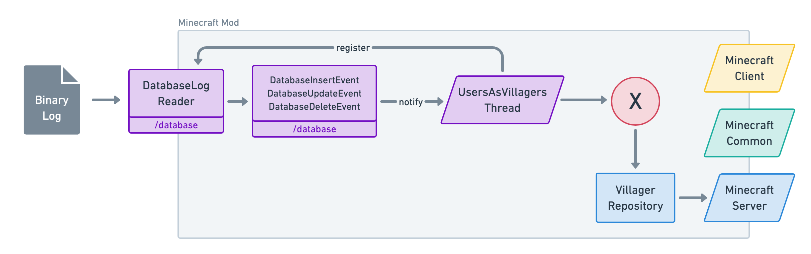
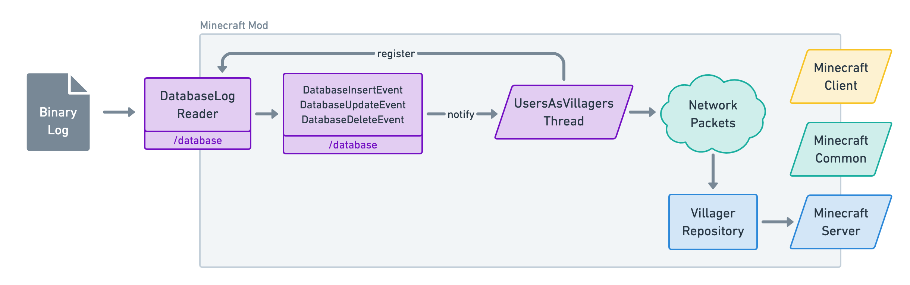
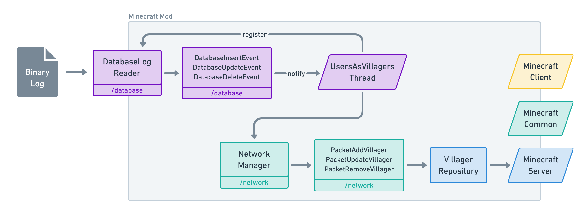
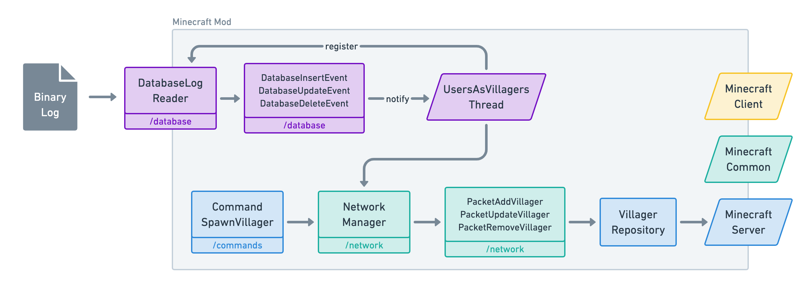

# Visualise your users as Minecraft villagers

In this tutorial, we are going to listen for real-time changes in our database and use that information to create or delete villagers in Minecraft. Before we get started, let's have a quick look at the result.

<YouTube url="https://www.youtube.com/embed/WmV03rvS_us" />

## Listening for database changes

We are going to use MySQL replication to listen to real-time changes in our database.

MySQL replication allows one MySQL _Master_ server to be asynchronously copied into different MySQL _Slave_ servers. It works like this:
- The MySQL _Master_ server writes entries in a _Binary Log_ every time something changes in the database (inserts, updates and deletes).
- The MySQL _Slave_ servers listen to that _Binary Log_ and reproduce the events to end up in the same state as the _Master_ server.


However, in our case, we don't need to replicate our MySQL database. All we want is for the database to output this _Binary Log_ so that we can listen to real-time changes.

Thus, instead of having MySQL _Slave_ servers reading the _Binary Log_, it will be our _Minecraft Mod_ (i.e. Minecraft extension) that will be reading it.


## How to set up MySQL replication

To enable MySQL replication such that it outputs a _Binary Log_, simply add the following configurations to your MySQL config file. In my case (MySQL installed via `brew` on Mac), this file is located at `/usr/local/etc/my.cfg`.

```sh
# /usr/local/etc/my.cfg
[mysqld]
server-id = 1
log_bin = /usr/local/var/log/mysql/mysql-bin.log
expire_logs_days = 10
max_binlog_size = 100M
binlog-format = row
```

The `log_bin` option should point to your MySQL log folder. In my case, this folder did not already exist so I had to `mkdir /usr/local/var/log/mysql`.

Next, restart your MySQL server. In my case, `brew services restart mysql`.

And that's it! Now if everything went well you should see this when running `mysql -uroot -e 'show variables like "%log_bin%";'`.

```
+---------------------------------+------------------------------------------+
| Variable_name                   | Value                                    |
+---------------------------------+------------------------------------------+
| log_bin                         | ON                                       |
| log_bin_basename                | /usr/local/var/log/mysql/mysql-bin       |
| log_bin_compress                | OFF                                      |
| log_bin_compress_min_len        | 256                                      |
| log_bin_index                   | /usr/local/var/log/mysql/mysql-bin.index |
| log_bin_trust_function_creators | OFF                                      |
| sql_log_bin                     | ON                                       |
+---------------------------------+------------------------------------------+
```

Please note that a lot of things can go wrong here. Each MySQL set up is different so you might need to provide a different log folder or even give replication privileges to a MySQL user. Fortunately, [this article from Pusher](https://pusher.com/tutorials/realtime-mysql-java#configuring-mysql-replication) explains this set up into more details and provides the default values for Windows and Linux. I strongly recommend reading it if you're stuck.

## Into the world of Minecraft Mods

Now that we have our MySQL replication ready, let's have a little introduction on Minecraft Mods.

A _Minecraft Mod_ is a Minecraft extension that one can code in **Java** using the [Minecraft Forge](http://files.minecraftforge.net/) API.

The _Minecraft Forge_ API is not an official API but it is widely used by Minecraft developers as Minecraft is not 100% open-source. _Minecraft Forge_ is extremely useful since it provides an encapsulation of the entire Minecraft ecosystem by decompiling the private parts of Minecraft and combining them with the open-source parts of Minecraft.

Now, explaining how to write your first Minecraft Mod from scratch is a long process that would take all of the focus away from this article. Furthermore, the _Minecraft Forge_ API changes slightly at every new major version of Minecraft so learning how to Mod requires to always check the latest tutorials available. For these reasons, I'm going to through the **set up points** very quickly and provide some **additional content** if you'd like to dig more into it.

Finally note that, even if you have zero experience with Java or Minecraft Mods, I will make sure you can follow the rest of the article by explaining things at a high-level and providing some code to review for the more curious.

### Setting up your first Minecraft Mod
- Install [Java 8](https://www.oracle.com/java/technologies/javase-jdk8-downloads.html) or another version below Java 11.
- Install [IntelliJ IDEA Community Edition (Free)](https://www.jetbrains.com/idea/download) or use [Eclipse (Free)](https://www.eclipse.org/downloads/packages/) if you already have it installed.
- [Download the latest MDK from Minecraft Forge](http://files.minecraftforge.net/). Under the "Download Recommended" panel, choose the "Mdk" button. (In my case, that was version `1.15.2 - 31.1.0`). \
    &nbsp;\
    
- Unzip the MDK, rename the folder to whatever you want and place it in your Code directory.
- Launch _IntelliJ IDEA_ and open your project with it.
- Because the MDK uses _Gradle_ (a task manager for Java — similar to Gulp or Webpack), _IntelliJ IDEA_ should automatically recognise the tasks to call to initialise the project and you should already be ready to get started.
- In my case, the _Gradle_ tasks were not working because the MDK shipped with _Gradle_ `4.9` and it needed `5.0`. After upgrading the version in `gradle/wrapper/gradle-wrapper.properties`, everything worked.

```diff
- distributionUrl=https\://services.gradle.org/distributions/gradle-4.9-bin.zip
+ distributionUrl=https\://services.gradle.org/distributions/gradle-5.0-bin.zip
```

### Additional content for learning how to Mod
- [The Minecraft Forge official documentation](https://mcforge.readthedocs.io/en/latest/gettingstarted/).
- [The Minecraft Forge Modder support](https://www.minecraftforge.net/forum/forum/70-modder-support/).
- [The Grey Minecraft Coding blog](https://greyminecraftcoder.blogspot.com/p/list-of-topics-1144.html). I strongly recommend the first three articles.
    - [The Client-Server division](http://greyminecraftcoder.blogspot.com/2020/02/the-client-server-division-1144.html).
    - [How Forge start up your code](http://greyminecraftcoder.blogspot.com/2020/02/how-forge-starts-up-your-code-1144.html).
    - [Minecraft Distributions](http://greyminecraftcoder.blogspot.com/2020/02/minecraft-distributions-client-vs.html).
- [Youtube Tutorial from Jorrit Tyberghein](https://wiki.mcjty.eu/modding/index.php?title=YouTube-1.14). The final result is [available on GitHub](https://github.com/McJty/YouTubeModding14).
- [Cadiboo/Example-Mod (Example Mod)](https://github.com/Cadiboo/Example-Mod). This is my personal favourite. I've learned a lot from reading that Mod.
- [TheGreyGhost/MinecraftByExample (Example Mod)](https://github.com/TheGreyGhost/MinecraftByExample).
- [Beardlessbrady/Currency-Mod (Example Mod)](https://github.com/Beardlessbrady/Currency-Mod).
- [BigBadE/BattlePets (Example Mod)](https://github.com/BigBadE/BattlePets).

## Reading the Database log

Okay, now we're ready to code something in our Mod. Let's start with the part that listens for database changes.

Furtunately for us, there is [a Java library](https://github.com/shyiko/mysql-binlog-connector-java) that already does this for us. All we need to do is add it to our dependencies in our `build.gradle` file.

```diff
 // ... 

 dependencies {
     minecraft 'net.minecraftforge:forge:1.15.2-31.1.18'
+    compile 'com.github.shyiko:mysql-binlog-connector-java:0.20.1'
 }
```

Because the API provided by this library is quite low-level, I've created a `database` folder (or package — as they call it in the Java world) that encapsulate the logic of that library in a `DatabaseLogReader` class that can notify any observer of insertions, updates and/or deletions.

<GithubButton url="https://github.com/lorisleiva/minecravel/tree/5e4023f1812f15122397c51c0fe8a57eacaa4798/src/main/java/com/lorisleiva/minecravel/database" title="See Database package"></GithubButton>



Remember, the _Binary Log_ is being updated in real-time by our MySQL server,


## Minecraft Server vs Client

Next, to understand who needs to be the _Observer_ for the `DatabaseLogReader`, we need to talk about the two sides of Minecraft: Server versus Client.

- The Minecraft Client is responsible for rendering a Graphic User Interface (GUI) and reading input from the player.
- The Minecraft Server is responsible for maintaining a master copy of the world (i.e. a source of truth) and send updated information to the client(s).

This is very similar to the world of Web development. For example, you have your VueJS application (_Client_) communicating to your Laravel API (_Server_).
However, in game developement, these two cannot be so separated. Imagine if every single time you did an action in a game (e.g. walk), you had to wait for the server to receive your request before making a new action (e.g. continue to walk). That would be extremely frustrating.

That's why, in Minecraft, each _Client_ also have their own little _Local Server_ running along with them whose purpose is to eventually be in sync with the real Server. Which mean we have to make the distinction between a _Physical_ client/server and a _Logical_ client/server.

|   | Physical Client | Physical Server |
| - | --------------- | --------------- |
| Logical Client | **The** Client | - |
| Logical Server | Local Server | **The** Server |

In Minecraft, we call a Physical Client a _Combined Client_ and a Physical Server a _Dedicated Server_. Also note that in Single-Player mode, we don't even need a _Dedicated Server_ since we don't need to maintain a "Master copy of the world" for multiple players (i.e. the _Local Server_ take on that role).

<small>You can read more about this [here](http://greyminecraftcoder.blogspot.com/2020/02/the-client-server-division-1144.html) and [here](http://greyminecraftcoder.blogspot.com/2020/02/minecraft-distributions-client-vs.html).</small>

Now, why do we need to know all of this? Because we need to understand that the Minecraft game has two _Logical_ threads: a _Minecraft Client_ thread and a _Minecraft Server_ thread. But these two threads are very often running the same code which is referred to as _Common Code_. This enables the Client and the Server to be in sync when they need to be and share the same API.

Now that we know all this, which "side" should our observer communicate to in order to generate Villagers?



We could use the _Common_ side since both the Server and Client sides have an understanding of the `World` and its `Entities` (i.e. Villagers, Players, Mobs, etc.). However, this means for every notification that we receive from our `DatabaseLogReader`, we will need to notify both the Server and the Client(s).

Since, at the end of the day, all we want to do is spawn and despawn villagers, notifying the Server only is good enough since the Server will then work its magic to eventually ensure the Client(s) are in sync.

Okay so let's make it happen. We create a new `VillageRepository` that accepts a `ServerWorld` and encapsulate the logic of spawning and despawning villagers.

<GithubButton url="https://github.com/lorisleiva/minecravel/blob/5e4023f1812f15122397c51c0fe8a57eacaa4798/src/main/java/com/lorisleiva/minecravel/VillagerRepository.java" title="See VillageRepository"></GithubButton>




## Observing asynchronously

Okay so now, all we need to do is implement an asynchronous Java thread `UsersAsVillagersThread` whose entire responsibility is to listen to the `DatabaseLogReader` and call the `VillageRepository` when it gets notified.



Sadly, asynchronous threads cannot access the Minecraft API directly. If you try to do so, it will raise a `NullPointerException` and the game will crash.

Fortunately, the Minecraft Forge API provides a convenient _Network_ package for both the Server side and the Client side. This enables us to create custom communication between the Server and the Client but also from other asynchronous threads.

So instead of directly accessing the `VillagerRepository` from the `UsersAsVillagersThread`, we simply need to send a _Network Packet_ to the Server and let it handle that for us.

<GithubButton url="https://github.com/lorisleiva/minecravel/blob/5e4023f1812f15122397c51c0fe8a57eacaa4798/src/main/java/com/lorisleiva/minecravel/UsersAsVillagersThread.java" title="See UsersAsVillagersThread"></GithubButton>



## Communicating via Network packets

Concretely, this means we need a new `network` package that defines three new types of _Network Packets_:
- `PacketAddVillager`
- `PacketUpdateVillager`
- `PacketRemoveVillager`

And a `NetworkManager` class to register them.

<GithubButton url="https://github.com/lorisleiva/minecravel/tree/5e4023f1812f15122397c51c0fe8a57eacaa4798/src/main/java/com/lorisleiva/minecravel/network" title="See Network package"></GithubButton>



## Commands as a way to debug

You might have noticed a `commands` package in the repository. Commands in Minecraft are instructions that a Player can give directly in the in-game chat. For example, you can change the time to midday by running the following native command: `/time set 6000`.

Since commands are easy to set up within the Minecraft Forge API, it can be a great way to debug your Mods. For example, I created this `CommandSpawnVillager` that allows a player to run `/villager John Doe` to spawn a villager at their position named "John Doe". Once I knew this command was working, I was confident enough to work on other parts of the code.

<GithubButton url="https://github.com/lorisleiva/minecravel/blob/5e4023f1812f15122397c51c0fe8a57eacaa4798/src/main/java/com/lorisleiva/minecravel/commands/CommandSpawnVillager.java" title="See CommandSpawnVillager"></GithubButton>



## Conclusion

Minecraft Modding is not for the faint-hearted. We don't have an official API or exhaustive documentation we can refer to like we can in Laravel. It can be very frustrating at times but the results are incredibly rewarding.

Even though I hadn't touched a Java program for years, it felt good being out of my comfort zone and experimenting with new language features and new APIs. Staying too long in the comfort zone of a tech stack is good for developing expert skills but can also bring some monotony. I strongly recommend to break that monotony from time to time and just program things because you can and have fun doing it. That's what originally made us fall in love with programming.

Back to our little "Users as villagers" project, there are still a lot of things we could do to improve it. I will write down some ideas that I might toy with in the future or just leave as an "exercise".
- Use a `date_of_birth` database column to spawn a baby villager instead of a regular villager if the user is under 18 years old.
- Use a `role` database column to define the Biome of the villager (e.g. `admin` → Savana, `moderator` → Taiga, `user` → Plains, etc.). 
- Use an `industry` database column to define the Job of the villager (`null` → Unemployed, `agriculture` → Farmer, `medical` → Cleric, etc.)
- Ensure villagers cannot breed or be killed otherwise they will be inconsistent with the database state.

<GithubButton url="https://github.com/lorisleiva/minecravel" title="See full project on GitHub"></GithubButton>
