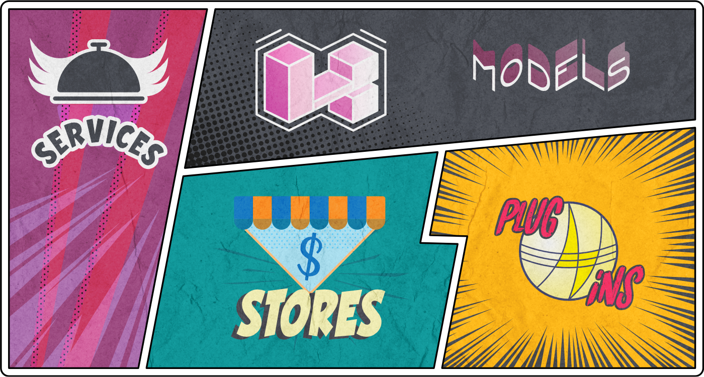
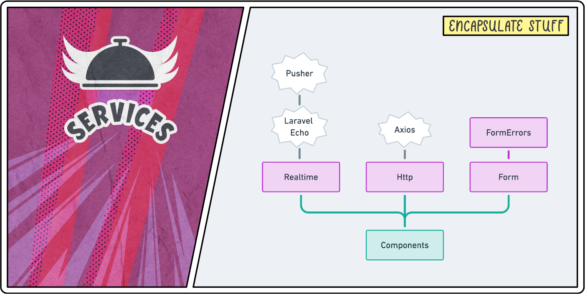
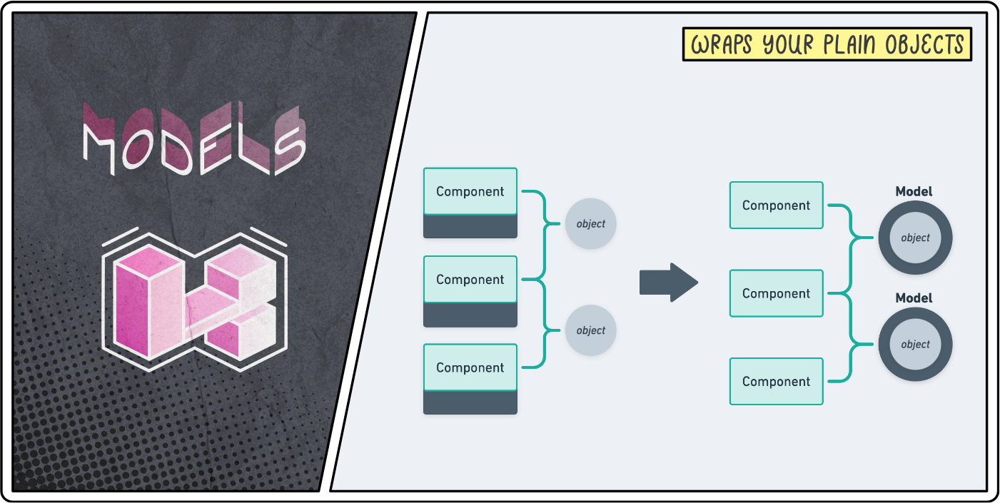
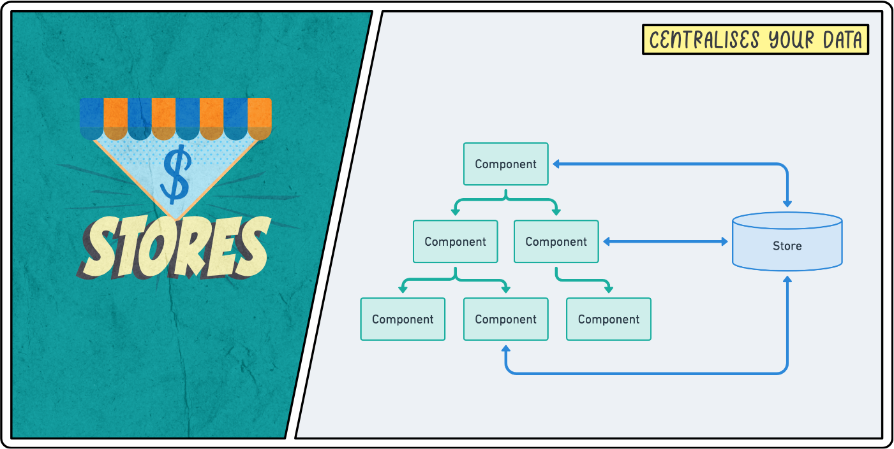
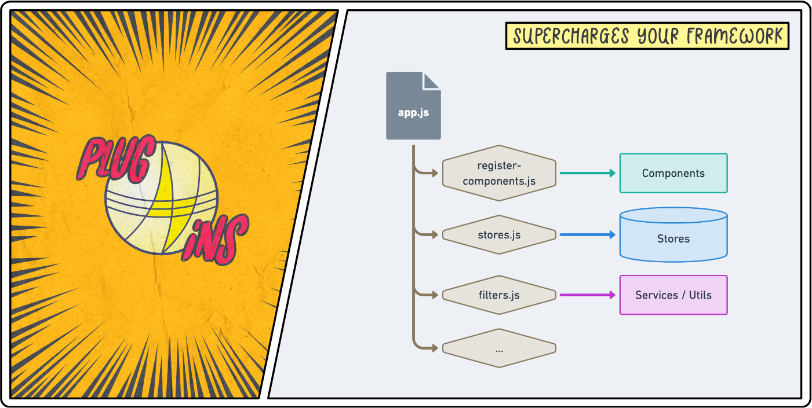

## Introduction
In an era where developers are trying to run away from JavaScript by using tools like LiveWire, I decided to put together an article that I hope will help developers make peace with the frontend world.

There are certainly valid use cases where a JavaScript framework is not needed and tools like Alpine and LiveWire make total sense. However, making the switch to an almost-no-js environment undeniably comes with its own set of technical debt.

When [Sam](https://twitter.com/slashequip) and I started creating [Octohook](https://octohook.com), we immediately followed the LiveWire hype train. We thought: "we don't need too much frontend magic, all we need is a few modals and some tab navigation". After less than a month we started spending days implementing fairly trivial frontend tasks that would have taken a few hours with a JavaScript framework. It had literally become the bottleneck of most new features. A few weeks later, we had enough and reverted everything to use VueJs within blade.

After an entire weekend of copy/pasting some code from old side projects, I finally felt like I had control over my frontend. And whilst Single-File-Components in VueJs are great, they can only be partially credited for that success.

The real heroes are the various patterns I added to my `js` folder in order to remove some of the burden from my VueJs components.

In this article, I'd like you to meet these heroes.

## We can be heroes 🦸‍♂️ 
<small>...and not just for one day.</small>



Meet our 4 new heroes: Services, Models, Stores and Plugins.

The first thing to note here is that everything will be homemade. None of these patterns are difficult to implement from scratch and we want to use them to clean our frontend and encapsulate the outside world. Adding more libraries to do this feels like an anti-pattern to me. Additionally, most libraries will try to create a one-size-fit-all solution that ends up not really fitting anyone and requires adjustments to make it work. I have actually created such library for one of these patterns that I, myself, never use on any of my projects because it's just overkill most of the time (more on that later). Let's keep things clean, simple and adequate.

Another thing to note is: this is how I ended up thriving and maintaining complexity in the frontend world but things might be different for you. Don't see this as a universal way to assemble your frontend but as me sharing my frontend heroes so you can be inspired to create your own.

Finally, I will assume your stack is Laravel and VueJs. If it's not, you can still follow along and learn some nice vanilla JavaScript tips but this is the stack that I feel most comfortable with and end up writing about.

At the end of the day this article is all about relieving our final "Components" hero from most of the frontend complexity so it can focus on its children.


<small>I admit, I might have gone over the top with that superhero thing. 😅</small>

## Services

Let start with the simplest and most obvious hero but nonetheless a very important one.



Services are very common in the backend world but for some reasons we tend to ignore them in the `js` folder of our Laravel projects. We use `axios`, `lodash`, `moment`, and more without any encapsulation throughout our code.

Perhaps we're so used to these APIs that we see them more as part of the JavaScript language rather than as the libraries that they are.

Nevertheless, wrapping these libraries in services will:
* **Make it easier to switch to a different library.** For example, when you realise that the `moment` library is overkill for your feature set.
* **Give you back control on an API that makes sense to your domain.** E.g. If all you need is a way to render a video from a URL, you can create a `Video.render(url)` method and let the `Video` service worry about which API to delegate to (e.g. YouTube).
* **Provide a Single Point of Failure for that API and its configuration.** E.g. wrapping `axios` inside an `Http` service allows you to configure all `axios` options and interceptors in one place and ensures every single external API call run through that one `Http.send(...)` method.

Additionally, once you take the habit of wrapping your libraries into services, you will be more inclined to extract internal pieces of logic into services too.

Right, enough theory! Let's dig into some real-life examples of services I use in my projects.

### Realtime

Let's start with a simple example wrapping [Laravel Echo](https://github.com/laravel/echo).

```js
// resources/js/services/Realtime.js

import Echo from 'laravel-echo'

// Make Pusher globally accessible for Laravel Echo.
window.Pusher = require('pusher-js');

const echo = new Echo({
    broadcaster: 'pusher',
    key: process.env.MIX_PUSHER_APP_KEY,
    cluster: process.env.MIX_PUSHER_APP_CLUSTER,
    csrfToken: Octohook.csrfToken,
    forceTLS: true,
    namespace: '',
})

export default {
    subscribe (channel, listeners, publicChannel = false) {
        channel = publicChannel
            ? echo.channel(channel)
            : echo.private(channel)

        Object.keys(listeners).forEach(function (event) {
            channel.listen(`.${event}`, listeners[event])
        })
    },

    unsubscribe (channel) {
        echo.leave(channel)
    },
}
```

As you can see, all that application need is a way to subscribe and unsubscribe to a channel. When subscribing, I want to pass an object of event listeners that the service will take care of registering for me. That's it. Now the rest of the frontend doesn't need to be aware of the ins and out of Laravel Echo nor how it is configured. Before moving on to our next service, let's see a basic usage example of Realtime.

```js
// resources/js/components/SomeComponent.vue

import { Realtime } from '@services'

export default {
    props: ['initialSuperPower'],
    data () {
        return {
            superPower: this.initialSuperPower,
        }
    },
    created () {
        // Register real-time listeners.
        Realtime.subscribe('my-channel', {
            'power.updated': newSuperPower => this.superPower = newSuperPower,
            'power.level-up': () => this.superPower.level++,
            'power.level-down': () => this.superPower.level--,
        })
    },
    beforeDestroy () {
        // Unsubscribe when the component gets destroyed.
        Realtime.unsubscribe('my-channel')
    },
}
```

### Http

Following the same concept, let's encapsulate our dear friend `axios` into an Http service.

```js
// resources/js/services/Http.js

import axios from 'axios'

axios.defaults.headers.common = {
    'X-Requested-With': 'XMLHttpRequest',
    'X-CSRF-TOKEN': Octohook.csrfToken,
    'Content-Type': 'application/json',
    'Accept': 'application/json',
}

export default {
    async get (url, config = {}) {
        return this.send('get', url, {}, config)
    },

    async post (url, data = {}, config = {}) {
        return this.send('post', url, data, config)
    },

    async put (url, data = {}, config = {}) {
        return this.send('put', url, data, config)
    },

    async patch (url, data = {}, config = {}) {
        return this.send('patch', url, data, config)
    },

    async delete (url, data = {}, config = {}) {
        return this.send('delete', url, data, config)
    },

    async send (method, url, data = {}, config = {}) {
        const response = await axios({ method, url, data, ...config })
        return response.data
    },
}
```

Now say we want to refresh the page whenever we receive a 419 status code due to the expiration of the CSRF token. 

We can do this as an `axios` interceptor...


```js
axios.interceptors.response.use(response => response, error => {
    if (error.response !== undefined) {
        return Promise.reject(error)
    }

    switch (error.response.status) {
        case 419:
            window.location.reload()
            break
    }

    return Promise.reject(error)
})
```

... or directly within our `send` method.


```js
export default {
    // ...

    async send (method, url, data = {}, config = {}) {
        try {
            const response = await axios({ method, url, data, ...config })
            return response.data
        } catch (error) {
            return this.handleError(error)
        }
    },

    handleError (error) {
        if (error.response && error.response.status === 419) {
            window.location.reload()
        }

        throw error
    },
}
```

No matter how we decide to do it, the value here is in abstracting all the quirks of your Http logic within one file. Once you close this file, you can use it as a black box within the rest of your code.

Basic usage examples:

```js
import { Http } from '@services'

const newVillain = await Http.post('/villains', attributes)
const allVillains = await Http.get('/villains')
const firstVillain = await Http.get('/villains/1')
const updatedVillain = await Http.put('/villains/1', attributes)
await Http.delete('/villains/1')
```

### Form and FormErrors

For our last service, we will not encapsulate a library but some custom code that enables us to interacts with Forms in a more intuitive manner.

This technique was heavily inspired by the source code of [Spark](https://spark.laravel.com/) and has been tweaked over the years as I've used this in various projects since then.

The idea is simple, a Form contains some data and a submit callback that either results in a successful response or a set of errors. Before digging into the code that makes this happen, let's have a look at some usage example to get a better understanding of what it does.

Say we have a component that updates the name and email address of a user. Let's create a Form object that takes care of that for us.

```js
// resources/js/components/SomeComponent.vue

import { Http, Form } from '@services'

export default {
    props: ['user'],
    data () {
        const initialData = {
            name: this.user.name,
            email: this.user.email,
        }
    
        return {
            form: new Form(initialData, async form => {
                const user = await Http.put(`/users/${this.user.id}`, form.export())
                this.$emit('user-updated', user)
            }),
        }
    }
}
```

Note that it's important for the form to be declared as a `data` variable so that it can be reactive.

Now we can use that form object in our template like this.

<small>I have omitted most of the styling to keep things to the point.</small>

```html
<!-- Name field. -->
<label>Name</label>
<input
    v-model="form.name"
    @input="form.errors.clear('name')"
></input>
<div
    v-if="form.errors.has('name')"
    v-text="form.errors.get('name')"
    class="text-red-500"
></div>

<!-- Email field. -->
<label>Email</label>
<input
    v-model="form.email"
    @input="form.errors.clear('email')"
></input>
<div
    v-if="form.errors.has('email')"
    v-text="form.errors.get('email')"
    class="text-red-500"
></div>

<!-- Submit button. -->
<button v-if="! form.busy" @click="form.submit()">
    Update details
</button>
<div v-else>
    Loading state...
</div>

<!-- Success alert. -->
<div v-if="form.successful">
    Your details have been updated successfully.
</div>
```

Et voilà! Everything will work as you expect it to.

* Whilst the submit callback is being executed, `form.busy` will be `true` allowing you to provide a visual loading state.
* When the submit callback is over, either `form.successful` will be `true` or you will have errors matching your Laravel validation rules in `form.errors`.
* You can use `form.errors.has(key)`, `form.errors.get(key)` or `form.errors.clear(key)` to respectively check, retrieve or remove a validation error.
* You can use `form.errors.message` to retrieve any global error message provided by the backend.
* You can use `form.errors.clear()` to remove all form errors.
* You can use `form.reset()` the revert the form to its original state using the `initialData` object provided when instantiating the form.
* You can provide arguments to `form.submit()`  and they will be injected to the form submit callback after the `form` argument. E.g. by providing this submit callback when creating a form: `(form, answerToEverything) => { ... }`, you can run `form.submit(42)` and `answerToEverything` will be equal to `42`.

Phew! So many features! Yet the code itself for that service is quicker to read than my explanation above. The `Form` service is only 58 lines of code and the `FormErrors` class used to handle errors contains 32 lines.

That's one of the reasons I see no point in extracting such service — as useful as it might be — into a JavaScript library. The other and arguably more important reason being that every project is different. For my next project, I might not need all that fuss around clearing errors or I might want my global error message to be provided differently. More often than not, I find copy/pasting/adapting a piece of code from one project to another more valuable and easier to maintain in the long run.

Right Loris, shut up and show us the code! Fair enough, here's a gist for you. 😘

<GithubButton url="https://gist.github.com/lorisleiva/4c03fc332cd54941493e70ad464f730e" title="Form.js and FormErrors.js Gist"></GithubButton>

### Form and Http

If you scroll up a bit to our Form usage example, you'll notice that, inside our submit callback, we used `form.export()` to transform the form object into a plain JavaScript object in order to pass it to our Http service.

Well, we own that service. So let's make life easier for ourselves and automatically export the form data before sending an HTTP request.

```js
// resources/js/services/Http.js

import Form from './Form'

export default {
    // ...

    async send (method, url, data = {}, config = {}) {
        if (data instanceof Form) {
            data = data.export()
        }
        const response = await axios({ method, url, data, ...config })
        return response.data
    }
}
```

This is just a small example on how your services can benefit from each other now that you have complete control over them.

### Utils

Not every reusable piece of logic is a service. Sometimes, you just have a few helper methods that you want to store somewhere and organise them in different files.

For that I use a traditional `utils` directory containing files such as `dates.js`, `strings.js`, `collections.js`, etc. These files can sometimes import external libraries but always export individual helper methods rather than abstracting a full ecosystem as a black box.

For example, here's the `utils/strings.js` of one of my projects.

```js
import Dinero from 'dinero.js'

export const slugify = value => value.toLowerCase().replace(/[\s\W-]+/g, '-')

export const capitalize = value => value.charAt(0).toUpperCase() + value.slice(1).toLowerCase()

export const titleCase = value => value.replace(/\w[^\s-\_]*/g, capitalize)

export const currency = (amount, currency, locale = 'en-US') => {
    return Dinero({ amount: Math.round(amount * 100), currency })
        .setLocale(locale)
        .toFormat('$0,0.00');
}
```

Arguably this could also be a valid `Str` service — to follow Laravel‘s naming convention — and you'd call these methods like so: `Str.slugify(text)`, `Str.capitalize(text)`, etc. It depends on the needs of your projects but most importantly it depends on the API you — and 6-months-from-now you — like the most.

### Index files and webpack aliases

A quick note on imports before moving on to our next hero.

You might have noticed that I used webpack aliases to import services in the above examples.

This enables us to import our custom code using the same beautiful syntax we would use to import from a library.

```js
// Without webpack aliases.
import Http from '../services/Http'
import RealTime from '../services/RealTime'
import { slugify } from '../utils/strings'
import { fromNow } from '../utils/dates'

// With webpack aliases.
import { Http, RealTime } from '@services'
import { slugify, fromNow } from '@utils'
```

From this point forward I will assume we have webpack aliases that points to an `index.js` file for each of our frontend folders. If you're interested in knowing how to achieve this, I've create a little GitHub gist that shows how to set this up.

<GithubButton url="https://gist.github.com/lorisleiva/877004cc7650f458903d357bce45298e" title="Gist on webpack aliases"></GithubButton>

## Models



The initial value of almost everything in the frontend world is a plain object.

You're passing a PHP variable from a blade file to a VueJs component using `json_encode`. You end up with a plain object as a props.

You're retrieving some data from your Http service using a JSON API. Your response payload is a plain object.

We have to accept what we receive from the external world and that's fine but no one said we couldn't transform it into something more practical.

Now, if you're using typescript — which, to be honest, I don't with VueJs 2.x — then that should be a little bit more obvious to you since the language basically forces you to strongly type everything. But this isn't just about types. This is about realising that what you're given is not necessarily what you have to use.

More to the point, this is about wrapping these plain objects into classes that you can control.

In the particular case of this second hero, this is about importing the concept of Laravel models to your frontend.

Imagine creating an entire Laravel backend without any models and, instead, using plain PHP arrays to manipulate the data back and forth from your database. I bet you'll have nightmares about this this evening! Then why not offer the same level of care to your frontend?

### A homemade Model class

Initially, I was so enthusiastic about this approach that I spent weeks perfecting a JavaScript library that would bring the power of Eloquent into our frontends. And I did. It's called [Javel](https://github.com/lorisleiva/javel) and I wrote a [blog post](https://lorisleiva.com/introducing-javel/) about it.

I tackled the challenge of making sure it would fit at least 80% of projects and even made it modular by importing the concepts of JavaScript mixins.

In the end, it did so much that it just felt unnecessarily complicated for any of my new projects. Most of them needed about 20% of what the package does but each required a slightly different 20%. Again, this is because I feel into the trap of extracting a library when all I needed was a good starting point to copy/paste/adapt — I feel like I need to stick this on a mug or something 🤔.

Below is the starting point I use in all of my projects. It's only 46 lines of code long yet it's just powerful enough to get me started whilst giving me the flexibility to improve it based on the evolving needs of my projects.

<GithubButton url="https://gist.github.com/lorisleiva/93e66ba226ec53cc13c9e54d7f334f2c" title="Model.js Gist"></GithubButton>

All this class does is accept a bunch of attributes (e.g. the response payload you got from an Http call) and return an object with those same attributes except that, this time, the object is an instance of a class we can control!

It provides a static `make` function that either:
* accepts some attributes and returns an instance of that model
* or accepts an array of attributes and returns an array of instantiated models.

Finally, it allows you to define the relationships within that model. That way, whenever a new model is instantiated, we will automatically recognise nested models and wrap them into their appropriate models.

### Usage example

Let's take a look at an example to understand how we can benefit from such model classes.

Say you have a page that displays a list of articles and that each of these articles have a nested `author` object that references a `User` model.

Then you'd define your models like this.

```js
// resources/js/models/Article.js

import Model from './Model'
import User from './User'

export default class Article extends Model {
    getRelationships () {
        return {
            author: User,
        }
    }
}

// resources/js/models/User.js

import Model from './Model'

export default class User extends Model {
    //
}
```

You can now wrap your plain JavaScript articles in `Article` models using the `make` method and the author objects will automatically be wrapped in `User` models as well.

```js
const myArticles = Article.make(myPlainArticles)
```

More concretely, if you were passing a collection of articles as JSON from a blade file to a VueJs component, you could do it like this:

```html
<!-- resources/views/some-blade-file.blade.php -->

<MyArticleTimeline :init-articles="{{ $articles }}"></MyArticleTimeline>
```

```js
// resources/js/components/MyArticleTimeline.vue

import { Article } from '@models'

export default {
    props: ['initArticles'],
    data () {
        return {
            articles: Article.make(this.initArticles),
        }
    }
}
```

You can interact with these models just like you were before. They can be used inside `v-model` attributes, they can be passed as props to children components, etc. Except that now, we have a dedicated class where we can add any logic specific to this model.

For example, say an article object has an ISO 8601 formatted `created_at` date and you need to display it using a human-friendly format within your application. Instead of parsing this date in the template of many components, you can just have a `getCreatedAtForHumans()` method in your `Article` model.

```js
// resources/js/models/Article.js

import { dateForHumans } from '@utils'

export default class Article extends Model {
    // ...

    getCreatedAtForHumans() {
        return dateForHumans(this.created_at)
    }
}
```

Even better, make it a getter method so you can access it as if it was available as a `created_at_for_humans` property.

```js
// resources/js/models/Article.js

import { dateForHumans } from '@utils'

export default class Article extends Model {
    // ...

    get created_at_for_humans() {
        return dateForHumans(this.created_at)
    }
}
```

The same could apply if we needed a `fullname` property from the `firstname` and `lastname` properties of a user.

```js
// resources/js/models/User.js

export default class User extends Model {
    // ...

    get fullname() {
        return `${this.firstname} ${this.lastname}`
    }
}
```

Since we have already specified that the `author` property of an article is a `User` model, we can access the full name of an article's author using `article.author.fullname`.

### Async methods

Potentially the biggest benefit of having model classes in your frontend though, is that they can have asynchronous methods that interact with your backend!

Say you want to update the title of an article. Well, you can now have an async method on your `Article` model that does just that. Since we're already inside that model class, we can update the title on the object directly after the request was successful.

```js
// resources/js/models/Article.js

import { Http } from '@services'

export default class Article extends Model {
    // ...

    async updateTitle (newTitle) {
        await Http.put(this.apiUrl(), { title: newTitle })
        this.title = newTitle

        return this
    }

    apiUrl () {
        return `/articles/${this.id}`
    }
}
```

Note that we are still making use of our Http service inside our model classes to make sure all our API requests are going through a single-point of failure.

The possibilities here are limitless. You can even use this to delete an article altogether.

```js
// resources/js/models/Article.js

export default class Article extends Model {
    // ...

    async delete () {
        await Http.delete(this.apiUrl())
    }
}
```

### Static async methods

And the fun doesn't stop here. There is nothing stopping us from creating static asynchronous methods that interact with our backend.

This is particularly useful to create new instances of models or to find models using an identifier. Here is a typical CRUD example using JavaScript frontend.

```js
// resources/js/models/Article.js

export default class Article extends Model {
    // ...

    static async create (attributes = {}) {
        const { data } = await Http.post(`/articles`, attributes)
        return this.make(data)
    }

    static async all () {
        const { data } = await Http.get(`/articles`)
        return this.make(data)
    }

    static async find (id) {
        const { data } = await Http.get(`/articles/${id}`)
        return this.make(data)
    }

    async update (attributes = {}) {
        const { data } = await Http.put(`/articles/${this.id}`, attributes)

        // "fill" update the attributes of the current model
        // whereas "make" returns a new model.
        return this.fill(data)
    }

    async delete () {
        await Http.delete(`/articles/${this.id}`)
    }
}
```

Note that I would recommend using asynchronous methods that make sense to your domain logic rather than sticking to `create`, `all`, `find`, `update` and `delete` but hopefully this helps you see what can be done with that super duper Model hero!

## Stores



Stores in a JavaScript framework enable you to centralise some piece of data that can then be used by many components throughout your app.

Without them, as the number of components increases, we can easily end up with a huge amount of data being passed from parent to children components. Especially when some data needs to be available in many different parts of the component tree.

Now, because every framework as its own official Store management system — Redux for React, Vuex for VueJs, etc. — it seems to be widely accepted that _this is the way_ of creating stores.

However, I am a firm believer that these libraries are overkill 99% of the time. They introduce concepts like "actions", "mutations", "mapping getters and setters", etc. All you needed was a way to extract some data away from your components and now you're having to learn a new framework within your framework. Not cool!

Well, worry not, our Store hero is here to save the day.

A Store is actually a simple concept: **it's an object that wraps an observed state**. It allows the store to be passed as reference and the state to be reactive.

I promise it's simpler than it sounds. Imagine wanting to store two variables `hero` and `level` so that they can be available everywhere — e.g. in your navbar, your settings page, etc.

You could do this by creating a new `super-hero.js` file inside a `stores` folder. That file would simply export an object with these values.

```js
export default {
    hero: 'Store',
    level: 42,
}
```

And this would work. You would be able to access and update this data from everywhere in the app.

However, there is issue with this store: it's not reactive. Meaning that, if we used some of that data in the template of our components and then updated the data, it would not re-render the component. Fortunately, VueJs makes this very easy for us by providing a `Vue.observable()` method that makes any given object reactive.

```js
export default Vue.observable({
    hero: 'Store',
    level: 42,
})
```

That's better but a great thing with Stores is they enable you to define custom methods that interact with these values.

Taking our example above, imagine you needed a method that increases the level and a getter method that returns a human-friendly text for that data. These helper methods interact with reactive data but they don't need to be reactive themselves.

Therefore, we need to separate the **state** — the data we want to centralise — from the **store** — the object that allows us to interact with that data.

```js
export default {
    state: Vue.observable({
        hero: 'Store',
        level: 42,
    }),

    levelUp (increment = 1) {
        this.state.level += increment
    },

    get text () {
        return `${this.state.hero} (Level ${this.state.level})`
    },
}
```

That's it! You now have a way of making homemade stores in just a few lines of codes.

You can now use that store and interact with its data in any component you want.

```js
import { superHeroStore } from '@stores'

export default {
    computed: {
        text () {
            return superHeroStore.text
        }
    },
    methods: {
        levelUp () {
            return superHeroStore.levelUp()
        }
    },
}
```

Right! Enough theory on Stores, let's see how we can leverage them in practice!

### Auth store

Potentially, one of the best use-case for a Store is one that keeps track of the authenticated user. That information needs to be available just about everywhere. Think about how often you use `Auth::user()` on Laravel. Let's bring that goodness to our frontend!

Here is the starting base I use for almost all of my projects. See explanations as comments in the code.

```js
// resources/js/stores/authStore.js

import { Http } from '@services'
import { User, Team } from '@models'

export const authStore = {

    // Most of my apps are using some sort of multi-tenancy so I tend
    // to start with an authentication store that keeps track of
    // all the user's teams as well as their current team.
    state: Vue.observable({
        user: null,
        currentTeam: null,
        teams: [],
        ready: false,
    }),

    // This particular example of authentication store assumes 
    // we are using VueJS within Blade and therefore expect
    // us to provide the initial data manually from PHP.
    init (user, currentTeam, teams) {
        this.state.user = User.make(user)
        this.state.currentTeam = Team.make(currentTeam)
        this.state.teams = Team.make(teams)
        this.refreshCsrfTokenEveryFewMinutes()
        this.state.ready = true
    },

    // For most of the variables inside the "state" of my stores,
    // I like to create getter shortcuts so I don't need to
    // call `myStore.state.myVariable` every single time.
    get user () { return this.state.user },
    get currentTeam () { return this.state.currentTeam },
    get teams () { return this.state.teams },
    get ready () { return this.state.ready },

    // If you're using the `web` middleware group to make API calls,
    // then you need a dedicated `POST` endpoint that does nothing 
    // in order to refresh the CSRF token every now and then.
    refreshCsrfTokenEveryFewMinutes () {
        setInterval(() => Http.post('/api/refresh-csrf'), 1000 * 60 * 15) // Every 15 min.
    },
}
```
An important thing to note here is the use of the `init` method to initialise the store with some initial data. This is not mandatory but, for some stores, it can be a useful way to regroup all the logic of initialising the state of a store.

In this case, the `init` method assumes the data will be coming from blade and therefore provided immediately.

To do this, I like to create a global variable — using [`View::share`](https://laravel.com/docs/7.x/views#sharing-data-with-all-views) — and pass it to the frontend using a global `window` property. I usually name this variable after the application itself. For example:

```html
<!-- Global Octohook Object -->
<script>
    window.Octohook = {!! json_encode($octohook) !!}
</script>
```

I can then use this `Octohook` variable in the `app.js` file to intialise our `authStore`.

```js
// resources/js/app.js

import { authStore } from '@stores'

new Vue({
    el: '#app',
    created () {
        const { user, currentTeam, teams } = Octohook
        authStore.init(user, currentTeam, teams)
    },
});
```

Now if, instead, I was implementing a Single-Page Application (SPA), I would need to make some calls to the backend to figure out who the authenticated user is, if there is one. For example, this `init` method could look like this.

```js
export const authStore = {

    async init () {
        // Assume we have a static method `me` that gets the
        // authenticated user or null if we're logged out.
        const user = await User.me()

        // If we're logged out, we keep the initial 
        // values and mark that we're initialised.
        if (! user) {
            this.state.ready = true
            return
        }

        // Otherwise, we keep track of the authenticated user
        // and fetch its teams as well as its current team.
        this.state.user = user
        this.state.currentTeam = await Team.find(user.current_team_id)
        this.state.teams = await Team.forUser(user.id)
        this.state.ready = true
    },

    // ...
}
```

This store will be even more powerful when we introduce a certain plugin that provides an `$auth` shortcut to every component. But before we move on to Plugins, let's take a look at a few more Store examples.

### Router store

If you are using VueJs within Blade, chances are you came across the need of using VueJs to separate the page in multiple tabs that alter the URL as you click on them but does not refresh the page.

For example, you might have a settings page with a "profile" tab, a "security" tab and a "billing" tab. Clicking on the page should update the anchor of the URL — anything after the `#`. For example, clicking on the "security" tab would update the URL to `/settings#security` such that if a user copies the URL and pastes it back later, they will be back in the exact same tab.

Whilst this might be overkill for this simple example, there are plenty of valid usage for such "anchor" router. For example, when building [Octohook](https://octohook.com/), we wanted the user to be able to click on a webhook to get more information without leaving the page since webhooks appear in real-time on a timeline. When visiting that webhook "sub-page" we wanted to make sure the URL will be updated accordingly such that they could share it to other members of their team.

We ended up creating a Store that acts as a custom router and it's been absolutely brilliant to use. Here is the code we used — minus any domain specific logic that you likely won't need.

```js
// resources/js/stores/routerStore.js

export const routerStore = {
    initiated: false,
    prefix: '#/',
    defaultHash: '',

    // `hash` is everything after our `prefix` (here: '#/').
    //   -> E.g. "webhooks/42/body"
    // `segments` is an array of all elements between "/" in our `hash`.
    //   -> E.g. ["webhooks", "42", "body"]
    state: Vue.observable({
        hash: '',
        segments: [],
    }),

    // You can initialise your route store with a default hash that will be automatically
    // applied when no achor exists in the URL. The `hashchange` event listener makes
    // sure our store is always up-to-date when the user updates the URL directly.
    init (defaultHash = null) {
        this.defaultHash = defaultHash ? (this.prefix + defaultHash) : ''
        this.set(this.getCurrentHash())

        window.addEventListener('hashchange', () => {
            this.set(this.getCurrentHash())
        })

        this.initiated = true
    },

    // Find the current hash from the URL or fallback to the default hash.
    getCurrentHash () {
        return window.location.hash || this.defaultHash
    },

    // Use this method to travel to different hash.
    push (hash) {
        history.pushState(null, null, this.prefix + hash)
        this.set(this.prefix + hash)
    },

    // Removes the anchor from the URL.
    reset () {
        history.pushState(null, null, ' ')
        this.state.hash = ''
        this.state.segments = []
    },

    // The logic that sets the `hash` and split it into `segments`.
    set (hash) {
        this.state.hash = hash
        this.state.segments = hash.substring(1).replace(/^\//, '').split('/')
    },

    // Use this method to check if the URL has the given hash.
    // E.g. This is useful for tab active states.
    is (hash) {
        return this.state.hash === (this.prefix + hash)
    },

    // Same as above but comparing with the default hash.
    isDefault () {
        return this.state.hash === this.defaultHash
    },
}
```

<small>Notice how not every variable of a store has to be observable.</small>

And here is how we use it in our webhook pages.

```js
import { routerStore } from '@stores'

export default {
    created () {
        routerStore.init()
    },
    computed: {
        // We can now use $router.push(...), 
        // $router.is(...), etc. in our template.
        $router () {
            return routerStore
        },
    }
}
```

<small>Plugins will help us cleaning this up by providing a global `$router` VueJs property.</small>

### Shared store

Finally, it's worth noting that when using more and more stores, organising their initialisation can become a difficult task.

Which is why some developers like to use a "shared" store to take care of the coordination of data between stores and abstract how such data is initially fetched.

A good example of such shared store is [the one implemented in the Koel application by Phan An](https://github.com/koel/core/blob/423f3512a874a44d65d83fa057efbd5c7eccd274/js/stores/shared.ts). Note that, their stores do not use the `Vue.observable` method because their frontend rely on adding these stores in the `data` function of their components which automatically makes them reactive.

Also note that the [Koel project](https://github.com/koel/koel) is an amazing open source repository to learn from, both on the backend (Laravel) and the frontend (VueJs SPA).

In all honesty, I rarely end up needing a shared store because I already clean a lot of that store initialisation logic using plugins.

## Internal plugins



Our last heroes of this (much too long) article are Plugins.

We know them, we `npm install` them and we `Vue.use` them but we rarely take a minute to think about how we could use them to refactor our own internal logic.

Ultimately, a VueJs plugin is a just a function. More precisely, it's an object containing an `install` function.

```js
export default {
    install (Vue) {
       // That's it! That's a plug-in.
    }
}
```

In my applications, I basically use local plugins to clean up my `app.js` file. This file is the entry file of your frontend ecosystem. I see it as the welcome mat of my frontend and for that reason I like to make it as tidy as possible.

Furthermore, any logic that typically lives in our `app.js` file is related to super-charging our frontend one way or another. We might register some components globally, import external plugins, initialise some stores, create global mixins, etc. All of these things are perfect use-cases for plugins.

For example, this is Octohook's `app.js` file:

```js
// resources/js/app.js

// Global variables.
window.Vue = require('vue')
window.Http = require('@services/Http').default
window.Form = require('@services/Form').default

// Plugins.
import registerPlugins from '@plugins'
registerPlugins(Vue)

// Start the application.
new Vue({
    el: '#app',
});
```

<small>Quick side-note: I use the `Http` and `Form` services so much that I like to define them as global variables so I don't have to import them everywhere.</small>

The `@plugins` webpack alias points to the following file that exports a function whose entire job is to register all our plugins, both external plugins (downloaded from NPM) and internal plugins (files inside our `plugins` directory).

```js
// resources/js/plugins/index.js

export default function (Vue) {
    // External plugins.
    Vue.use(require('vue-unique-id').default)    

    // Internal plugins.
    Vue.use(require('./register-components').default)
    Vue.use(require('./stores').default)
    Vue.use(require('./filters').default)
}
```

I'm not going to talk about external plugins since it's just the case of downloading, using and configuring them.

Instead, I'm going to focus on providing examples of internal plugins so you can help you get some inspiration to design your own. Let's go!

### Register components globally

The most common thing we do in our `app.js` is making sure some of our components are registered globally.

Say you're using VueJs in blade files and you want to automatically register all components inside the `components` directory recursively. Here's a plugin for that.

```js
// resources/js/plugins/register-components.js

export default {
    install (Vue) {
        // Register App components dynamically.
        const files = require.context('../components', true, /\.(vue|js)$/i)
        files.keys().map(key => Vue.component(key.split('/').pop().split('.')[0], files(key).default))
    }
}
```

You can tweak what you can to import automatically by updating the arguments of the `require.context` method.

```js
require.context(
    '../components',  	// path to your directory (string)
    true, 				// look into nested directories (boolean)
    /\.(vue|js)$/i		// filename pattern (regex)
)
```

For example, if you only wanted to globally register the `.vue` files of your `components/pages` folder without looking into subdirectories, that plugin would become:

```js
// resources/js/plugins/register-components.js

export default {
    install (Vue) {
        // Register App components dynamically.
        const files = require.context('../components/pages', false, /\.vue$/i)
        files.keys().map(key => Vue.component(key.split('/').pop().split('.')[0], files(key).default))
    }
}
```

You get the gist, let's move on to our next internal plugin.

### Initialise stores

We saw on the previous section how useful stores can be, but they can be even more useful when integrated within our VueJs framework.

The first thing I like to do is to register all my stores as `Vue` properties and prefix them with a `$` to feel like it's part of the `VueJs` framework. This enables me to have direct access to all the stores from both the template and the script of the `.vue` components.

Here is an example of what this could looks like with the authentication store.

```html
<template>
    <div v-if="$auth.user">
        <h1>Hi, {{ $auth.user.name }}!</h1>
        <button>Logout</button>
    </div>
    <div v-else>
        <button>Login</button>
    </div>
</template>

<script>
import { Realtime } from '@services'

export default {
    mounted () {
        if (this.$auth.user) {
            Realtime.subscribe(this.$auth.user.id, {
                // My realtime listeners here...
            })
        }
    }
}
</script>
```

To make this happen, all we need to do is create an internal plugin that attach a new property to the `Vue` prototype using the `Object.defineProperty` method. Because doing this is quite verbose, I like create a little helper function called `addProperty` within that plugin. Here is what this looks like for Octohook:

```js
// resources/js/plugins/stores.js

import { authStore, modalStore, routerStore, sourceStore } from '@stores'

function addProperty(Vue, property, value) {
    Object.defineProperty(Vue.prototype, property, {
        get () { return value }
    })
}

export default {
    install (Vue) {

        // Register store properties.
        addProperty(Vue, '$auth', authStore)
        addProperty(Vue, '$modals', modalStore)
        addProperty(Vue, '$router', routerStore)
        addProperty(Vue, '$source', sourceStore)
    }
}
```

<small>Note that, we could achieve the same result using a global mixin that defines computed properties. I prefer using `Object.defineProperty` since it doesn't come with all the unnecessary reactivity that brings computed properties.</small>

Next, we can leverage this plugin to initialise our stores. What we previously had in our `app.js` file can be migrated over here.

```js
// resources/js/plugins/stores.js

export default {
    install (Vue) {
        // ...

        // Initialise stores.
        const { user, currentTeam, teams } = Octohook
        authStore.init(user, currentTeam, teams, true)
    }
}
```

Finally, we can use this `stores.js` plugin as an opportunity to add any additional functionality that any of ours stores might need.

For example, for our `router` store, we might want to add a custom hook called `routeChanged` that will be triggered every time the URL anchor gets updated.

```js
// resources/js/components/SomeComponent.vue

export default {
    // ...

    async routeChanged ({ segments }) {
        if (segments.length === 0) {
            return this.$source.unselectWebhook()
        }

        await this.$source.selectWebhook(segments[0])
    },
}
```

To achieve this, we simply register a global mixin that uses the `created` hook to register our new custom `routeChanged` hook.

```js
// resources/js/plugins/stores.js

export default {
    install (Vue) {
        // ...

        // Register routeChanged(state) hook.
        Vue.mixin({
            created() {
                if (this.$options.routeChanged) {
                    const handler = () => {
                        if (this.$router.initiated) {
                            this.$options.routeChanged.bind(this)(this.$router.state)
                        }
                    }
                    const unwatch = this.$watch('$router.state.hash', handler, { immediate: true })
                    this.$once('hook:destroyed', unwatch)
                }
            },
        })
    }
}
```

And there you have it! Our complete `stores.js` internal plugin. Btw, this is verbatim what we use on Octohook right now.

```js
// resources/js/plugins/stores.js

import { authStore, modalStore, routerStore, sourceStore } from '@stores'

function addProperty(Vue, property, value) {
    Object.defineProperty(Vue.prototype, property, {
        get () { return value }
    })
}

export default {
    install (Vue) {

        // Register store properties.
        addProperty(Vue, '$auth', authStore)
        addProperty(Vue, '$modals', modalStore)
        addProperty(Vue, '$router', routerStore)
        addProperty(Vue, '$source', sourceStore)

        // Initialise stores.
        const { user, currentTeam, teams } = Octohook
        authStore.init(user, currentTeam, teams, true)

        // Register routeChanged(state) hook.
        Vue.mixin({
            created() {
                if (this.$options.routeChanged) {
                    const handler = () => {
                        if (this.$router.initiated) {
                            this.$options.routeChanged.bind(this)(this.$router.state)
                        }
                    }
                    const unwatch = this.$watch('$router.state.hash', handler, { immediate: true })
                    this.$once('hook:destroyed', unwatch)
                }
            },
        })
    }
}
```

<small>If you are intrigued by how the `modalStore` works, I might dedicate a separate article to this. It's probably one of my favourite use-case for a store.</small>

### Util methods as filters

For our final internal plugin, let's use a less heavy example. I often like using filters in VueJs for very common string operations. In case, you're not familiar with filters, they're just a way of transforming variables using pipes — `|`. For example:

```html
{{ article.status }}                <!-- "published" -->
{{ article.status | capitalize }}   <!-- "Published" -->
```

Therefore, I like having a `filter.js` internal plugin that uses some of my most common services or utils functions and register them as VueJs filters.

```js
// resources/js/plugins/filters.js

import { capitalize, fromNow } from '@utils'

export default {
    install (Vue) {
        Vue.filter('capitalize', capitalize)
        Vue.filter('fromNow', fromNow)
    }
}
```

## Conclusion
Congratulations, you made it to the end of this article! 😅

I've been meaning to write about these frontend patterns for a while now and I'm really pleased to have finally shared that with you.

I hope that they will help you feel more in control of your frontend and that they will inspire you to create some new ones that are more relevant to your current project. If that's the case, feel free to share them with the community in the comments below.
