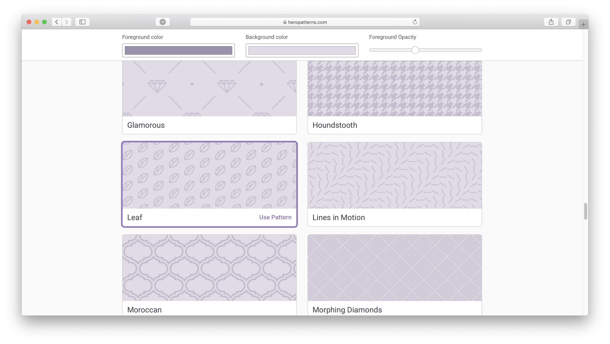
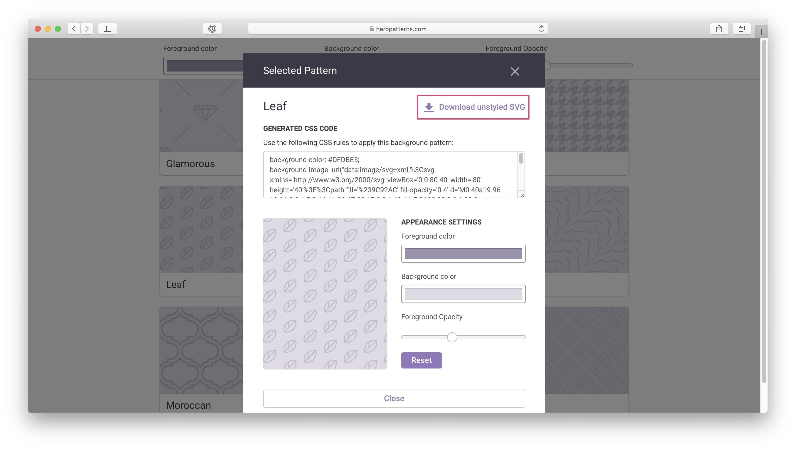

Today I needed to update the SVG pattern from a TailwindUI component so I thought I'd document it here so I can refer back to this article in the future and hopefully this helps someone else as well.

Most of the TailwindUI components use the same "square grid pattern" as you can see in the image below.


Whilst, this is a very nice default pattern to use, you might want to distinguish yourself from other TailwindUI users by updating this pattern to something more custom.

## Download a new pattern

Fortunately, Steve Schoger has a brilliant collection of free SVG patterns that can be downloaded here: [heropatterns.com](https://www.heropatterns.com/). So let's download one from there. For this tutorial, I'll be using the "leaf" pattern. 🍃



Select the pattern you want and click on "Download unstyled SVG". You can ignore the "Foreground color" and "Background color" settings, this will not affect us.



Now unzip that file and you should see a SVG element that looks like this:

```html
<!-- Leaf pattern. -->
<svg xmlns="http://www.w3.org/2000/svg" viewBox="0 0 80 40">
    <path fill="#000" d="M0 40a19.96 19.96 0 0 1 5.9-14.11 20.17 20.17 0 0 1 19.44-5.2A20 20 0 0 1 20.2 40H0zM65.32.75A20.02 20.02 0 0 1 40.8 25.26 20.02 20.02 0 0 1 65.32.76zM.07 0h20.1l-.08.07A20.02 20.02 0 0 1 .75 5.25 20.08 20.08 0 0 1 .07 0zm1.94 40h2.53l4.26-4.24v-9.78A17.96 17.96 0 0 0 2 40zm5.38 0h9.8a17.98 17.98 0 0 0 6.67-16.42L7.4 40zm3.43-15.42v9.17l11.62-11.59c-3.97-.5-8.08.3-11.62 2.42zm32.86-.78A18 18 0 0 0 63.85 3.63L43.68 23.8zm7.2-19.17v9.15L62.43 2.22c-3.96-.5-8.05.3-11.57 2.4zm-3.49 2.72c-4.1 4.1-5.81 9.69-5.13 15.03l6.61-6.6V6.02c-.51.41-1 .85-1.48 1.33zM17.18 0H7.42L3.64 3.78A18 18 0 0 0 17.18 0zM2.08 0c-.01.8.04 1.58.14 2.37L4.59 0H2.07z"></path>
</svg>
```

## Replace the pattern

Now that we have our new pattern at hand, let's use it. If you've copy/pasted some code from the TailwindUI application, chances are the SVG you're looking to update has the following structure:

```html
<!-- SVG element to update. -->
<svg class="some tailwindcss classes" width="404" height="784" fill="none" viewBox="0 0 404 784">
    <defs>
        <pattern id="b1e6e422-73f8-40a6-b5d9-c8586e37e0e7" x="0" y="0" width="20" height="20" patternUnits="userSpaceOnUse">
            <rect x="0" y="0" width="4" height="4" class="text-gray-200" fill="currentColor" />
        </pattern>
    </defs>
    <rect width="404" height="784" fill="url(#b1e6e422-73f8-40a6-b5d9-c8586e37e0e7)" />
</svg>
```

It's should contain (from bottom to top):
- A `<rect>` tag that defines the overall shape of your pattern — kind of like the "mask" of your pattern.
- A `<defs>` tag containing a `<pattern>` tag. This quite intuitively defines the pattern that will be repeated inside the mask.

You guessed it, we'll need to update this `<pattern>` tag.

<CodePen id="RwayPeX" title="Replacing Tailwind UI hero patterns: Step 1"></CodePen>

First, copy whatever is inside the SVG element of your new pattern.

```html
<!-- Leaf pattern. -->
<svg xmlns="http://www.w3.org/2000/svg" viewBox="0 0 80 40">

    <!-- Copy this line below. -->
    <path fill="#000" d="M0 40a19.96 19.96 0 0 1 5.9-14.11 20.17 20.17 0 0 1 19.44-5.2A20 20 0 0 1 20.2 40H0zM65.32.75A20.02 20.02 0 0 1 40.8 25.26 20.02 20.02 0 0 1 65.32.76zM.07 0h20.1l-.08.07A20.02 20.02 0 0 1 .75 5.25 20.08 20.08 0 0 1 .07 0zm1.94 40h2.53l4.26-4.24v-9.78A17.96 17.96 0 0 0 2 40zm5.38 0h9.8a17.98 17.98 0 0 0 6.67-16.42L7.4 40zm3.43-15.42v9.17l11.62-11.59c-3.97-.5-8.08.3-11.62 2.42zm32.86-.78A18 18 0 0 0 63.85 3.63L43.68 23.8zm7.2-19.17v9.15L62.43 2.22c-3.96-.5-8.05.3-11.57 2.4zm-3.49 2.72c-4.1 4.1-5.81 9.69-5.13 15.03l6.61-6.6V6.02c-.51.41-1 .85-1.48 1.33zM17.18 0H7.42L3.64 3.78A18 18 0 0 0 17.18 0zM2.08 0c-.01.8.04 1.58.14 2.37L4.59 0H2.07z"></path>
</svg>
```

And replace it with whatever is inside your current `<pattern>` tag.

```html
<!-- SVG element to update. -->
<svg class="some tailwindcss classes" width="404" height="784" fill="none" viewBox="0 0 404 784">
    <defs>
        <pattern id="b1e6e422-73f8-40a6-b5d9-c8586e37e0e7" x="0" y="0" width="20" height="20" patternUnits="userSpaceOnUse">
            <!-- Replace this... -->
            <rect x="0" y="0" width="4" height="4" class="text-gray-200" fill="currentColor" />

            <!-- ... With this. -->
            <path fill="#000" d="M0 40a19.96 19.96 0 0 1 5.9-14.11 20.17 20.17 0 0 1 19.44-5.2A20 20 0 0 1 20.2 40H0zM65.32.75A20.02 20.02 0 0 1 40.8 25.26 20.02 20.02 0 0 1 65.32.76zM.07 0h20.1l-.08.07A20.02 20.02 0 0 1 .75 5.25 20.08 20.08 0 0 1 .07 0zm1.94 40h2.53l4.26-4.24v-9.78A17.96 17.96 0 0 0 2 40zm5.38 0h9.8a17.98 17.98 0 0 0 6.67-16.42L7.4 40zm3.43-15.42v9.17l11.62-11.59c-3.97-.5-8.08.3-11.62 2.42zm32.86-.78A18 18 0 0 0 63.85 3.63L43.68 23.8zm7.2-19.17v9.15L62.43 2.22c-3.96-.5-8.05.3-11.57 2.4zm-3.49 2.72c-4.1 4.1-5.81 9.69-5.13 15.03l6.61-6.6V6.02c-.51.41-1 .85-1.48 1.33zM17.18 0H7.42L3.64 3.78A18 18 0 0 0 17.18 0zM2.08 0c-.01.8.04 1.58.14 2.37L4.59 0H2.07z"></path>
        </pattern>
    </defs>
    <rect width="404" height="784" fill="url(#b1e6e422-73f8-40a6-b5d9-c8586e37e0e7)" />
</svg>
```

However, you can see that the previous pattern had the following attributes defining its colour: `class="text-gray-200" fill="currentColor"`. Whereas our new one is coloured in black `fill="#000"`. To fix this, we simply need to move these attributes over to the new pattern. You should end up with something like this:

```html{5}
<!-- SVG element to update. -->
<svg class="some tailwindcss classes" width="404" height="784" fill="none" viewBox="0 0 404 784">
    <defs>
        <pattern id="b1e6e422-73f8-40a6-b5d9-c8586e37e0e7" x="0" y="0" width="20" height="20" patternUnits="userSpaceOnUse">
            <path class="text-gray-200" fill="currentColor" d="M0 40a19.96 19.96 0 0 1 5.9-14.11 20.17 20.17 0 0 1 19.44-5.2A20 20 0 0 1 20.2 40H0zM65.32.75A20.02 20.02 0 0 1 40.8 25.26 20.02 20.02 0 0 1 65.32.76zM.07 0h20.1l-.08.07A20.02 20.02 0 0 1 .75 5.25 20.08 20.08 0 0 1 .07 0zm1.94 40h2.53l4.26-4.24v-9.78A17.96 17.96 0 0 0 2 40zm5.38 0h9.8a17.98 17.98 0 0 0 6.67-16.42L7.4 40zm3.43-15.42v9.17l11.62-11.59c-3.97-.5-8.08.3-11.62 2.42zm32.86-.78A18 18 0 0 0 63.85 3.63L43.68 23.8zm7.2-19.17v9.15L62.43 2.22c-3.96-.5-8.05.3-11.57 2.4zm-3.49 2.72c-4.1 4.1-5.81 9.69-5.13 15.03l6.61-6.6V6.02c-.51.41-1 .85-1.48 1.33zM17.18 0H7.42L3.64 3.78A18 18 0 0 0 17.18 0zM2.08 0c-.01.8.04 1.58.14 2.37L4.59 0H2.07z"></path>
        </pattern>
    </defs>
    <rect width="404" height="784" fill="url(#b1e6e422-73f8-40a6-b5d9-c8586e37e0e7)" />
</svg>
```

The last thing to do is to make sure the dimensions of our `<pattern>` tag matches the dimensions of our new "leaf" pattern. You can find these dimensions in the `viewBox` attribute of the downloaded pattern.

```html{3}
<!-- Leaf pattern. -->
<!-- The dimensions of this pattern are 80px by 40px. -->
<svg xmlns="http://www.w3.org/2000/svg" viewBox="0 0 80 40">
    <path fill="#000" d="M0 40a19.96 19.96 0 0 1 5.9-14.11 20.17 20.17 0 0 1 19.44-5.2A20 20 0 0 1 20.2 40H0zM65.32.75A20.02 20.02 0 0 1 40.8 25.26 20.02 20.02 0 0 1 65.32.76zM.07 0h20.1l-.08.07A20.02 20.02 0 0 1 .75 5.25 20.08 20.08 0 0 1 .07 0zm1.94 40h2.53l4.26-4.24v-9.78A17.96 17.96 0 0 0 2 40zm5.38 0h9.8a17.98 17.98 0 0 0 6.67-16.42L7.4 40zm3.43-15.42v9.17l11.62-11.59c-3.97-.5-8.08.3-11.62 2.42zm32.86-.78A18 18 0 0 0 63.85 3.63L43.68 23.8zm7.2-19.17v9.15L62.43 2.22c-3.96-.5-8.05.3-11.57 2.4zm-3.49 2.72c-4.1 4.1-5.81 9.69-5.13 15.03l6.61-6.6V6.02c-.51.41-1 .85-1.48 1.33zM17.18 0H7.42L3.64 3.78A18 18 0 0 0 17.18 0zM2.08 0c-.01.8.04 1.58.14 2.37L4.59 0H2.07z"></path>
</svg>
```

Therefore, after copying these dimentions to the `width` and `height` attributes of the `<pattern>` tag, we should end up with this: 🎉


```html{4}
<!-- SVG element to update. -->
<svg class="some tailwindcss classes" width="400" height="784" fill="none" viewBox="0 0 400 784">
    <defs>
        <pattern id="b1e6e422-73f8-40a6-b5d9-c8586e37e0e7" x="0" y="0" width="80" height="40" patternUnits="userSpaceOnUse">
            <path class="text-gray-200" fill="currentColor" d="M0 40a19.96 19.96 0 0 1 5.9-14.11 20.17 20.17 0 0 1 19.44-5.2A20 20 0 0 1 20.2 40H0zM65.32.75A20.02 20.02 0 0 1 40.8 25.26 20.02 20.02 0 0 1 65.32.76zM.07 0h20.1l-.08.07A20.02 20.02 0 0 1 .75 5.25 20.08 20.08 0 0 1 .07 0zm1.94 40h2.53l4.26-4.24v-9.78A17.96 17.96 0 0 0 2 40zm5.38 0h9.8a17.98 17.98 0 0 0 6.67-16.42L7.4 40zm3.43-15.42v9.17l11.62-11.59c-3.97-.5-8.08.3-11.62 2.42zm32.86-.78A18 18 0 0 0 63.85 3.63L43.68 23.8zm7.2-19.17v9.15L62.43 2.22c-3.96-.5-8.05.3-11.57 2.4zm-3.49 2.72c-4.1 4.1-5.81 9.69-5.13 15.03l6.61-6.6V6.02c-.51.41-1 .85-1.48 1.33zM17.18 0H7.42L3.64 3.78A18 18 0 0 0 17.18 0zM2.08 0c-.01.8.04 1.58.14 2.37L4.59 0H2.07z"></path>
        </pattern>
    </defs>
    <rect width="400" height="784" fill="url(#b1e6e422-73f8-40a6-b5d9-c8586e37e0e7)" />
</svg>
```

<small>You might want to slightly adjust the dimensions of your `<rect>` mask so that it is a multiple of the new pattern's dimensions.</small>

<CodePen id="MWyGaaV" title="Replacing Tailwind UI hero patterns: Step 2"></CodePen>

## Updating multiple patterns

One final note. If you have the same SVG pattern multiple times and want to quickly update all of them, you will not be able to just copy/paste the new `<pattern>` blindly everywhere. That's because the pattern's `id` is used by the `<rect>` mask in it's `fill` attribute.

```html{5,10}
<!-- SVG element to update. -->
<svg class="some tailwindcss classes" width="400" height="784" fill="none" viewBox="0 0 400 784">
    <defs>
        <!-- This id... -->
        <pattern id="b1e6e422-73f8-40a6-b5d9-c8586e37e0e7" x="0" y="0" width="80" height="40" patternUnits="userSpaceOnUse">
            <path class="text-gray-200" fill="currentColor" d="M0 40a19.96 19.96 0 0 1 5.9-14.11 20.17 20.17 0 0 1 19.44-5.2A20 20 0 0 1 20.2 40H0zM65.32.75A20.02 20.02 0 0 1 40.8 25.26 20.02 20.02 0 0 1 65.32.76zM.07 0h20.1l-.08.07A20.02 20.02 0 0 1 .75 5.25 20.08 20.08 0 0 1 .07 0zm1.94 40h2.53l4.26-4.24v-9.78A17.96 17.96 0 0 0 2 40zm5.38 0h9.8a17.98 17.98 0 0 0 6.67-16.42L7.4 40zm3.43-15.42v9.17l11.62-11.59c-3.97-.5-8.08.3-11.62 2.42zm32.86-.78A18 18 0 0 0 63.85 3.63L43.68 23.8zm7.2-19.17v9.15L62.43 2.22c-3.96-.5-8.05.3-11.57 2.4zm-3.49 2.72c-4.1 4.1-5.81 9.69-5.13 15.03l6.61-6.6V6.02c-.51.41-1 .85-1.48 1.33zM17.18 0H7.42L3.64 3.78A18 18 0 0 0 17.18 0zM2.08 0c-.01.8.04 1.58.14 2.37L4.59 0H2.07z"></path>
        </pattern>
    </defs>

    <!-- ... Must match this fill url. -->
    <rect width="400" height="784" fill="url(#b1e6e422-73f8-40a6-b5d9-c8586e37e0e7)" />
</svg>
```

Therefore whenever you copy/paste a pattern, make sure to provide a new `id` to that pattern and update the `fill` attribute to link the two together. Note that this doesn't have to be a UUID. My guess is that TailwindUI uses UUID to ensure their identifier do not conflict with some `id`s you might already have within your pages.

Alternatively, if you already have an SVG element that defines the pattern **on the same page**, you can simply reuse its `id` on the `fill` attribute of the other SVG elements.

```html
<svg class="some tailwindcss classes" width="400" height="784" fill="none" viewBox="0 0 400 784">
    <rect width="400" height="784" fill="url(#b1e6e422-73f8-40a6-b5d9-c8586e37e0e7)" />
</svg>
```

However, be aware that this will not work if the SVG element that defines the pattern is hidden — which could happen if you’re using different SVG elements based on the screen size to make them responsive.

<p class="mb-16 text-center">🍃</p>
