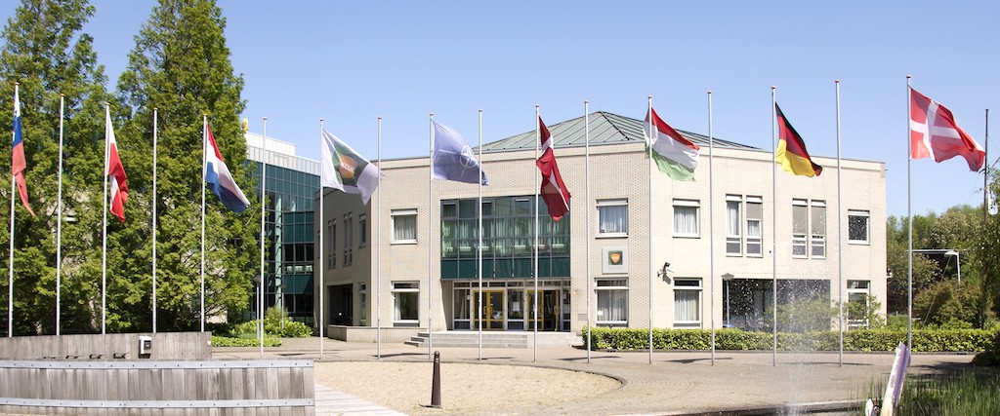
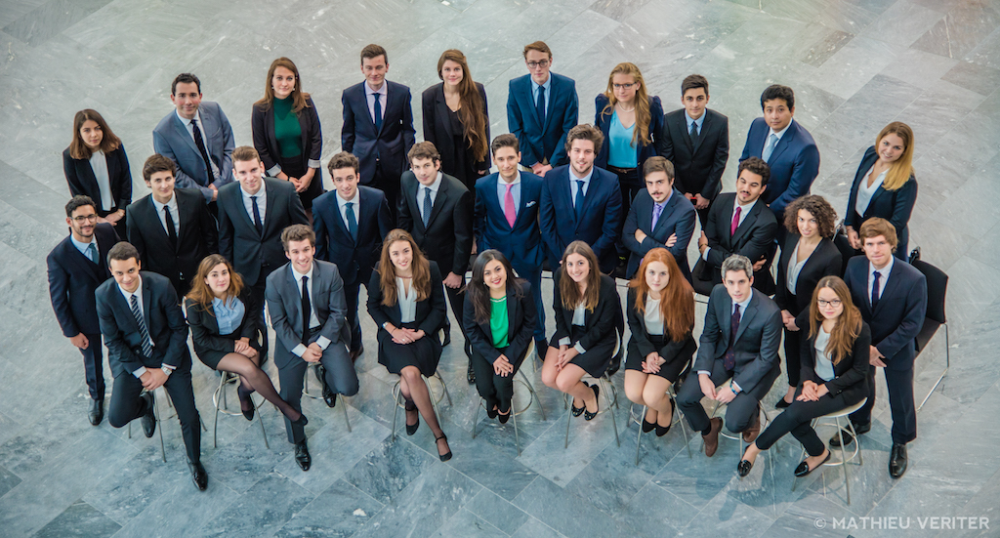

# Curriculum Vitæ

Having recently graduated from the EPFL, I am eager to find a career path that matches my work ethic and values. My primary goal is to be working in a motivating environment with talented people and an out-of-the-box business culture promoting individualism and thoroughness.

## Skills

<Skills
    :skills="[
        { body: 'Soft', theme: 'category', icon: 'home' },
        { body: 'IT Consulting' },
        { body: 'Project management' },
        { body: 'Team management' },
        { body: 'Prospecting clients' },
        { body: 'Mentoring' },
        { body: 'Visual communication' },
        { body: 'Marketing' },

        { body: 'Technical', theme: 'category', icon: 'home' },
        { body: 'Software engineering', theme: 'highlighted' },
        { body: 'CI / CD' },
        { body: 'Algorithmic optimization' },
        { body: 'AI & machine learning' },
        { body: 'Concurrent programming' },
        { body: 'Network security' },

        { body: 'Backend', theme: 'category', icon: 'home' },
        { body: 'Laravel', theme: 'highlighted' },
        { body: 'Symfony' },
        { body: 'SQL' },
        { body: 'Doctrine' },
        { body: 'Java' },
        { body: 'Scala' },
        { body: 'Python' },
        { body: 'Low-Level (C, Shell, Perl, VHDL)' },

        { body: 'Frontend', theme: 'category', icon: 'home' },
        { body: 'VueJS', theme: 'highlighted' },
        { body: 'React' },
        { body: 'CSS Preprocessors (Sass, Less, Stylus)' },
        { body: 'CSS Postprocessors (Tailwind CSS, PostCSS)' },
        { body: 'Templating (Twig, Blade, Handlebars)' },

        { body: 'Graphical', theme: 'category', icon: 'home' },
        { body: 'Sketch' },
        { body: 'Photoshop' },
        { body: 'Illustrator' },
        { body: 'InDesign' },
        { body: 'AfterEffect' },
        { body: 'Cinema4D' },
    ]"
></Skills>

## Education

* École Polytechnique Fédérale de Lausanne (EPFL) \
[Master in computer sciences](http://lorisleiva.com/assets/files/EPFL%20Transcript.pdf). Awarded full scholarship every available year. \
<small>Lausanne, Switzerland — 2012-2017</small>

* Lycée Sainte-Geneviève \
High School diploma in Sciences. Summa cum laude distinction \
<small>Paris, France — 2009-2012</small>

## Experience

### CTO & Co-Founder
[Elegon](https://elegon.io/) \
<small>London, United Kingdom — 2018-present</small> \
<small>Malaga, Spain — 2018</small>

#### Why?
In order to design software we can be proud of, whether it is for an ambitious client or as a startup venture. As the CTO and co-founder of Elegon, I am able to push the limits of development and innovation to a whole new level whilst creating a working environment that promotes individualism and personal fulfilment. It gives me the chance to bring ideas to life, guide clients at any point in their journey, work with talented individuals, share my knowledge to other developers and contribute to open source.
 
#### What?
* Take executive decisions and manage the technological requirements of our team.
* Build a portfolio of dozens of client applications and startups.
* Advise clients, remotely or on site, on the best ways software can achieve their goals based on factors that matters to them.
* Implement applications using agile development to work more closely with client expectations and integrate changes into future plans at minimal cost.
* Provide quality technology knowledge that reaches more than 2000 monthly users and help build a notoriety within the community we work with.
* Maintain multiple open source packages downloaded thousands of times every month that aim to solve recurring issues in a modular way.

#### How?
* Participating in technological events and finding talented full stack developers that fit with our values.
* Allocating time for research and personal growth to keep up with new technologies.
* Guiding clients at each step of the way by engaging in regular sessions where decisions can be made and new opportunities can be raised.
* Starting projects with a big emphasis on user experience (UX/UI) and prototyping.
* Frequently writing articles — around 15 articles per year — discussing various topics and sharing our internal technological explorations.
* Developing a Laravel package that makes it significantly easier to deploy your application with zero-downtime and making YouTube video tutorials on how to use it.

---

### IT Strategist & Full Stack Developer
[CIMIC Center Of Excellence (CCOE)](http://www.cimic-coe.org/) \
<small>The Hague, Netherlands — 2016-2017</small>

#### Why?
In order to improve the current model of a NATO accredited organisation by using both my technical and business background. As an IT strategist I had the ability to make quick noticeable improvements whilst designing a four-year plan that supports to-be business deliveries. I had the chance to broaden my network by working with members of different armies and external consultants from IT consulting firms to the Dutch ministry of defence.
 
#### What?
* Aligned the knowledge of the IT branch and ensured that information doesn’t get lost as soldiers rotate positions.
* Contributed to the improvement of the high-level business model of the organisation.
* Designed and automated a tailor-made risk assessment model that was then used to perform an IT-oriented risk assessment.
* Identified 19 recommendations to reduce the overhaul risk of the organisation.
* Provided network defenders tools that enhanced active and passive defence.
 
#### How?
* Writing a complete IT structure documentation that explains to newcomers how everything works but also provides current IT members a guide they can refer to in their day-to-day tasks.
* Defining the employees’ understanding of their roles and assets by conducting interviews with every branch of the organisation and using the results to map implementation to construction business processes.
* Designing an Entity-Relationship model describing all components of a risk assessment and how they interact with each other by following structural recommendations from international standards (ISO 27001).
* Implementing a user interface to interact with that model.
* Writing a complete documentation on the risk assessment’s results and how it has been conducted.
* Providing for each recommendation some concrete implementation actions, the resource needed and the benefits that will result the risk treatment.
* Implementing an intelligent local web-based application using Semantic Web technics that centralises all network activities.

---

### Project Manager & Consultant
[Junior Entreprise EPFL](http://je.epfl.ch/) \
<small>Lausanne, Switzerland — 2014-2016</small>

#### Why?
In order to gain practical insights of how small businesses are run and to have the ability to make a difference. As a project manager I had the chance to act as focal point of contact between external clients and internal student staff. I was approached by the association to modernise their visual identity and then promoted into a more strategic role that I designed together with the new direction.

#### What?
* In one year the student database doubled and the average number of projects per semester increased from 35 to 85.
* Following that first year, I ensured high levels of business service delivery across wide range of projects with a 70% focus on IT consultancy.
* Delivered continuous improvement of training and performance on client projects.
* Generated substantial improvements in skills and performance of new project managers.
* Rectified issues across quality, performance and expectations.

#### How?
* Designing new graphics for the association and devising a wide range of marketing collateral.
* Explaining complex or foreign information to clients before they make important decisions.
* Introducing new standards of talent development and knowledge transfer during workshops.
* Designing a project management introduction class and training up to 12 newcomers.
* Introducing a policy of recording and learning from mistakes, with comprehensive supporting documentation.
* Negotiating contracts, leading conflict resolution and removing technical obstacles to client satisfaction.

## Languages

* French (native) \
Ayant grandi en région parisienne, le français est ma langue maternelle et celle avec laquelle j'ai étudié la majeure partie de ma scolarité.

* English (fluent - C1) \
I have fallen in love with the language of Shakespeare from a very young age. Since then I have surrounded myself with English speaking people and I now speak more English than French on a daily basis.

* Spanish (B1) \
Quasi toda mi familia es de origen Español y habla el idioma perfectamente. Entonces lo entiendo muy bien pero lo he perdido mucho y no lo hablo como ellos.